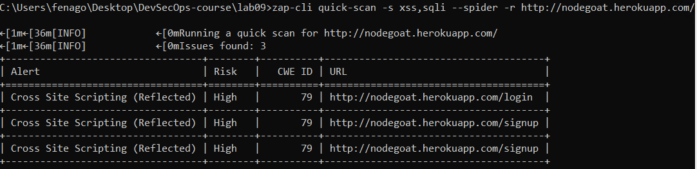
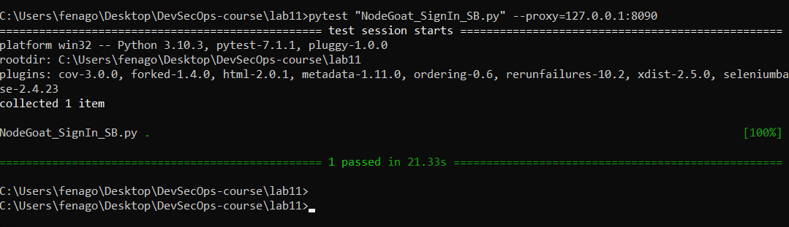
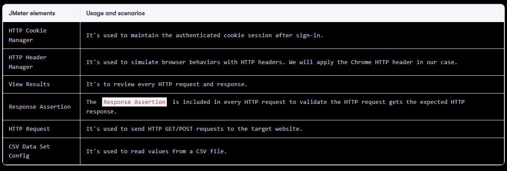
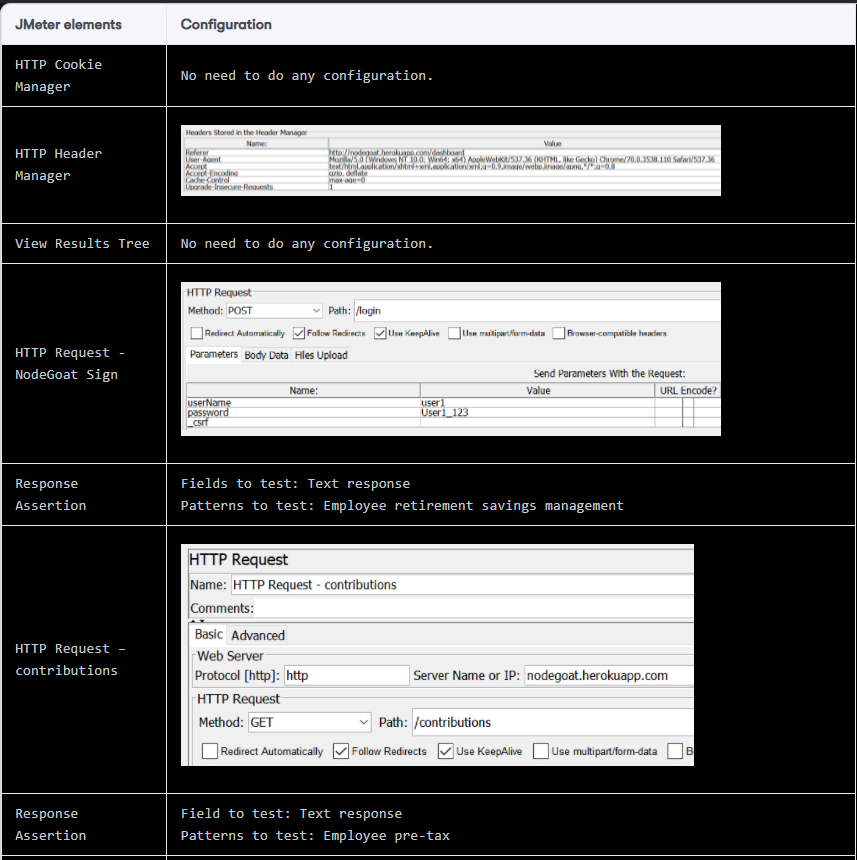
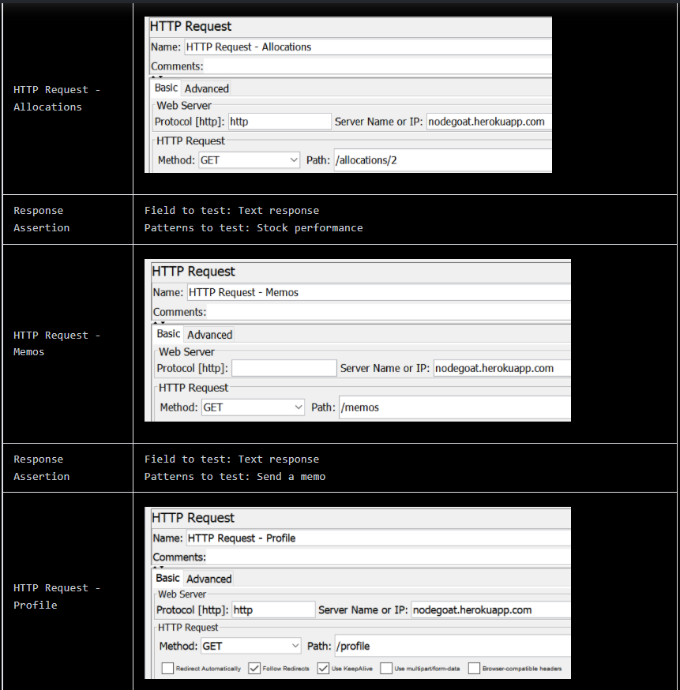
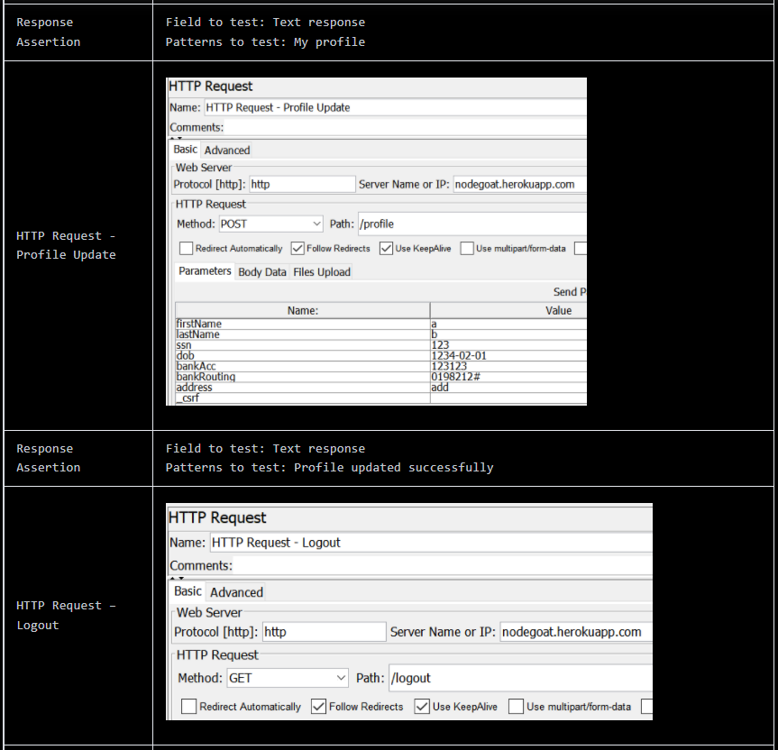
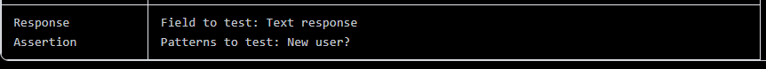
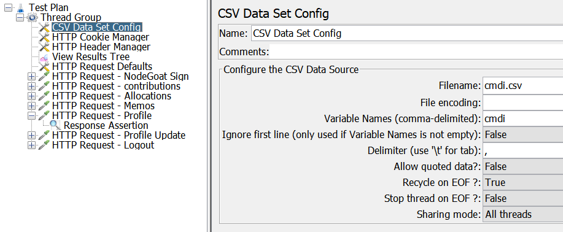
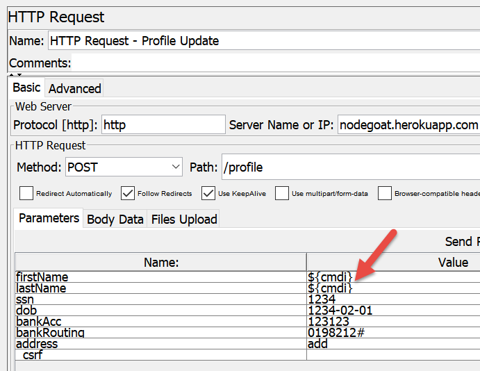

Automated Testing for Web Applications
======================================

In this lab, we will use three case studies to learn different
security automation techniques for use against the vulnerable NodeGoat
site. The first case is to automate OWASP ZAP by using the ZAP-CLI,
which will help identify any initial security issues on the website
before authentication. In the second case, we will be using selenium to
do the user sign-in, in order to access some authenticated pages and
identify more potential security issues. In the final case, we will use
JMeter to do the sign-in with external CSV data and detect potential
command injection security issues.

The topics that will be covered in this lab are as follows:

-   Web security automation testing with OWASP ZAP using the CLI
-   Web security automation testing with ZAP and Selenium
-   Web security testing with ZAP, JMeter, and DDT with FuzzDB


Case 1 -- web security scanning with ZAP-CLI
============================================

In this small NodeGoat web security testing scenario, we will automate
OWASP ZAP by using the ZAP-CLI for security smoke testing. The ZAP-CLI
provides a quick scan, which is handy because it achieves the following
in one command:

-   Open a URL to the target website
-   Spider scan to discover web resources (URLs) extensively on the
    target website
-   Active scan to identify more potential security issues by using
    known attacks

We will perform the following steps to execute the ZAP-CLI and review
the security results by


Step 1 -- Using ZAP-CLI
=======================

To ensure the success of the ZAP-CLI installation, you may try this
command with help options:


```
zap-cli quick-scan --help
```


Step 2 -- ZAP quick scan using the ZAP-CLI
==========================================

To do a ZAP-CLI quick scan with specified XSS and SQL injection security
policies, the following command can be used. The ZAP-CLI may require the
API Key of ZAP. To access or disable the API Key, configure the [Disable
the API Key] checkbox under the OWASP UI menu,
[Tools] \| [Options\...] \|
[API]:


```
zap-cli quick-scan -s xss,sqli --spider -r http://nodegoat.herokuapp.com/
```

It will take a while for ZAP to finish the spider and active scan. Confirm using ZAPI GUI that scan have been completed.




Step 3 -- generate a report
===========================

There are a few ways we can generate an OWASP ZAP report. The first is
to use [alerts] to show a summary list of the security issues:


```
zap-cli alerts
```


Furthermore, we can also use [report] to generate a detailed HTML
or XML report. The XML report can be used to import into other security
reporting tools, which we will introduce in Lab 15,
*Summary of Automation Security Testing Tips*:


```
zap-cli report -o   ZAP_Report.html  -f html
```


To generate the XML format report, execute this command:


```
zap-cli report -o ZAP_Report.xml -f xml
```


Uses of ZAP-CLI or ZAP RESTful API to automate the OWASP ZAP scan? The
ZAP RESTful API is provided by default in ZAP, while the ZAP-CLI will
require to install [zapcli]. If you only need basic web scan
operations, the ZAP-CLI may fit your needs. However, if you need more
control over ZAP, the ZAP RESTful API will be recommended.


Case 2 -- web security testing with ZAP & Selenium
==================================================

In this case for the security testing of NodeSign signin, we will be
using a Selenium script to automate the following UI steps and OWASP ZAP
will be running as a proxy mode to monitor and analyze all security
issues based on HTTP requests/responses. We will do the sign-in with a
valid username and password, then visit every authenticated page without
further data input and updates. The purpose of this testing is to do a
security smoke test of every authenticated page.

Here are the UI steps automated by Selenium:

-   Visit the sign-in page: <http://nodegoat.herokuapp.com/login>
-   Sign in with username = **user1** and password = **User1_123**
-   Visit the contributions page after sign-in
-   Visit the allocation page
-   Visit the profile

Follow the following instructions to proceed the testing.


Step 1 -- Selenium Python script
================================

We will create the Selenium Python script [NodeGoat\_SigIn.py].
The Selenium script will launch the Firefox browser.
Firefox web driver (geckodriver) is already downloaded and added in PATH, it
can be found here: <https://github.com/mozilla/geckodriver/releases>.

This sample code shows a Selenium/Python script used to log in to
NodeGoat with **user1/User1_123** credentials:


```
# -*- coding: utf-8 -*-
# NodeGoat_SignIn.py
from selenium import webdriver
from selenium.webdriver.common.by import By
from selenium.webdriver.common.keys import Keys
from selenium.webdriver.support.ui import Select
from selenium.common.exceptions import NoSuchElementException
from selenium.common.exceptions import NoAlertPresentException
import unittest, time, re

class SignIn(unittest.TestCase):
    def setUp(self):
        self.driver = webdriver.Firefox()
        self.driver.implicitly_wait(30)
   
    def test_sign_in(self):
        driver = self.driver
        driver.get("http://nodegoat.herokuapp.com/login")
        driver.find_element_by_id("userName").clear()
        driver.find_element_by_id("userName").send_keys("user1")
        driver.find_element_by_id("password").clear()
        driver.find_element_by_id("password").send_keys("User1_123")
        driver.find_element_by_xpath("//button[@type='submit']").click()
        driver.get("http://nodegoat.herokuapp.com/contributions")
        driver.find_element_by_xpath("//button[@type='submit']").click()
        driver.get("http://nodegoat.herokuapp.com/contributions")
        driver.get("http://nodegoat.herokuapp.com/allocations/2")
        driver.get("http://nodegoat.herokuapp.com/profile")
    
    
    def tearDown(self):
        self.driver.quit()


if __name__ == "__main__":
    unittest.main()
```


Step 2 -- running ZAP as a proxy
================================

In Lab 5, *Security API and Fuzz Testing*, and Lab 6,
*Web Application Security Testing*, we introduced the installation and
use of ZAP. Here, we will only discuss how to launch the browser with
the Selenium script and the specified ZAP proxy, which is
[127.0.0.1:8090] in our case.

Approach 1 -- Selenium Profile
==============================

In this approach, we define the selenium script to use the specified
proxy as [127.0.0.1:8090]. This will require a certain
modification of the selenium script. Here is the sample script, which
shows how to define the browser proxy. The [self.driver =
webdriver.Firefox()] will need additional profile preference
settings, as shown in this example:


```
# "Selenium Proxy Sample.py"
from selenium import webdriver
import warnings
warnings.simplefilter(action='ignore', category=Warning)


# Replace the 'self.driver = webdriver.Firefox()' with the following
profile = webdriver.FirefoxProfile()
profile.set_preference('network.proxy_type',1)
profile.set_preference('network.proxy.http',"127.0.0.1")
profile.set_preference('network.proxy.http_port',"8090")
driver=webdriver.Firefox(profile)
# End of Replacement


driver.get('http://nodegoat.herokuapp.com/login')
driver.close()
```


Run the script as follows:

```
cd C:\Users\fenago\Desktop\DevSecOps-course\lab11

python "Selenium Proxy Sample.py"
```

Approach 2 -- using SeleniumBASE
================================

If the script is done by using SeleniumBASE, the browser proxy can be
specified with proxy command options. Please be aware that our example,
[NodeGoat\_SignIn.py], cannot be executed directly by using
SeleniumBASE. Here are the steps to convert our original selenium script
into SeleniumBASE style. The steps work under the assumption that
SeleniumBASE is installed, which can be done with [pip install
seleniumbase]:


```
seleniumbase convert NodeGoat_SignIn.py
```


Then, we may execute the command with the proxy [127.0.0.1:8090]:
The previous command will generate [NodeGoat\_SignIn\_SB.py]:


```
pytest "NodeGoat_SignIn_SB.py" --proxy=127.0.0.1:8090
```




When the testing is stable, it\'s suggested to execute the selenium
testing script in headless mode. It means the testing will proceed
without launching a real browser. It will simulate the execution in
memory. This will improve the testing stability and cycle. For the uses
of SeleniumBASE, specify the headless option, for example:


```
pytest "NodeGoat_SignIn_SB.py" --proxy=127.0.0.1:8090 --headless --browser=chrome
```


Step 3 -- generate ZAP report
=============================

The ZAP security testing report can be generated by one of the
followings:


```
CURL "http://127.0.0.1:8090/OTHER/core/other/htmlreport/?formMethod=GET" > ZAP_Report.HTML
```


Alternatively, if the ZAP-CLI is installed, the HTML report can be
generated with this command:


```
zap-cli report -o   ZAP_Report.html  -f html
```


Case 3 -- fuzz XSS and SQLi testing with JMeter
===============================================

In *Case 3*, we will demonstrate the same user flows as in *Case 2*. The
key difference in *Case 3* is that we will have the data input with SQL
injection payloads. This will be done by using Jmeter with FuzzDB and
CSV Config elements. In Lab 13, *Automated Infrastructure Security*, we will also demonstrate how to do fuzz SQLi testing with selenium and Robot Framework.


Testing scenarios
=================

After user sign-in, particularly in step 6, we will be using JMeter to
send HTTP requests with FuzzDB security loads through the OWASP ZAP
proxy to the target testing website, NodeGoat.

The testing steps are as follows:

1.  Sign in to NodeGoat with the username **User1** and password **User1_123**
2.  Visit the contributions page
3.  Visit the allocations page
4.  Visit the memos page
5.  Visit the profile page
6.  **Input the security payloads for SQL and command injection testing
    on the profile update page**
7.  Log out
8.  Generate the security reports in OWASP ZAP

During these steps, OWASP ZAP will be used to analyze the HTTP
request/response traffic to identify potential security issues. The
general steps to complete the automation testing will be as follows:

1.  Set up the ZAP Proxy on port [8090] and JMeter
2.  Define the JMeter scripts
3.  Launch JMeter in the CLI with ZAP Proxy
4.  Generate the ZAP report with the CLI
5.  Shut down ZAP


Step 1 -- prepare environment
=============================

To prepare the environment for this security testing scenario, we will
mainly need JMeter, ZAP, and FuzzDB.


Step 2 -- define the JMeter scripts
===================================


**Solution:** JMX file has been saved in `C:\Users\fenago\Desktop\DevSecOps-course\lab11\NodeGoat.jmx`


Using JMeter can be very complex. In our case, we will only use parts of
the necessary elements to complete the testing scenario. This table
lists the use of JMeter elements in our case and also the configuration
needed in each element:



We will create a JMeter Script with the following configurations, and
save the script as [NodeGoat.jmx]:









Step 3 -- prepare security payloads
===================================

From the sources of FuzzDB, we will prepare two files `cmdi.csv`
for the data input of profile update. In the JMeter script, [CSV Data
Set Config] will be added with the following
configuration:

-   [Filename]: `cmdi.csv`
-   [Variable Names (comma-delimited)]: [cmdi]

This screenshot shows the JMeter script with [CSV Data Set
Config]:





CSV Data Set Config for Command Injection in JMeter


Then, we can use the [\${cmdi}] variable in [HTTP Request -
Profile Update]. For example, we replace the value of
[firstName] and [lastName] with
[\${cmdi}] to do command injection testing:





HTTP Request for Command Injection Testing in JMeter


To do the loop and read all the variables in `cmdi.csv`, we still
need to change the [Loop Count] settings in [Thread Group]. For example, we will do the loop 10 times with
each value in the `cmdi.csv`:

- Loop Count: 10


Step 4 -- launch JMeter in CLI with ZAP proxy
=============================================

To launch JMeter in console mode, we will specify the proxy to OWASP ZAP
by using the [-H]:


```
cd C:\Users\fenago\Desktop\DevSecOps-course\lab11

jmeter    -n   -H   localhost -P   8090   -t    NodeGoat.jmx      -l    NodeGoat_result.jtl  -j  NodeGoat_result.log
```


In addition, the proxy settings of JMeter can also be configured by
using [HTTP Request Defaults] under the
[Advanced] tab.


Step 5 -- generate a ZAP report
===============================

The ZAP security testing report can be generated by one of the
followings:


```
CURL "http://127.0.0.1:8090/OTHER/core/other/htmlreport/?formMethod=GET" > ZAP_Report.HTML
```


Should I select Selenium or JMeter as our security automation framework?
Both tools can achieve similar testing results. Selenium simulates user
behaviors in a real browser, but it may produce unexpected errors during
UI testing. On the other hand, JMeter only sends HTTP requests and
verifies HTTP responses, without rendering the UI in a browser. In
addition, for the selection of tools, we may also consider integration
with existing security or automation frameworks. For example, if the
team has built all the automation based on JMeter, then JMeter may be a
better choice for security automation.


Summary
=======

In this lab, we have demonstrated three technical approaches to
NodeGoat security automation testing. The first approach is to use the
ZAP-CLI to do a quick scan of the target website. This kind of testing
can be used as a smoke test for every release. It helps us to identify
potentially serious security issues. We also applied Selenium and JMeter
to guide ZAP for authenticated pages and other web UI flows. Selenium
can launch the browser to simulate a user\'s web operation behavior.
JMeter sends the HTTP requests and asserts the HTTP responses for the
API-level user sign-in flow.
