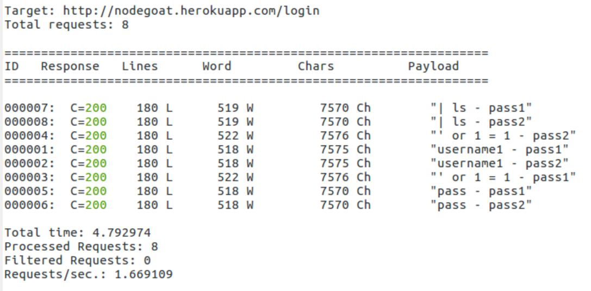
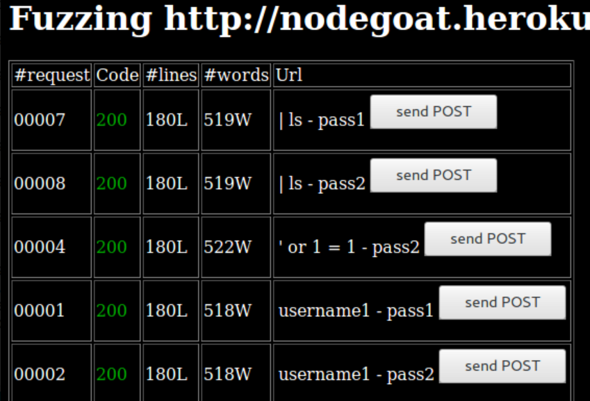
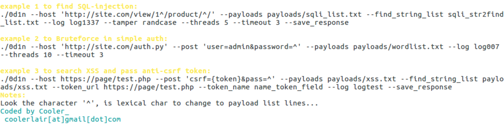
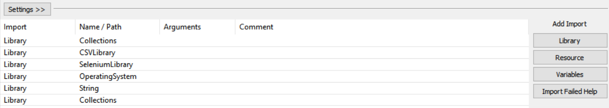
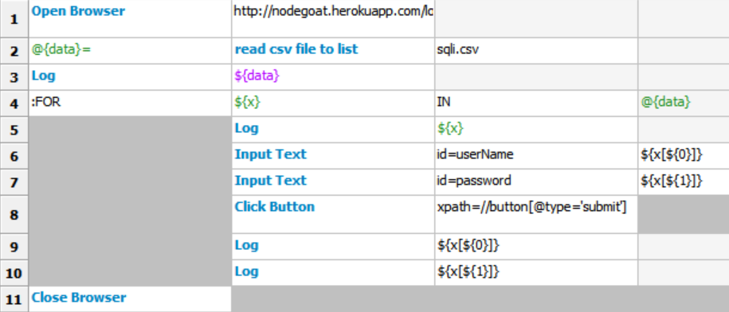

Automated Fuzz API Security Testing
===================================

API fuzz testing can be one of the most effective and efficient methods
for both security and automation testing. API fuzz testing involves
generating fuzz data as data input, sending HTTP requests with fuzz
data, and analyzing the HTTP response for security issues. We will
demonstrate several API fuzz automation tools (Wfuzz and 0d1n), fuzz
techniques, and integration with automation testing frameworks (Selenium
and Robot Framework DDT) in this lab.

The topics that will be covered here are as follows:

-   Fuzz testing and data
-   API fuzz testing with automation frameworks (Wfuzz, 0d1n Selenium
    DDT, and Robot Framework DDT)


Fuzz testing and data
=====================

FuzzDB, Seclist, and Big List of Naughty Strings are data input sources
for security fuzz testing. Here, we will introduce how to dynamically
generate your own security payloads for fuzz testing based on needs.
Fuzz testing is a testing technique used to explore unexpected data
input that can cause potential security issues such as buffer overflows,
unhandled exceptions, or data injection attacks. Fuzz testing requires a
massive systematic random data input, called a fuzz, to test the target
application in an attempt to make it crash or go out of service.

The following diagram shows the relationship between the fuzz data,
testing tools, and ZAP in web security. We will demonstrate the uses of
Radamsa to generate testing data, and illustrate how to apply
**data-driven testing** (**DDT**) techniques and testing tools to send
fuzz data for web security testing. OWASP ZAP plays the HTTP traffic
security analysis proxy role between the testing tools and the web:


Step 1 -- installing Radamsa
============================

For the Windows version, the tool can be downloaded here:
<https://github.com/vah13/radamsa/releases>.

For the Linux version, refer to the following:


```
$ git clone  https://gitlab.com/akihe/radamsa
$ cd radamsa
$ make
$ sudo make install 
$ radamsa --help
```


Step 2 -- generating the Security Random Payloads
=================================================

Here are some examples of data generation based on a given data sample:

-   Generating email-format fuzz data:


```
      $ echo "abc@test.com" | radamsa -n 5 --patterns od
```


-   Generating SQL injection-related fuzz data:


```
      $ echo "' or 1=1" | radamsa -n 5 --patterns od
```


-   Generating JavaScript injection data:


```
      $ echo "<script>alert(1)</script>" | radamsa -n 5 --patterns od
```


-   Generating the [XXX-XXX-XXXX] format-based fuzz data:


```
      $ echo "154-541-3214" | radamsa -n 5 --patterns od
```


-   Generating date-format fuzz data:


```
      $ echo "1977-12-01" | radamsa -n 5 --patterns od
```


The use of Radamsa enables us to dynamically generate fuzz data based on
a sample input. Then, we can use that generated fuzz data as data input
sources for further security testing.


Should I use FuzzDB or Radamsa? FuzzDB provides security data payloads
for various kinds of security testing, such as SQL injection, XXE, XSS,
and command injection. It\'s recommended you use FuzzDB for security
testing. On the other hand, we use Radamsa to generate formatted data to
test unexpected behaviors such as username, ID, telephone number,
address, and date.


API fuzz testing with Automation Frameworks
===========================================

In Lab 5,
*Security API and Fuzz Testing*, we demonstrated how to use JMeter to do
fuzz testing with OWASP ZAP. In this lab, we will demonstrate other
techniques using Selenium/ **data-driven testing** (**DDT**) and the
0d1n. There is no one solution that fits all testing scenarios. It may
depend on the skill-sets of the team, existing testing frameworks, and
integration flexibility.

Some key considerations and applied scenarios are listed in this table:

+-----------------------------------+-----------------------------------+
| **Considerations**                | **Applied scenarios and suggested |
|                                   | technical approaches**            |
+-----------------------------------+-----------------------------------+
| Launch a browser                  | There are pros and cons to        |
|                                   | launching a browser for Web UI    |
|                                   | E2E automation. The key advantage |
|                                   | is that it simulates the human    |
|                                   | behavior for complete E2E         |
|                                   | testing. However, this kind of    |
|                                   | testing execution cycle can be    |
|                                   | time-consuming and prone to error |
|                                   | due to Web UI interactions.       |
|                                   |                                   |
|                                   | Both Selenium and Robot Framework |
|                                   | support Web UI E2E automation.    |
|                                   | These two are very common         |
|                                   | automation testing frameworks.    |
+-----------------------------------+-----------------------------------+
| Programming                       | Selenium supports a wide range of |
|                                   | programming languages such as     |
|                                   | Java, Python, C\#, and Ruby.      |
|                                   | During implementation, we suggest |
|                                   | using the Selenium IDE to         |
|                                   | generate the related code and do  |
|                                   | further customization.            |
|                                   |                                   |
|                                   | The Robot Framework is            |
|                                   | keyword-driven. Although it       |
|                                   | doesn\'t require much programming |
|                                   | skill, the team has to know how   |
|                                   | to use keywords and related       |
|                                   | libraries correctly.              |
|                                   |                                   |
|                                   | JMeter doesn\'t require           |
|                                   | programming, but it will require  |
|                                   | you to understand the HTTP        |
|                                   | GET/POST API requests of the      |
|                                   | target website. This can be done  |
|                                   | by using browser *F12* to monitor |
|                                   | the [http] traffic. Then,   |
|                                   | we will define the HTTP requests  |
|                                   | in JMeter based on this           |
|                                   | information.                      |
|                                   |                                   |
|                                   | 0d1n is a CLI tool. It doesn\'t   |
|                                   | require any programming, but you  |
|                                   | will need to understand the HTTP  |
|                                   | [GET]/[POST] API and  |
|                                   | the parameters of the target      |
|                                   | website.                          |
+-----------------------------------+-----------------------------------+
| Quick testing                     | 0d1n and Wfuzz are standalone     |
|                                   | tools that can do a quick fuzz    |
|                                   | test on the target website        |
|                                   | without any dependencies.         |
|                                   |                                   |
|                                   | Although ZAP can also do fuzz     |
|                                   | testing, it currently can only be |
|                                   | executed in GUI mode.             |
+-----------------------------------+-----------------------------------+
| API-based testing                 | Jmeter, 0d1n, and Wfuzz are good  |
|                                   | candidates for HTTP API-level     |
|                                   | testing due to their simplicity   |
|                                   | of deployment and execution.      |
+-----------------------------------+-----------------------------------+
| Authenticated pages               | If the testing scenario requires  |
|                                   | authenticated pages to walk       |
|                                   | through, it\'s recommended to use |
|                                   | JMeter, Selenium, and Robot       |
|                                   | Framework since these testing     |
|                                   | frameworks can do web UI testing  |
|                                   | very well.                        |
+-----------------------------------+-----------------------------------+

The following table lists the key characteristics of various technical
approaches to implementing fuzz testing:

+---------+---------+---------+---------+---------+---------+---------+
|         | **OWASP | **J     | **Sel   | **Robot | *       | **      |
|         | ZAP**   | Meter** | enium** | Fram    | *0d1n** | Wfuzz** |
|         |         |         |         | ework** |         |         |
|         |         |         | **DDT** |         |         |         |
|         |         |         |         | **DDT** |         |         |
+---------+---------+---------+---------+---------+---------+---------+
| Dep     | No      | OWASP   | OWASP   | CSV     | OWASP   | No      |
| endency |         | ZAP     | ZAP     | Library | ZAP     |         |
+---------+---------+---------+---------+---------+---------+---------+
| Coding  | No      | No      | Yes,    | No      | No      | No      |
|         |         |         | but the |         |         |         |
|         |         |         | S       |         |         |         |
|         |         |         | elenium |         |         |         |
|         |         |         | IDE can |         |         |         |
|         |         |         | help to |         |         |         |
|         |         |         | g       |         |         |         |
|         |         |         | enerate |         |         |         |
|         |         |         | the     |         |         |         |
|         |         |         | script  |         |         |         |
+---------+---------+---------+---------+---------+---------+---------+
| Fuzz    | ZAP UI  | CSV     | DDT     | CSV     | [Λ      | [FUZZ   |
| data    | mode    | Config  | library | Library | ] | ] |
| handing | only    | in      | in      |         | in the  | or      |
|         |         | JMeter  | Python  | [for    | command | [FUZ2Z  |
|         |         |         |         | ] | line    | ] |
|         |         |         |         | Loop    |         | keyword |
+---------+---------+---------+---------+---------+---------+---------+
| Testing | Refer   | Refer   | Refer   | Refer   | Refer   | Output  |
| report  | to      | to      | to      | to      | to      | to the  |
|         | OWASP   | OWASP   | OWASP   | OWASP   | OWASP   | console |
|         | ZAP     | ZAP     | ZAP     | ZAP     | ZAP     | or file |
+---------+---------+---------+---------+---------+---------+---------+
| Fuzz    | Yes     | Yes     | Yes     | Yes     | Yes,    | Yes     |
| m       |         |         |         |         | but     |         |
| ultiple |         |         |         |         | other   | [FUZZ]  |
| par     |         |         |         |         | values  | , |
| ameters |         |         |         |         | may be  | [FUZ2Z] |
|         |         |         |         |         | filled  | , |
|         |         |         |         |         | as      | [       |
|         |         |         |         |         | empty   | FUZ3Z]{ |
|         |         |         |         |         |         | .kbd}.. |
+---------+---------+---------+---------+---------+---------+---------+
| Inte    | No      | RESTful | S       | Robot   | **comma | CLI     |
| gration |         | APIs    | elenium | Fr      | nd-line |         |
| in      |         |         | scripts | amework | inte    |         |
| terface |         | JMeter  |         | scripts | rface** |         |
|         |         | scripts |         |         | (*      |         |
|         |         |         |         |         | *CLI**) |         |
+---------+---------+---------+---------+---------+---------+---------+
| Testing | The API | High    | High    | High    | Low     | MED     |
| fr      | and CLI |         |         |         |         |         |
| amework | don\'t  | JMeter  | Common  | Common  | 0d1n is |         |
| pop     | support | is      | web UI  | acc     | speci   |         |
| ularity | fuzz    | common  | fr      | eptance | fically |         |
|         | testing | in REST | amework | testing | built   |         |
|         | at this | API and |         | fr      | for     |         |
|         | point   | perf    |         | amework | fuzz    |         |
|         |         | ormance |         |         | testing |         |
|         |         | testing |         |         | in the  |         |
|         |         |         |         |         | CLI     |         |
+---------+---------+---------+---------+---------+---------+---------+
| Launch  | No      | No      | Yes     | Yes     | No      | No      |
| browser |         |         |         |         |         |         |
| during  |         |         |         |         |         |         |
| testing |         |         |         |         |         |         |
+---------+---------+---------+---------+---------+---------+---------+

In the following sections, we will demonstrate how these techniques and
tools can be applied to security fuzz testing with the NodeGoat sign-in
API.


Which is the best solution? If your team has created the automation
frameworks you\'re using or you are familiar with specific tools such as
JMeter, Selenium, or Robot Framwork, it\'s suggested you build on top of
it instead of introducing a new one.


Approach 1 -- security fuzz testing with Wfuzz
==============================================

In this demonstration, we will use Wfuzz to do username and password
fuzz testing with the sign-in page. The values of the username and
password will be provided with [cmdi.csv] and [sqli.csv] .


Step 1 -- installing Wfuzz
==========================

It\'s suggested you install Wfuzz on Linux. Follow these commands to
install Wfuzz:


```
$ git clone https://github.com/xmendez/wfuzz
$ cd wfuzz/
$ sudo python setup.py install
```


Step 2-- fuzz testing with sign-in
==================================

The basic use of Wfuzz testing with sign-in is shown as follows:


```
wfuzz -c -z file,name.csv -z file,pass.csv -f Wfuzz_report.html,html -d "userName=FUZZ&password=FUZ2Z&_csrf=" http://nodegoat.herokuapp.com/login
```


Here is the explanation of how each option is used in our case:

+-----------------------------------+-----------------------------------+
| **Options**                       | **Explanation of use**            |
+-----------------------------------+-----------------------------------+
| [-c]                        | Color output on the console       |
+-----------------------------------+-----------------------------------+
| [-z file,\<filename\>]      | Read the values from a file to    |
|                                   | replace [FUZZ],             |
|                                   | [FUZ2Z\...FUZnZ].           |
|                                   |                                   |
|                                   | In our example, we have two       |
|                                   | parameters to be replaced with    |
|                                   | fuzz data.                        |
+-----------------------------------+-----------------------------------+
| [-f                               | Output the result to an HTML file |
| \<Output\_filename\>,html]  | named [Wfuzz\_report.html]  |
+-----------------------------------+-----------------------------------+
| [-d \"name=FUZZ\"]          | It defines the [POST]       |
|                                   | message body. The [FUZZ]    |
|                                   | keyword and [FUZ2Z] will be |
|                                   | replaced with the file input,     |
|                                   | which was defined by using        |
|                                   | [-z] file previously.       |
+-----------------------------------+-----------------------------------+

Although it\'s not a must, it\'s also suggested to configure OWASP ZAP
as a system proxy. This will allow OWASP ZAP to analyze the HTTP
requests/responses for potential security issues. After all, OWASP ZAP
includes a more powerful security detection engine while Wfuzz can only
do basic results analysis.


Step 3 -- reviewing the Wfuzz report
====================================

Wfuzz will output a summary report to the console and also in HTML. In
the console, the response column shows the response code. It also shows
the number of lines, words, and chars of the HTTP response, based on
each specified Payload. Here are some tips for reading the HTTP
response, based on this kind of fuzz testing:

+-----------------------------------+-----------------------------------+
| **HTTP response code**            | **What it means in security       |
|                                   | testing**                         |
+-----------------------------------+-----------------------------------+
| 200                               | It means the target resource is   |
|                                   | available. It\'s useful for       |
|                                   | directory traversal to identify   |
|                                   | whether the resources, URL, or    |
|                                   | path are available.               |
+-----------------------------------+-----------------------------------+
| 302                               | If it\'s for sign-in testing, it  |
|                                   | can be an indicator of login      |
|                                   | success. If we are doing          |
|                                   | brute-force sign-in testing, we   |
|                                   | will be looking for the major     |
|                                   | variation responses among all the |
|                                   | HTTP responses. For example, all  |
|                                   | other requests return 200, but a  |
|                                   | few requests return 302.          |
+-----------------------------------+-----------------------------------+
| 404                               | Page or resource not found. It\'s |
|                                   | used to identify that the target  |
|                                   | resource is available.            |
+-----------------------------------+-----------------------------------+
| 401 or 403                        | This can be an indicator that the |
|                                   | resource is available but the     |
|                                   | request is unauthorized.          |
+-----------------------------------+-----------------------------------+
| 50x                               | This can be a serious security    |
|                                   | issue; one of the following needs |
|                                   | further investigation:            |
|                                   |                                   |
|                                   | -   Excessive system information  |
|                                   |     exposure                      |
|                                   | -   Symptoms of SQL injection due |
|                                   |     to error exposure             |
|                                   | -   Denial of service             |
+-----------------------------------+-----------------------------------+

Here is a screenshot of the Wfuzz console output. Look for any
variations in the responses. In this case, all of the responses are 200.
If any requests return non-200 responses, they will need further
investigation. For lines, words, and chars, we are also looking for a
major variation of the request, which can be an indicator of potential
security issue:





In addition, Wfuzz also provides a HTML report. If you found any request
suspicious, click [send POST] to trigger the HTTP request
again:





Wfuzz testing report


Approach 2 -- security fuzz testing with 0d1n
=============================================

In this demonstration, we will be using another fuzz tool, 0d1n, to do
fuzz testing with NodGoat sign-in.


Step 1 -- installation of 0d1n
==============================

The installation of 0d1n requires it to be compiled from the source code
and [libcurl] installed. Follow these commands shown as follows:


```
$ git clone https://github.com/CoolerVoid/0d1n/
$ sudo apt-get install libcurl-dev

$ sudo yum install libcurl-devel

$ make

$ ./0d1n
```


If the installation is successful, the [./0d1n] command should be
able to list the detailed usage of the tool.

This screenshot shows the execution of [./0d1n] for the usage
examples:





0d10 usage


Step 2 -- execution of 0d1n with OWASP ZAP
==========================================

The following command will trigger fuzz testing against the NodeGoat
login page. In addition, 0d1n can also easily define the proxy which we
will specify OWASP ZAP here. Although running ZAP can be optional, it
will be a supplement to [0d1n] to detect security issue based on
HTTP requests/responses:


```
$ ./0d1n --host 'http://nodegoat.herokuapp.com/login' --post 'userName=user1&password=^&_csrf=' --payloads ./payloads/user.txt --log log001 --threads 3 --timeout 5 --proxy 127.0.0.1:8090 --find_string_list ./payloads/response.txt --save_response --tamper randcase
```


Following are the list of commands used in execution of 0d1n:

  ------------------------------------------------ -------------------------------------------------------------------------------------------------------------------
  **Command options**                              **Explanation of use**
  [\--host \'\<target Host\>\']              Define the target website
  [\--post \'\<Post Message body\>\']        Define the POST message body. The [∧] symbol will be replaced with fuzz data, which is defined by payloads.
  [\--payloads \<filename\>]                 Define the source of the payloads for fuzz data input
  [\--log \<logName\>]                       The log name
  [\--proxy \<host:port\>]                   In our case, we still use ZAP as a proxy to monitor security issues
  [\--find\_string\_list \<response.txt\>]   0d1n allows us to search for some suspicious strings in the HTTP response
  [\--save\_response]                        Enable the save response highlights view when you click on a HTTP status code in data tables
  [\--tamper randcase]                       Use lowercase and uppercase random position in a string
  ------------------------------------------------ -------------------------------------------------------------------------------------------------------------------


Step 3 -- review the ZAP report (optional)
==========================================

To review the security issues identified by OWASP ZAP, execute this
command:


```
$ zap-cli report -o   ZAP_Report.html  -f html
```


Approach 3 -- Selenium DDT (data-driven testing)
================================================

In this approach, we will be using selenium to do the sign-in and the
DDT techniques to read all the fuzz data from the file
([sqli.csv]).


Step 1: Selenium script with DDT
================================

Here is the fuzz data we prepared for the username and password input.
The [sqli.csv] file defined two columns of data, which are
username and password:


```
username,password
a,a
)%20or%20('x'='x,''
%20or%201=1,' 1=1
```


The key highlight of the [SignIn\_DDT\_NodeGoat.py] Selenium
Python script is the adoption of the DDT module. The code in bold is
mostly related how to read each value from [sqli.csv] and replace
them with the username and password parameters for every HTTP request:


```
# -*- coding: utf-8 -*-
# SignIn_DDT_NodeGoat.py
from selenium import webdriver
from selenium.webdriver.common.by import By
from selenium.webdriver.common.keys import Keys
from selenium.webdriver.support.ui import Select
from ddt import ddt, data, unpack
import csv
import unittest, time, re

@ddt
class NodeGoatSignIn(unittest.TestCase):
    # the method is used to read the "sqli.csv" file.
    def get_csv_data(csv_path):
        rows = []
        csv_data = open(str(csv_path), "rb")
        content = csv.reader(csv_data)
        next(content, None)
        for row in content:
            rows.append(row)
        return rows
  
    @classmethod
    def setUp(self):
        self.driver = webdriver.Firefox()
        self.driver.implicitly_wait(30)

    
  # The @data and @unpack will help to read all the data in the 'sqli.csv' for the testing loop of the test_sign_in method
    @data(*get_csv_data("sqli.csv"))
    @unpack
    def test_sign_in(self, username, password):
        driver = self.driver
        
        # The following steps may be changed based on your web UI operations senarios.
        # Selenium IDE is suggested to generate the following scripts. 
        driver.get("http://nodegoat.herokuapp.com/login")
        driver.find_element_by_id("userName").click()
        driver.find_element_by_id("userName").clear()
        driver.find_element_by_id("userName").send_keys(username)
        driver.find_element_by_id("password").click()
        driver.find_element_by_id("password").clear()
        driver.find_element_by_id("password").send_keys(password)
        driver.find_element_by_xpath("//button[@type='submit']").click()
    
    @classmethod
    def tearDown(self):
        self.driver.quit()
        
if __name__ == "__main__":
    unittest.main()


```


The Selenium/Python script can be automatically generated by using the
Katalon Recorder browser extension. Once the script is generated, add
the DDT parts of the code shown in bold.


Step 2 -- executing the Selenium script
=======================================

If the SeleniumBASE framework is installed, we can use the following
command to trigger test execution. The [127.0.0.1:8090] proxy is
the OWASP ZAP proxy. By executing the command, it will launch Firefox
for sign-in with every value defined in [sqli.csv]. It may take a
while, since it will launch and close Firefox for every request:


```
$ pytest   SignIn_DDT_NodeGoat.py  --proxy=127.0.0.1:8090
```


Step 3 -- review the ZAP report
===============================

Once the testing is done, refer to the OWASP ZAP report:


```
$ zap-cli report -o   ZAP_Report.html  -f html
```


Approach 4 -- Robot Framework DDT testing
=========================================

In this case, we will be doing the same scenario. However, instead of
using Selenium and Python, we will use Robot Framework to perform the
DDT testing for the NodeGoat sign-in. We will still read the
[sqli.csv] file to do the username and password fuzz testing.


Step 1-- Robot Framework environment setup
==========================================

The Robot Framework environment setup may refer to Lab 9,
*BDD Acceptance Security Testing*. In this testing scenario, in addition
to Robot Framework, we will also require the following external
libraries:

  ----------------------------- --------------------------------------------------------------- --------------------------------------------------------------
  **Robot Framework library**   **How to install**                                              **Usage scenarios in this case**
  CSVLibrary                    [pip install -U robotframework-csvlibrary]                Read values from the CSV file
  SeleniumLibrary               [pip install \--upgrade robotframework-seleniumlibrary]   Launch the browser and execute the defined web UI operations
  ----------------------------- --------------------------------------------------------------- --------------------------------------------------------------

In addition, the selenium web drivers also need to be installed on the
testing machine. This approach assumes that ZAP is running and the
system proxy is configured to the ZAP proxy properly.


Step 3 -- Robot Framework script
================================

To complete the testing scenario, here are some major robot framework
keywords used in this case:

  -------------------------------- -------------------------------------------------------------------------------------------------------------
  **Keyword commands**             **Use of the keyword**
  read [.csv] file to list   Read the [sqli.csv] CSV file to the list
  Open Browser                     Open the browser
  Log                              Print the value to the log
  [FOR \.....IN]             This is a loop to read all the values of the CSV files
  Input Text                       Locate the NodeGoat sign-in username and password, and input the text with the values from [sqli.csv]
  Click button                     Click the [Submit] button on the NodeGoat website
  Close Browser                    Close the browser for every test
  -------------------------------- -------------------------------------------------------------------------------------------------------------

The Robot Framework [RF\_DDT.robot] script will be defined as
follows:


```
*** Settings ***
Library Collections
Library CSVLibrary
Library SeleniumLibrary
Library OperatingSystem
Library String
Library Collections

*** Test Cases ***
SignIn_DDT
 Open Browser http://nodegoat.herokuapp.com/login
 @{data}= read csv file to list sqli.csv
 Log ${data}
 :FOR ${x} IN @{data}
 \ Log ${x}
 \ Input Text id=userName ${x[${0}]}
 \ Input Text id=password ${x[${1}]}
 \ Click Button xpath=//button[@type='submit']
 \ Log ${x[${0}]}
 \ Log ${x[${1}]}
 Close Browser
```


In the Robot Framework RIDE, the script will look like this. This
screenshot shows the [Settings] section of the script:





Robot Framework settings


The screenshot shows the steps definition of the Robot Framework in the
RIDE editor:





DDT Testing Script in Robot Framework


To execute the robot Framework execute the following command:


```
$ robot   RF_DDT.robot
```


The Robot Framework itself has limited capability to analyze security
issues in HTTP responses. Therefore, it\'s suggested to configure OWASP
ZAP as the system proxy.


Step 4 -- review the ZAP report
===============================

Use this command to generate the ZAP report:


```
$ zap-cli report -o   ZAP_Report.html  -f html
```


Summary
=======

In this lab, we discussed various kinds of techniques to achieve API
fuzz security testing. We have introduced the use of FuzzDB and seclist
for the sources of data input. In addition, we also demonstrated the use
of Radamsa, which allows us to dynamically generate fuzz data based on a
specified data sample.

For the API fuzz testing, we also demonstrated some automation
frameworks and tools such as JMeter, Selenium/DDT, Robot Framework DDT,
0d1n, Wfuzz, and integration with ZAP. During API fuzz testing, it\'s
recommended to apply ZAP as a proxy to identify security issues. We
demonstrated four different technical approaches.

*Approach 1* is to do the testing using Wfuzz. It can do the fuzz
testing with multiple parameters, and output a summary of response codes
and the number of lines, words, and chars of every HTTP response. Wfuzz
testing is a good candidate for login brute-force, directory traversal,
and RESTful API testing.

In *Approach 2*, we use 0d1n for fuzz testing, which is similar to
Wfuzz. During testing, we specified [find\_string\_list] and
executed OWASP ZAP to identify security issues based on HTTP responses.

Selenium with DDT is demonstrated in *Approach 3*. The behavior is
mostly close to human behaviors due to the launch of browser and Web UI
interaction behaviors. In the selenium script, we apply a DDT module to
read the FuzzDB files for the input of username and password. OWASP ZAP
is used to identify security issues.

In the final approach, Robot Framework DDT is used. This is similar to
the Selenium/DDT approach. However, the Robot Framework script is
defined by keyword driven instead of programming languages. It makes the
Robot Framework script more readable. In Robot Framework, CSVLibrary is
used to read the CSV files for FuzzDB data input.

In the next lab, we will introduce infrastructure security testing.


Questions
=========

1.  Which one is not used for fuzz testing a data source?
    1.  FuzzDB
    2.  Seclist
    3.  Radamsa
    4.  None of the above
2.  Which automation framework cannot simulate human behaviors for web
    UI operations?
    1.  Selenium
    2.  Robot Framework
    3.  ZAP
    4.  All of the above
3.  What is the keyword used for Wfuzz to replace with fuzz data in the
    command?
    1.  [FUZZ]
    2.  [@]
    3.  [∧]
    4.  [DATA]
4.  Which one best describes the HTTP response code 401/403?
    1.  URL or path is available
    2.  An indicator of login success
    3.  An indicator that the resource is available but the request is
        unauthorized
    4.  Symptoms of SQL injection due to error exposure


5.  What is not the key characteristics to use Robot Framework?
    1.  Keyword-driven script
    2.  SeleniumLibrary can be used to launch a browser and simulate
        human web operations
    3.  Fast execution cycle
    4.  CSVLibrary is used to read fuzz data files


Further reading
===============

-   **Naughty Strings**:
    [https://github.com/minimaxir/big-list-of-naughty-strings/blob/master/blns.tx](https://github.com/minimaxir/big-list-of-naughty-strings/blob/master/blns.txt)
-   **FuzzDB**: <https://github.com/fuzzdb-project/fuzzdb>
-   **Data Production System**:
    <https://code.google.com/archive/p/ouspg/wikis/Blab.wiki>
-   **Robot Framework Selenium Library**:
    <http://robotframework.org/SeleniumLibrary/>
-   **Robot Framework CSV Library**:
    <http://github.com/s4int/robotframework-CSVLibrary>
-   **Wfuzz**: <http://wfuzz.readthedocs.io/en/latest/>
-   **0d1n fuzz testing**: <http://github.com/CoolerVoid/0d1n>
