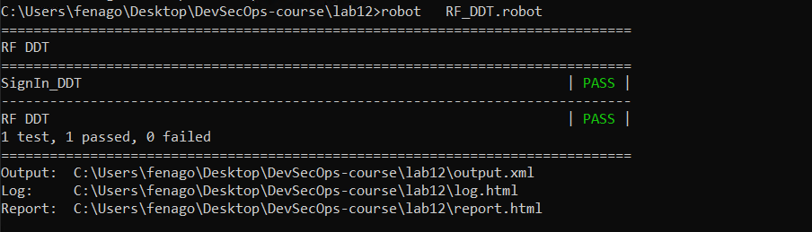

Automated Fuzz API Security Testing
===================================

API fuzz testing can be one of the most effective and efficient methods
for both security and automation testing. API fuzz testing involves
generating fuzz data as data input, sending HTTP requests with fuzz
data, and analyzing the HTTP response for security issues. We will
demonstrate several API fuzz automation tools (Wfuzz and 0d1n), fuzz
techniques, and integration with automation testing frameworks (Selenium
and Robot Framework DDT) in this lab.

The topics that will be covered here are as follows:

-   Fuzz testing and data
-   API fuzz testing with automation frameworks (Wfuzz, 0d1n Selenium
    DDT, and Robot Framework DDT)


Fuzz testing and data
=====================

FuzzDB, Seclist, and Big List of Naughty Strings are data input sources
for security fuzz testing. Here, we will introduce how to dynamically
generate your own security payloads for fuzz testing based on needs.
Fuzz testing is a testing technique used to explore unexpected data
input that can cause potential security issues such as buffer overflows,
unhandled exceptions, or data injection attacks. Fuzz testing requires a
massive systematic random data input, called a fuzz, to test the target
application in an attempt to make it crash or go out of service.

The following diagram shows the relationship between the fuzz data,
testing tools, and ZAP in web security. We will demonstrate the uses of
Radamsa to generate testing data, and illustrate how to apply
**data-driven testing** (**DDT**) techniques and testing tools to send
fuzz data for web security testing. OWASP ZAP plays the HTTP traffic
security analysis proxy role between the testing tools and the web:


Step 1 -- installing Radamsa
============================

radamsa.exe has been downloaded from here:
<https://github.com/vah13/radamsa/releases>.


Step 2 -- generating the Security Random Payloads
=================================================

Here are some examples of data generation based on a given data sample:

- Generating email-format fuzz data:


```
echo "abc@test.com" | radamsa -n 5 --patterns od
```

- Generating JavaScript injection data:


```
echo "<script>alert(1)</script>" | radamsa -n 5 --patterns od
```


- Generating the [XXX-XXX-XXXX] format-based fuzz data:


```
echo "154-541-3214" | radamsa -n 5 --patterns od
```


- Generating date-format fuzz data:


```
echo "1977-12-01" | radamsa -n 5 --patterns od
```


The use of Radamsa enables us to dynamically generate fuzz data based on
a sample input. Then, we can use that generated fuzz data as data input
sources for further security testing.


API fuzz testing with Automation Frameworks
===========================================

In Lab 5, *Security API and Fuzz Testing*, we demonstrated how to use JMeter to do
fuzz testing with OWASP ZAP. In this lab, we will demonstrate other
techniques using Selenium/ **data-driven testing** (**DDT**).


Approach - Selenium DDT (data-driven testing)
=============================================

In this approach, we will be using selenium to do the sign-in and the
DDT techniques to read all the fuzz data from the file
([sqli.csv]).


Step 1: Selenium script with DDT
================================

Here is the fuzz data we prepared for the username and password input.
The [sqli.csv] file defined two columns of data, which are
username and password:


```
username,password
a,a
)%20or%20('x'='x,''
%20or%201=1,' 1=1
```


The key highlight of the [SignIn\_DDT\_NodeGoat.py] Selenium
Python script is the adoption of the DDT module. The code in bold is
mostly related how to read each value from [sqli.csv] and replace
them with the username and password parameters for every HTTP request:


```
# -*- coding: utf-8 -*-
# SignIn_DDT_NodeGoat.py
from selenium import webdriver
from selenium.webdriver.common.by import By
from selenium.webdriver.common.keys import Keys
from selenium.webdriver.support.ui import Select
from ddt import ddt, data, unpack
import csv
import unittest, time, re

@ddt
class NodeGoatSignIn(unittest.TestCase):
    # the method is used to read the "sqli.csv" file.
    def get_csv_data(csv_path):
        rows = []
        csv_data = open(str(csv_path), "rb")
        content = csv.reader(csv_data)
        next(content, None)
        for row in content:
            rows.append(row)
        return rows
  
    @classmethod
    def setUp(self):
        self.driver = webdriver.Firefox()
        self.driver.implicitly_wait(30)

    
  # The @data and @unpack will help to read all the data in the 'sqli.csv' for the testing loop of the test_sign_in method
    @data(*get_csv_data("sqli.csv"))
    @unpack
    def test_sign_in(self, username, password):
        driver = self.driver
        
        # The following steps may be changed based on your web UI operations senarios.
        # Selenium IDE is suggested to generate the following scripts. 
        driver.get("http://nodegoat.herokuapp.com/login")
        driver.find_element_by_id("userName").click()
        driver.find_element_by_id("userName").clear()
        driver.find_element_by_id("userName").send_keys(username)
        driver.find_element_by_id("password").click()
        driver.find_element_by_id("password").clear()
        driver.find_element_by_id("password").send_keys(password)
        driver.find_element_by_xpath("//button[@type='submit']").click()
    
    @classmethod
    def tearDown(self):
        self.driver.quit()
        
if __name__ == "__main__":
    unittest.main()

```


The Selenium/Python script can be automatically generated by using the
Katalon Recorder browser extension. Once the script is generated, add
the DDT parts of the code shown in bold.


Step 2 -- executing the Selenium script
=======================================

If the SeleniumBASE framework is installed, we can use the following
command to trigger test execution. The [127.0.0.1:8090] proxy is
the OWASP ZAP proxy. By executing the command, it will launch Firefox
for sign-in with every value defined in [sqli.csv]. It may take a
while, since it will launch and close Firefox for every request:


```
cd C:\Users\fenago\Desktop\DevSecOps-course\lab12

pytest   SignIn_DDT_NodeGoat.py  --proxy=127.0.0.1:8090
```


Step 3 -- review the ZAP report
===============================

Once the testing is done, refer to the OWASP ZAP report:


```
zap-cli report -o   ZAP_Report.html  -f html
```


Approach 4 -- Robot Framework DDT testing
=========================================

In this case, we will be doing the same scenario. However, instead of
using Selenium and Python, we will use Robot Framework to perform the
DDT testing for the NodeGoat sign-in. We will still read the
[sqli.csv] file to do the username and password fuzz testing.


Step -- Robot Framework script
==============================

To complete the testing scenario, here are some major robot framework
keywords used in this case:


The Robot Framework [RF\_DDT.robot] script will be defined as
follows:


```
*** Settings ***
Library Collections
Library CSVLibrary
Library SeleniumLibrary
Library OperatingSystem
Library String
Library Collections

*** Test Cases ***
SignIn_DDT
 Open Browser http://nodegoat.herokuapp.com/login
 @{data}= read csv file to list sqli.csv
 Log ${data}
 :FOR ${x} IN @{data}
 \ Log ${x}
 \ Input Text id=userName ${x[${0}]}
 \ Input Text id=password ${x[${1}]}
 \ Click Button xpath=//button[@type='submit']
 \ Log ${x[${0}]}
 \ Log ${x[${1}]}
 Close Browser
```

To execute the robot Framework execute the following command:


```
cd C:\Users\fenago\Desktop\DevSecOps-course\lab12

robot   RF_DDT.robot
```



The Robot Framework itself has limited capability to analyze security
issues in HTTP responses. Therefore, it\'s suggested to configure OWASP
ZAP as the system proxy.


Step 4 -- review the ZAP report
===============================

Use this command to generate the ZAP report:


```
zap-cli report -o   ZAP_Report.html  -f html
```


Summary
=======

In this lab, Selenium with DDT is demonstrated . The behavior is
mostly close to human behaviors due to the launch of browser and Web UI
interaction behaviors. In the selenium script, we apply a DDT module to
read the FuzzDB files for the input of username and password. OWASP ZAP
is used to identify security issues.

In the final approach, Robot Framework DDT is used. This is similar to
the Selenium/DDT approach. However, the Robot Framework script is
defined by keyword driven instead of programming languages. It makes the
Robot Framework script more readable. In Robot Framework, CSVLibrary is
used to read the CSV files for FuzzDB data input.

In the next lab, we will introduce infrastructure security testing.


