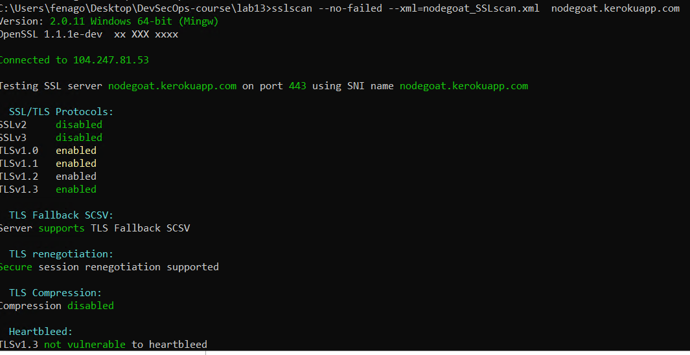

Automated Infrastructure Security
=================================

In this lab, we will demonstrate how to automate infrastructure
security testing against the NodeGoat website. The infrastructure
security testing will include known vulnerable JavaScript libraries,
insecure SSL configurations, and the advanced NMAP NSE script testing
technique for web security. At the end, we will also illustrate how to
apply the BDD automation framework to SSLScan and NMAP.

The topics that will be covered in this lab are as follows:

-   Scan For known JavaScript vulnerabilities
-   Scanning with OWASP dependency check
-   Secure communication scan with SSLScan
-   NMAP security scan with the BDD framework

Scan For known JavaScript vulnerabilities
=========================================

We will be using RetireJS because it\'s simple to use and provides
several ways of scanning, such as a command-line scanner, Grunt plugin,
browser (Chrome/Firefox) extension, and also the Burp and OWASP Zap
plugins. In our demonstration, we will be using the command-line scanner
in the following steps.


Step 1 -- install RetireJS
==========================

RetireJS has been installed in the lab environment using `npm`


Step 2 -- scan with RetireJS
============================

Once it\'s installed, we may specify the target project to be scanned.
In our example, we will scan the whole project under the
[/NodeGoat/] path:


```
cd C:\Users\fenago\Desktop\DevSecOps-course\lab13

retire   --path   ./NodeGoat/    --colors
```


Step 3 -- review the retireJS results
=====================================

The RetireJS scanning results show critical issues in red. There are two
major known vulnerabilities with these JavaScript libraries:


The following screenshot shows the retireJS scanning results for the
NodeGoat project:


WebGoat with OWASP dependency check
===================================

In addition to RetireJS, we will also the OWASP dependency check to scan
all the files of the NodeGoat project for known vulnerable libraries.
Follow these steps for the OWASP dependency check scan.


Step 1 -- prepare WebGoat environment
=====================================

To better demonstrate the scanning results of the OWASP dependency
check, we will use the WebGoat project instead of NodeGoat. The WebGoat
project can be downloaded from Git. WebGoat is a purpose-built
vulnerable web project used to practice security testing:


```
git    clone    https://github.com/WebGoat/WebGoat
```


Step 2 -- dependency check scan
===============================

To execute the dependency-check, locate the
[\\dependency-check\\bin\\] path. Refer to the following command for the WebGoat
project scan:


```
dependency-check --project WebGoat --format XML --scan C:\Users\fenago\Desktop\DevSecOps-course\lab13\WebGoat

dependency-check --project WebGoat --format HTML --scan C:\Users\fenago\Desktop\DevSecOps-course\lab13\WebGoat
```


The XML report format can be useful to import into other security
management tools.

It will take a while to download the NVD CVE. If you would like to do
the scan without downloading the NVD CVE, you may specify the
[\--noupdate] option.


Step 3 -- review the OWASP dependency-check report
==================================================

After the scan, the report will be generated under the
[\\dependency-check\\bin\\] execution path. The filenames are
[dependency-check-report.html] and the
[dependency-check-report.xml]:


Secure communication scan with SSLScan
======================================

In this demonstration, we will inspect vulnerable security
configurations with HTTPS. The tool we will be using is SSLScan. Follow
these steps to perform the scan.


Step 1 -- SSLScan setup
=======================

To Do:


Step 2 -- SSLScan scan
======================

To execute sslscan, we will specify the output as XML, and also specify
the target website\'s URL:


```
sslscan --no-failed --xml=nodegoat_SSLscan.xml  nodegoat.kerokuapp.com
```


[\--no-failed] means only *accepted* connections will be listed in
the test results. When reviewing the SSLSCan test results, we will only
focus on those connections with *accepted*.


Step 3 -- review the SSLScan results
====================================

Here are the SSLScan results without the options of
[\--no-failed]. Please focus on connections with *accepted* only.
When reading the SSLScan test results, we will focus on weak HTTPS
protocols and encryption algorithms such as SSL v3, TLS v1.0, TLS v1.1,
and NULL. Generally, the following will be considered as vulnerable:

-   SSLv2 and SSLv3
-   Symmetric encryption algorithms smaller than 112 bits
-   X509 certificates with RSA or DSA keys smaller than 2048 bits
-   Weak hash algorithms such as MD5

This screenshot shows the sslScan results for the NodeGoat website:





In addition to SSLScan, we can also use SSLTest, SSLyze, or NAMP for SSL
configuration inspection.


To read the SSLScan test results, focus on the connections with
*accepted* or specify [\--no-failed] to reduce unnecessary
information.


Step 4 -- fix the HTTPS secure configurations
=============================================

The secure HTTPS configuration of a website can be very tedious and
prone to mistakes. It\'s suggested to use the Mozilla SSL configuration
generator. It will help to generate secure SSL configurations based on
the web server. Refer to
<https://mozilla.github.io/server-side-tls/ssl-config-generator/> for
details.


NMAP security scan with BDD framework
=====================================

The test results for NMAP may be difficult to understand and take time
to interpret for non-security professionals. The purpose of integration
with BDD and NMAP allows us to define the NMAP execution in plain
English. In this example, we will use NAMP to execute some common web
security tests with an **NMAP NSE** (**NMAP Scripting Engine**) script.
Due to the execution of NMAP and the scanning results can be difficult
to interpret, we will apply the Gauntlt framework to execute NMAP.
Please be reminded that NAMP web security testing cannot replace a web
scanner such as ZAP, due to the limitations of the security payloads and
detection engine of NMAP.


NMAP For web security testing
=============================

We will be using the NMAP NSE for the following security testing:
security header check, HTTP slow DOS check, SSL cipher check, XSSed
history check, SQL injection check, and stored XSS check.

This table lists the NMAP security testing scenario, the NSE script we
will need, and the expected results:


The [-oX] option can be used to generate the output in an
XML-format file:


```
nmap -p80 --script http-security-headers nodegoat.kerokuapp.com  -oX nodeGoat_NmapScan_HTTPheaders.xml
```


We will be using these NMAP security testing commands and expected
results to integrate with the BDD framework Gauntlt in the following
demonstrations.


NMAP BDD with Robot Framework
=============================

We will apply Robot Framework with NMAP in this
demonstration. Here are some of the key components to be used in this
testing scenario:


Step 1 -- define the Robot Framework steps
==========================================

If you use \'Run Process\' to execute NMAP, please be aware that it will
require double spaces between each parameter in the command options.
Otherwise, the Robot Framework will return a file not found error even
if NMAP is installed. In our example, the command options are [-p80
\--script http-xssed nodegoat.kerokuapp.com]:


```
*** Settings ***
Library Process

*** Test Cases ***
Testing if the website was previously reported XSS
     ${result} = Run Process nmap  -p80  --script  http-xssed  nodegoat.kerokuapp.com
     Log         ${result.stdout}
     Should Contain ${result.stdout} No previously reported
```


Robot Framework has several verification keywords built in, such as
\'Should Be Equal\', \'Should Start With\', \'Should End With\' \'Should
Not Match\', \'Should Match Regexp\', and so on. Refer to
<http://robotframework.org/robotframework/latest/libraries/BuiltIn.html#Should%20Be>
for more details.


Step 2 -- execute and review the results
========================================

To execute the robot Framework script, use the following command:


```
robot    nmap_NodeGoat.robot
```


The following screenshot shows the test results for robot framework. It also generates HTML reports:


Here is one of the Robot framework HTML reports, [log.html]:


Summary
=======

In this lab, we demonstrated infrastructure security testing against
the NodeGoat website using RetireJS, OWASP dependency check, SSL
communication configuration, and integration with BDD frameworks. These
security testing scenarios cover the known vulnerable libraries check,
secure SSL configuration check, and basic web security check.

The RetireJS and OWASP dependency check can identify the known CVE of
libraries, based on a scan of their project source files. SSLScan is
used to inspect any vulnerable HTTPS configurations such as SSL, short
encryption keys, and weak HSA or encryption algorithms.

We also illustrated how NMAP NSE can be used to do basic web security
inspections such as XSS and SQL injection. An NMAP security scan with
the integration of Robot Framework was also demonstrated.
BDD testing techniques can help to make infrastructure security testing
easier to understand and can even be maintained by a non-security team.
