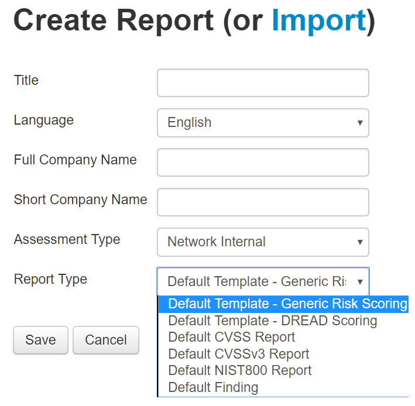
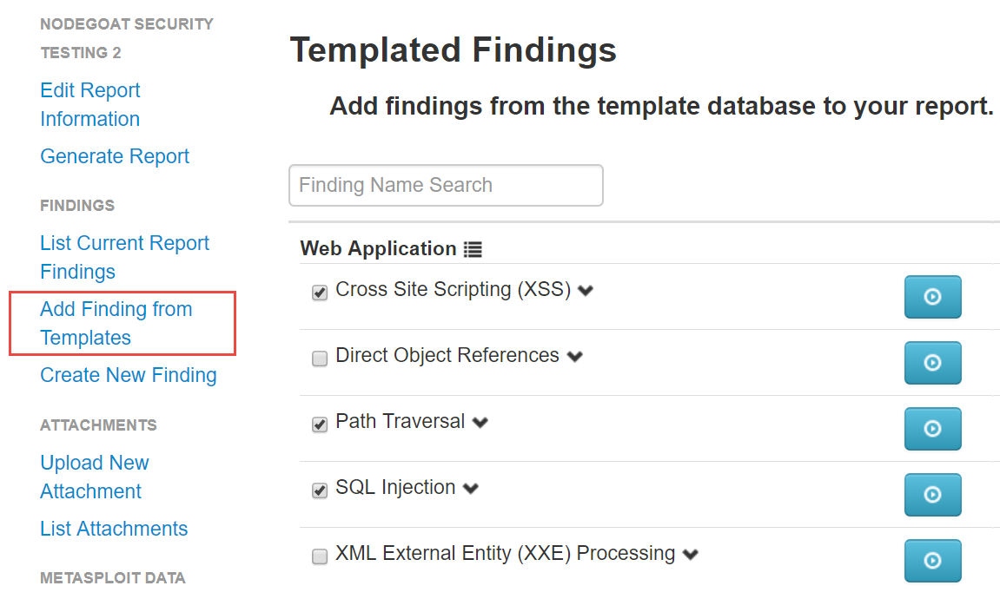
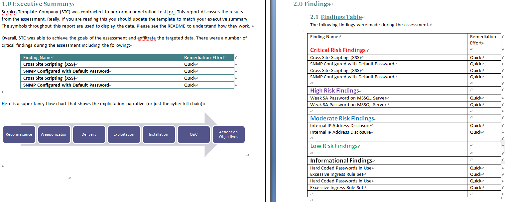

Managing and Presenting Test Results
====================================

In this lab, we will cover the following topics:

-   Managing and presenting test results
-   Approach - generating a professional pentest report with Serpico


Approach - generate a professional pentest report with Serpico
=================================================================

A summary of the security testing documentation will help you to
communicate with stakeholders. The report should not only list the
security findings but also how they were identified, the testing scope,
the methodology, and also mitigation suggestions. It\'s a common
practice for an independent security testing firm to produce such
documentation. The PCI DSS Penetration Test Guidance suggests a
Penetration Test Report Outline as follows:

-   Executive summary
-   Statement of Scope
-   Statement of methodology
-   Segmentation test results
-   Findings
-   Tools used

Serpico is a penetration testing report generator, which can help to
produce such a document. Although Serpico doesn\'t import the security
testing results from tools, it allows users to select security
findings/mitigation\'s based on templates. Follow the steps in the next
sectionto generate your own penetration testing document.


Step 1 -- Start Serpico
=======================

Serpico has been installed in the lab environment. Serpico can be
launched with the [start\_serpico.bat] script:


```
cd Serpico

start_serpico.bat
```

Then, use a browser to visit [https://localhost:8443/].


Step 2 -- Create a Report based on Templates
============================================

To create a report, click `New Report` from the menu at
the top. There are some report templates you may select, such as
assessment type, and also report types such as DREAD, CVSS, and NIST 800.

This screenshot shows `Create Report` in Serpico:





Step 3 -- Add Finding from Templates
====================================

After creating a report with basic project information, it\'s suggested
to [Add Finding From Templates] instead of add every
finding from scratch. The finding templates include some common attacks
and mitigation information. We may edit the security findings based on
these templates and project testing results.

This screenshot shows `Add Finding from Templates`:




Step 4 -- generate a report
===========================

To generate a report, click [Generate Report] on the left
menu. One Word document will be automatically generated based on your
selected information and security findings.

This screenshot shows a sample of a generated report in Word format:





Summary
=======

In this lab, we have introduced approaches to managing the
testing results. First, we can use the script to integrate all the
testing results. We demonstrated the uses of a Python script, RapidScan,
which executes several security testing tools and presents the security
findings in a console with highlighted colors. Secondly, we also
introduced the document generator Serpico, which can help to generate
professional penetration testing documentation, which includes the
summary, security findings, risk ratings, and mitigations.
