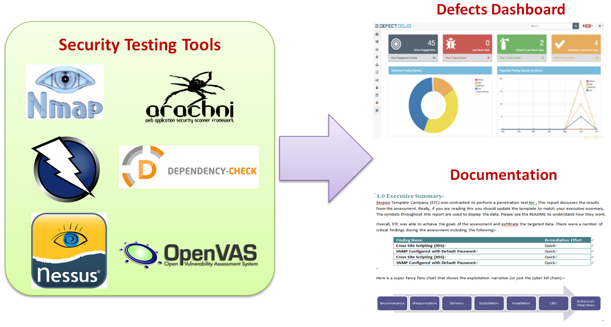
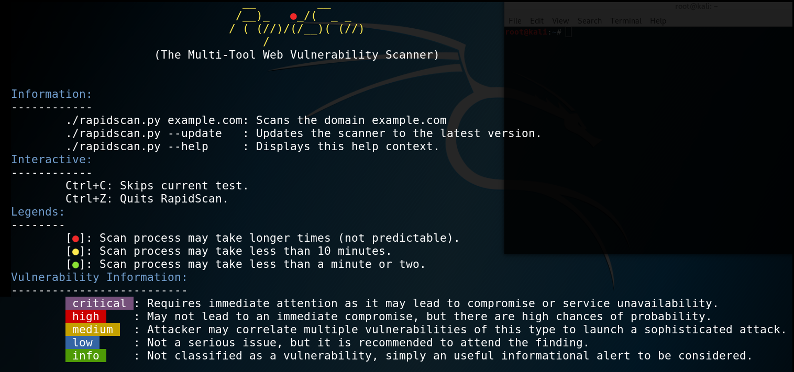
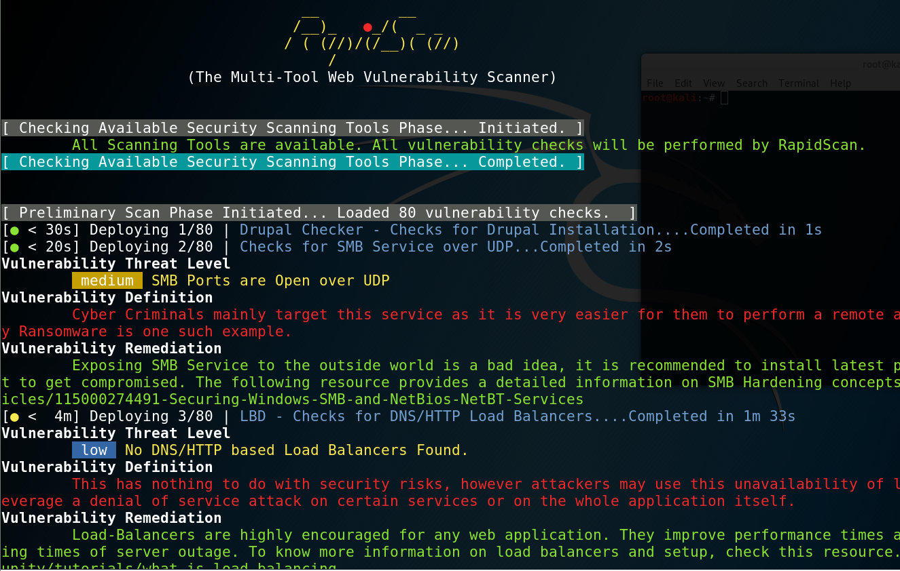

Managing and Presenting Test Results
====================================

In the previous labs, we have introduced lots of security automation
frameworks and techniques. However, how do we consolidate and present
all the security findings as a whole to stakeholders? For a security
team to execute and manage several security testing projects at a time
can be a challenge. The security team, the project team, and the
management would like to know the security status of each project. This
requires us to consolidate some previously mentioned security testing
tools\' results into one portal or summary document. We will need to not
only manage all the security testing tools\' execution results, but also
present a security dashboard for the overall security posture of a
project. We will introduce some approaches and tools to achieve this
goal.

In this lab, we will cover the following topics:

-   Managing and presenting test results
-   Approach 1 -- integrating the tools with RapidScan
-   Approach 2 -- generating a professional pentest report with Serpico

Managing and presenting test results
====================================

We have learned several security testing techniques and automation
frameworks. After all the security testing is done, we will need to
consolidate the security testing findings to present into a dashboard or
a document to share with stakeholders. In addition to Robot Framework,
which we have demonstrated, there are also other tools that can help us
to do the reporting consolidation.

The screenshot shows the integration of security findings from different
testing tools:





Security Testing Reporting Framework


We will introduce three typical tools to achieve consolidation of
security findings:

+-----------------+-----------------+-----------------+-----------------+
| **Tools**       | **RapidScan**   | **OWASP         | **Serpico**     |
|                 |                 | DefectDojo**    |                 |
+-----------------+-----------------+-----------------+-----------------+
| **Ch            | It\'s a Python  | It can import   | It provides a   |
| aracteristics** | script that     | several open    | list of         |
|                 | will execute    | source and      | security        |
|                 | several         | commercial      | findings        |
|                 | security        | security        | templates       |
|                 | testing tools   | testing tools\' | (security       |
|                 | and present the | reports, and    | issues and      |
|                 | results.        | present         | mitigation      |
|                 |                 | security issues | suggestions).   |
|                 |                 | in one          | You may apply   |
|                 |                 | dashboard.      | the security    |
|                 |                 |                 | findings to     |
|                 |                 | It can also     | generate a      |
|                 |                 | generate a      | professional    |
|                 |                 | testing report  | document.       |
|                 |                 | document based  |                 |
|                 |                 | on selected     |                 |
|                 |                 | information.    |                 |
|                 |                 |                 |                 |
|                 |                 | -   Multiple    |                 |
|                 |                 |     team        |                 |
|                 |                 |     co-work     |                 |
|                 |                 | -   Manage      |                 |
|                 |                 |     several     |                 |
|                 |                 |     projects    |                 |
|                 |                 | -   Defect      |                 |
|                 |                 |     management  |                 |
|                 |                 |     dashboard   |                 |
+-----------------+-----------------+-----------------+-----------------+
| **Generate a    | No, output to   | Yes, PDF or     | Yes, DOC        |
| document**      | console only    | ASCII           |                 |
+-----------------+-----------------+-----------------+-----------------+
| **Execution**   | Python script:  | Web service:    | Web service:    |
|                 |                 |                 |                 |
|                 | [\$ python      | [http://localh  | [               |
|                 | rapi            | ost:8000] | https://localho |
|                 | dscan.py] |                 | st:8443/] |
+-----------------+-----------------+-----------------+-----------------+
| **Import        | No              | Yes             | No              |
| testing results |                 |                 |                 |
| from tools**    |                 |                 |                 |
+-----------------+-----------------+-----------------+-----------------+
| **Manage        | No              | Yes             | Yes             |
| multiple        |                 |                 |                 |
| projects**      |                 |                 |                 |
+-----------------+-----------------+-----------------+-----------------+
| **License**     | GNU General     | BSD 3-Clause    | BSD 3-Clause    |
|                 | Public License  |                 |                 |
|                 | v2.0            |                 |                 |
+-----------------+-----------------+-----------------+-----------------+

\
In addition to OWASP Defect Dojo, the following penetration testing
reporting tools may also be considered. These reporting tools allow
penetration testers to import the security testing output (XML) from
various security testing tools:

-   FaradaySEC
-   Jackhammer
-   Dradis Framework
-   ArcherySec
-   Dradis Framework


Approach 1 -- integrate the tools with RapidScan
================================================

RapidScan can execute several security testing tools and output key
security findings.


Step 1 -- get the RapidScan Python script
=========================================

To get the RapidScan script, follow these commands:


```
wget -O rapidscan.py https://raw.githubusercontent.com/skavngr/rapidscan/master/rapidscan.py && chmod +x rapidscan.py
$ python rapidscan.py  nodegoat.herokuapp.com
```


The script will not install related security tools, but it will show a
warning message for any missing security tools. It\'s recommended to run
the RapidScan script under Kali Linux to reduce the installation of the
security testing tools. The table lists the security testing tools that
will be executed by the RapidScan script:

  ---------------------- -------------------------------------------------------------------------------------------------------------------------------------------------------------------------------------------
  **Tools**              **Security Testing Scenario**
  [wapiti]         It checks for SQLi, RCE, XSS, and Other Vulnerabilities
  [whatweb]        It\'s used to check for X-XSS Protection security Header
  [nmap]           In RapidScan, it\'s used to check listening ports, and also SSL vulnerabilities.
  [golismero]      It\'s a web security scanner that can check whether the domain is spoofed, brute force attack on the target domain, and perform SSL vulnerabilities scans
  [host]           It\'s used to check the existence of an IPV6 address in the RadpiScan
  [wget]           It\'s used to check administrator web interfaces such as [/wp-admin]
  [uniscan]        Uniscan can perform attacks such as Remote File Include, Local File Include, and Remote Command Execution. It can also do brute force for filenames and directories
  [wafw00f]        It checks for the existence of an application firewall
  [dirb]           Brute forces the directory traverse
  [davtest]        Checks whether WEBDAV is enabled on the Home directory
  [theharvester]   It uses Google to search if any email address related to the target domain
  [xsser]          It scans for **XSS** (**cross-site scripting**) security issues
  [dnsrecon]       It can check all NS Records for Zone Transfers
  [fierce]         Fierce is a DNS reconnaissance tool used to scan for any zone transfers
  [dnswalk]        DNSWalk is also used to check any zone transfer
  [whois]          It\'s used to check the administrator contact information of the registered domain
  [sslyze]         It checks for SSL vulnerabilities
  [lbd]            It checks for DNS/HTTP Load Balancers
  [dnsenum]        It checks for DNS zone transfer
  [dmitry]         It searches for email information from the domain
  [davtest]        It scans for enabled WebDAV enabled servers by uploading test executable files
  [nikto]          nikto is used to scan for several web security issues such as XSS headers, subdomain traversal, internal IP disclosure, SSL vulnerabilities, sensitive files, injectable paths, and so on
  [dnsmap]         It can brute force scan for subdomains of the target website
  ---------------------- -------------------------------------------------------------------------------------------------------------------------------------------------------------------------------------------


To execute the RapidScan, it\'s suggested to run it directly in Kali
Linux. It will save lots of time to do the security tools installation.
For detailed information on how to use each tool executed by RapidScan,
refer to the Kali Tool list: <https://tools.kali.org/tools-listing>.


This screenshot shows the use of the RapidScan:





RapidScan usage


Step 2 -- review scanning results
=================================

The RapidScan detects the following major security vulnerabilities:

-   Nmap [\[STUXNET\]] Critical Vulnerable to STUXNET
-   Nmap: Checks for Remote Desktop SErvice over TCP : High RDP Server
    Detected over TCP
-   Uniscan detected possible XSS, SQLi, BSQLi
-   Nmap [\[FTP\]] FTP Service Detected

For detailed information of report, please also refer to
[RS-Debug-ScanLog] and [RS-Vulnerability-Report].

This screenshot shows parts of the NodeGoat scanning results of the
RapidScan:





RapidScan Scan Results


Approach 2 -- generate a professional pentest report with Serpico
=================================================================

A summary of the security testing documentation will help you to
communicate with stakeholders. The report should not only list the
security findings but also how they were identified, the testing scope,
the methodology, and also mitigation suggestions. It\'s a common
practice for an independent security testing firm to produce such
documentation. The PCI DSS Penetration Test Guidance suggests a
Penetration Test Report Outline as follows:

-   Executive summary
-   Statement of Scope
-   Statement of methodology
-   Segmentation test results
-   Findings
-   Tools used

Serpico is a penetration testing report generator, which can help to
produce such a document. Although Serpico doesn\'t import the security
testing results from tools, it allows users to select security
findings/mitigation\'s based on templates. Follow the steps in the next
sectionto generate your own penetration testing document.


Step 1 -- installation of Serpico
=================================

Depending on the platform, download one of the installation packages
here:

<https://github.com/SerpicoProject/Serpico/releases>

For example, we can download [serpico\_1.3.0\_x86.msi] for
installation on Windows. Once the installation is done, Serpico can be
launched with the [start\_serpico.bat] script:


```
cd Serpico
$ start_serpico.bat
```


Then, use a browser to visit [https://localhost:8443/].


\
By the time of the writing, you may ecnouter report generation error
after adding images in the findings. When it occurs, try to comment out
the following lines in [server.rb] to workaround the issue:


```
      #elsif png?(img_data)
      #width = IO.read(image.filename_location)[0x10..0x18].unpack('NN')[0]
      #height = IO.read(image.filename_location)[0x10..0x18].unpack('NN')[1]
```


Step 2 -- create a Report based on Templates
============================================

To create a report, click [New Report] from the menu at
the top. There are some report templates you may select, such as
assessment type, and also report types such as DREAD, CVSS, and NIST
800. The key differences between these report types are the risk scoring
categories.

For example, NIST 800-30 defines risk rating as shown in the following
table:


**Impact of threat**

Informational

Low

Moderate

High

Critical

**Threat likelihood**

High

Informational

Low

Moderate

High

Critical

Moderate

Informational

Low

Moderate

Moderate

High

Low

Informational

Low

Low

Moderate

Moderate

This screenshot shows [Create Report] in Serpico:


Serpico Report


Step 3 -- Add Finding from Templates
====================================

After creating a report with basic project information, it\'s suggested
to [Add Finding From Templates] instead of add every
finding from scratch. The finding templates include some common attacks
and mitigation information. We may edit the security findings based on
these templates and project testing results.

This screenshot shows [Add Finding from Templates]:


Serpico Report Templates


Step 4 -- generate a report
===========================

To generate a report, click [Generate Report] on the left
menu. One Word document will be automatically generated based on your
selected information and security findings.

This screenshot shows a sample of a generated report in Word format:


Summary
=======

A well-documented report can not only help you to communicate with
stakeholders, but also demonstrate the value of security testing. A
professional penetration testing report should include an agenda such as
executive summary, statement of scope, statement of methodology, test
results, findings, mitigations, and tools used.

In this lab, we have introduced three approaches to managing the
testing results. First, we can use the script to integrate all the
testing results. We demonstrated the uses of a Python script, RapidScan,
which executes several security testing tools and presents the security
findings in a console with highlighted colors. Secondly, we also
introduced the document generator Serpico, which can help to generate
professional penetration testing documentation, which includes the
summary, security findings, risk ratings, and mitigations.
