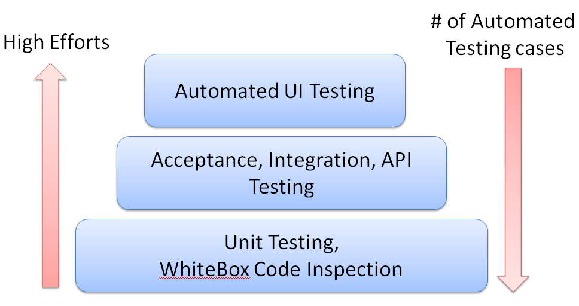

Integrating Security and Automation
===================================

The following topics will briefly be discussed in this lab:

-   The domains of automation testing and security testing
-   Automation frameworks and techniques
-   Automating existing security testing
-   Security testing with an existing automation framework


The domains of automation testing and security testing
======================================================

The domain of automation includes white-box code inspection, unit
testing, acceptance testing, integration testing, API testing, and
end-to-end UI testing. In terms of implementation effort, unit testing
and white-box inspection usually take the least effort, while UI testing
often takes the most effort, particularly in order to understand the UI
business flow.

Therefore, most automated testing cases are done with unit testing or
API-level testing. Automated UI testing may only cover the scenarios
from a user perspective while the API testing may cover more business
logic or exception handling use cases. The following diagram illustrates
the different levels of automation testing and how much effort they
take.





Levels of Automation Testing


On the other hand, the domain of security testing can be much broader.
The following table lists the practices that come under the general
umbrella of security testing. In this course, we will have some case
studies to cover some of the topics in bold:

+-----------------------+-----------------------+-----------------------+
| -   **Information     | -   Reverse           | -   Denial of service |
|     gathering**       |     engineering       | -   **Encryption**    |
| -   **Vulnerability   | -   **Reporting       | -   Error handling    |
|     analysis**        |     tools**           | -   **Information     |
| -   Wireless attacks  | -   Hardware hacking  |     disclosure**      |
| -   **Web application | -                     | -   Race conditions   |
|     exploitation      |    **Authentication** | -   **Session         |
|     tools**           | -   **Authorization** |     management**      |
| -   Forensics tools   | -   **Configuration   | -   **Secure          |
| -   Stress testing    |     management**      |     transmission**    |
| -   Sniffing and      | -   **Cryptography**  |                       |
|     spoofing          | -   **Data            |                       |
| -   **Password        |     validation**      |                       |
|     attacks**         |                       |                       |
| -   **Maintaining     |                       |                       |
|     access**          |                       |                       |
+-----------------------+-----------------------+-----------------------+


Automation frameworks and techniques
====================================

In this section, we will introduce some common automation testing
frameworks, covering API, functional, UI, and mobile testing.
Understanding the key characteristics of each automation framework will
help the security team know how to integrate security testing and figure
out what can be improved by automation.


UI functional testing for web, mobile, and windows
==================================================

UI functional testing looks at the end user\'s perspective. It walks
through the UI flow and verifies the response from the GUI. There are
three testing target platforms: web services, mobile applications, and
Windows applications. The following table lists some common open
source/free automation frameworks:

+-----------+-----------+-----------+-----------+-----------+-----------+
| **A       | Macaca    | AutoIT    | Selenium  | Appium    | Sikuli    |
| utomation |           |           |           |           |           |
| fr        |           |           |           |           |           |
| amework** |           |           |           |           |           |
+-----------+-----------+-----------+-----------+-----------+-----------+
| *         | Mobile    | Windows   | Web UI    | Mobile    | Im        |
| *Target** | (iOS and  | app       |           | (iOS and  | age-based |
|           | Android)  | lications |           | Android)  | Visual    |
|           |           |           |           |           | Testing   |
|           | Web UI    |           |           |           |           |
+-----------+-----------+-----------+-----------+-----------+-----------+
| **Pr      | Java,     | B         | Java,     | Java and  | Visual    |
| ogramming | Python,   | ASIC-like | Python,   | Python    | images    |
| l         | and       | script    | C\#, and  |           | and       |
| anguage** | Node.js   |           | Ruby      |           | B         |
|           |           |           |           |           | ASIC-like |
|           |           |           |           |           | script    |
+-----------+-----------+-----------+-----------+-----------+-----------+
| **Record  | UI        | AutoIT    | Selenium  | Desktop   | Yes       |
| and       | Recorder  | Recorder  | IDE       | Inspector |           |
| replay**  |           |           |           |           |           |
+-----------+-----------+-----------+-----------+-----------+-----------+


HTTP API testing
================

UI testing may be prone to errors due to the instability of GUI
responses. Another approach to functional testing that avoids the GUI is
API-level testing. Since most web services provide RESTful APIs, API
testing can be one of the most effective and efficient ways of
automation testing.

Here are some common approaches to API testing techniques:

+-----------+-----------+-----------+-----------+-----------+-----------+
| **API     | Java      | Python    | JMeter    | Fiddler   | Postman   |
| testing   |           |           |           |           |           |
| tools**   | Res       | Requests  |           |           |           |
|           | t-Assured |           |           |           |           |
+-----------+-----------+-----------+-----------+-----------+-----------+
| **Pr      | Java      | Python    | No        | JavaSc    | No        |
| ogramming |           |           |           | ript-like |           |
| l         |           |           |           | Syntax    |           |
| anguage** |           |           |           |           |           |
+-----------+-----------+-----------+-----------+-----------+-----------+
| **Record  | No        | No        | Yes       | Yes       | Yes       |
| and       |           |           |           |           |           |
| replay**  |           |           |           |           |           |
+-----------+-----------+-----------+-----------+-----------+-----------+
| **Ver     | Java      | PyUnit    | Yes       | Yes       | Yes       |
| ification | TestNG or |           |           |           |           |
| (Asser    | JUnit     |           |           |           |           |
| tation)** |           |           |           |           |           |
+-----------+-----------+-----------+-----------+-----------+-----------+
| **Proxy   | No        | No        | Yes       | Yes       | Yes       |
| mode**    |           |           |           |           |           |
+-----------+-----------+-----------+-----------+-----------+-----------+

For HTTP testing, the support of proxy mode gives the following benefit:

-   Monitor HTTP request/response history
-   Record and replay or modify specific HTTP requests
-   Mock certain HTTP responses to reduce web server dependencies
-   Simulate HTTP-based API testing as a mock web service.


HTTP mock server
================

The mock server works as a proxy between the testing client and target
web services. For HTTP service testing, the mock server proxy can help
test API interfaces to reduce the dependency or the readiness of the
whole backend web services. It allows us to prepare client-side
automation without the need to have the whole backend web services. When
it comes to security testing, proxy mode helps to monitor HTTP traffic,
send security payloads with HTTP requests, and analyze HTTP responses
for potential security issues. Most web security scanners can run in
proxy mode, including OWASP ZAP and Arachni.

Here are some of common free/open source mock server frameworks:

+-----------------------------------+-----------------------------------+
| **HTTP mock server**              | **Key characteristics**           |
+-----------------------------------+-----------------------------------+
| Moco                              | If you just want to have a simple |
|                                   | HTTP mock server with a few       |
|                                   | defined HTTP responses, Moco is   |
|                                   | highly recommended due to the     |
|                                   | ease of deployment and use. Moco  |
|                                   | is a standalone JAR and the HTTP  |
|                                   | response behaviors can be defined |
|                                   | by one JSON configuration file.   |
|                                   |                                   |
|                                   | <h                                |
|                                   | ttps://github.com/dreamhead/moco> |
+-----------------------------------+-----------------------------------+
| mitmproxy                         | For an open source HTTPS proxy    |
|                                   | solution, mitmproxy is also       |
|                                   | highly recommended. The web       |
|                                   | interface makes it easy to use,   |
|                                   | just like Chrome Developer Tools. |
|                                   | mitmproxy is a free and open      |
|                                   | source interactive HTTPS proxy.   |
|                                   | It provides a command line, web   |
|                                   | interface, and Python API to      |
|                                   | intercept, inspect, modify, and   |
|                                   | replay web traffic for both HTTP  |
|                                   | and HTTPS.                        |
|                                   |                                   |
|                                   | <https://mitmproxy.org/#mitmweb>  |
+-----------------------------------+-----------------------------------+
| GoReplay                          | GoReplay can capture and replay   |
|                                   | web traffic like TCPDump. It      |
|                                   | simply captures web traffic based |
|                                   | on a given communication port.    |
|                                   |                                   |
|                                   | <https://goreplay.org/>           |
+-----------------------------------+-----------------------------------+


Most of the web security testing tools are running as a web proxy. It\'s
also called as **MITM** (**Man in The Middle**). The Web Proxy will
monitor the web traffic, and analyze the every responses to identify
potential web security issues.


White-box search with GREP-like tools
=====================================

There may be scenarios where we need to search specific patterns or
keywords to identify potential issues. The GREP tool in Linux is a
common search tool for source code or plain text configurations. For
code-security reviews, here are some security scanning tools that
provide GREP-like search functionality:

+-----------------------------------+-----------------------------------+
| **Search tools**                  | **Key characteristics**           |
+-----------------------------------+-----------------------------------+
| Code Review Audit Script Scanner  | This is a one-shell script that   |
|                                   | includes all common code security |
|                                   | issue patterns. No other          |
|                                   | dependency is required to run the |
|                                   | script.                           |
|                                   |                                   |
|                                   | <https://github.com/floyd-        |
|                                   | fuh/crass/blob/master/grep-it.sh> |
+-----------------------------------+-----------------------------------+
| Grep Rough Audit                  | This is a shell script that will  |
|                                   | read signatures for potential     |
|                                   | security issues in source code    |
|                                   |                                   |
|                                   | <https                            |
|                                   | ://github.com/wireghoul/graudit/> |
+-----------------------------------+-----------------------------------+
| GrepBugs                          | This scans security issues based  |
|                                   | on defined regular expression     |
|                                   | patterns                          |
|                                   |                                   |
|                                   | <https://grepbugs.com/browse>     |
+-----------------------------------+-----------------------------------+
| VisualCodeGrepper                 | This is a Windows scanner tool    |
|                                   | with defined regular expression   |
|                                   | security patterns                 |
|                                   |                                   |
|                                   | <https://github.com/nccgroup/VCG> |
+-----------------------------------+-----------------------------------+
| Flawfinder                        | This is a simple C/C++ security   |
|                                   | source code scanner               |
|                                   |                                   |
|                                   | <htt                              |
|                                   | p://www.dwheeler.com/flawfinder/> |
+-----------------------------------+-----------------------------------+
| ripgrep recursively searches      | This is a powerful regular        |
|                                   | expression searcher               |
|                                   |                                   |
|                                   | <https                            |
|                                   | ://github.com/BurntSushi/ripgrep> |
+-----------------------------------+-----------------------------------+


Behavior-driven development testing frameworks
==============================================

**Behavior-driven development** (**BDD**) testing frameworks define the
testing script in the format of \"*Given\...When\...Then*.\" Here is a
typical example.


```
Given NMAP is installed
When I launch an NMAP network scan "nmap -F host"
Then the output should match "25 tcp open"
```


Here are some common BDD frameworks:

+-----------------------------------+-----------------------------------+
| **BDD framework**                 | **Usage and scenarios**           |
+-----------------------------------+-----------------------------------+
| Robot Framework                   | This is a common keyword-driven   |
|                                   | testing acceptance automation     |
|                                   | framework. Robot Framework is     |
|                                   | programming language independent, |
|                                   | though Robot Framework itself was |
|                                   | built by Python.                  |
|                                   |                                   |
|                                   | [http://robotframework            |
|                                   | .org](http://robotframework.org/) |
+-----------------------------------+-----------------------------------+
| Behave                            | This is a Python-based BDD        |
|                                   | framework                         |
|                                   |                                   |
|                                   | <                                 |
|                                   | https://github.com/behave/behave> |
+-----------------------------------+-----------------------------------+
| Jgiven                            | This is a Java-based BDD          |
|                                   | framework                         |
|                                   |                                   |
|                                   | <http://jgiven.org/>              |
+-----------------------------------+-----------------------------------+
| Gauntlt                           | It\'s a security testing BDD      |
|                                   | Framework.                        |
|                                   |                                   |
|                                   | <http://gauntlt.org/>             |
+-----------------------------------+-----------------------------------+

In the comping labs, we will demostrate the uses of Robot Framework
and Gauntlt to achieve the security automation testing.


Testing data generators
=======================

For some testing scenarios, we may need to update the SQL database with
testing data (such as names, phone numbers, IPs, email addresses, city
names, and filenames), or to allow the web service to respond with basic
sample data. Here are some tools that can generate testing data based on
the user-defined data type or format such as (date, address, ID, numeric
data or strings):

+-----------------------------------+-----------------------------------+
| **Tools**                         | **Usage and scenarios**           |
+-----------------------------------+-----------------------------------+
| Mockaroo                          | This provides an online data      |
|                                   | generator service that provides   |
|                                   | test data in CSV, JSON, and SQL   |
|                                   | formats, based on your defined    |
|                                   | data type                         |
|                                   |                                   |
|                                   | [https://mockaroo.com/            |
|                                   | ](https://mockaroo.com/%E2%80%8B) |
+-----------------------------------+-----------------------------------+
| JSON Schema Faker                 | This generates JSON data based on |
|                                   | a defined JSON schema             |
|                                   |                                   |
|                                   | <                                 |
|                                   | http://json-schema-faker.js.org/> |
+-----------------------------------+-----------------------------------+
| JS Faker                          | This provides a **command-line    |
|                                   | interface** (**CLI**) to generate |
|                                   | the data type based on your       |
|                                   | options, such as system, name,    |
|                                   | address, and phone. It can also   |
|                                   | output based on the specified     |
|                                   | locale language.                  |
|                                   |                                   |
|                                   | <http                             |
|                                   | s://github.com/lestoni/faker-cli> |
+-----------------------------------+-----------------------------------+


Automating existing security testing
====================================

If the team already have certain security testing measures in place and
would like to apply an automation testing framework to improve
efficiency or reduce manual execution efforts, there are some
recommended automation frameworks the team may consider. The following
table details the automation frameworks that may help in various kinds
of security testing scenarios:

+-----------------------------------+-----------------------------------+
| **Types of automation             | **The scenarios where the         |
| frameworks**                      | automation framework can help**   |
+-----------------------------------+-----------------------------------+
| Web UI automation                 | -   User registration flow        |
|                                   | -   Authentication/authorization  |
| (Selenium or Robot Framework)     |     flow                          |
|                                   | -   Shopping cart and order       |
|                                   |     payment flow                  |
|                                   | -   Forget password flow          |
|                                   | -   PII (Personally identifiable  |
|                                   |     information ) -sensitive      |
|                                   |     operations, such as profile   |
|                                   |     update                        |
+-----------------------------------+-----------------------------------+
| API testing (JMeter)              | -   RESTful API testing with      |
|                                   |     injection payloads            |
+-----------------------------------+-----------------------------------+
| BDD testing                       | -   When a BDD framework is       |
|                                   |     applied to security testing,  |
| Robot Framework or gauntlt        |     the purpose is to enhance     |
|                                   |     cross-team communication and  |
|                                   |     enable a non-security team to |
|                                   |     understand how security is    |
|                                   |     tested                        |
+-----------------------------------+-----------------------------------+
| Fuzz Testing                      | -   Security payload testing with |
|                                   |     various injection and buffer  |
|                                   |     overflow testing              |
+-----------------------------------+-----------------------------------+
| **Data-driven testing** (**DDT**) | -   DDT testing is normally done  |
|                                   |     with fuzz testing             |
|                                   | -   DDT is normally included in   |
|                                   |     the unit testing framework of |
|                                   |     the programming language      |
+-----------------------------------+-----------------------------------+


Security testing with an existing automation framework
======================================================

If the team has done some automation testing, security testing can be
built on top of it. For security testing to be integrated with
automation frameworks, we need to consider the input data for the tool,
the support of the API or CLI to trigger the execution, and the
preferred testing report format, such as JSON, XML, or CSV. In addition,
in order to consolidate all the testing reports generated by various
security testing tools, we will introduce OWASP DefectDojo to import all
the security findings and the security dashboard presentation.
Therefore, the output format of the security testing tools is also part
of the security testing tool selection criteria.

The following table lists some recommended security testing tools that
provide flexible interfaces for automation framework integration, and
the output formats can be imported into OWASP DefectDojo:

+-----------------------------------+-----------------------------------+
| **Type of security testing**      | **Recommended tools for           |
|                                   | automation and rationale**        |
+-----------------------------------+-----------------------------------+
| Web security                      | **Arachni and OWASP ZAP**:        |
|                                   | Arachni provides both a CLI and a |
|                                   | Ruby library that can help to     |
|                                   | achieve automation integration.   |
|                                   | OWASP ZAP provides a CLI, REST    |
|                                   | API, and other programming        |
|                                   | libraries for further             |
|                                   | integration.                      |
+-----------------------------------+-----------------------------------+
| Known vulnerable components       | **OWASP Dependency Check**: This  |
|                                   | mainly scans for Java and .NET    |
|                                   | known vulnerable components       |
|                                   |                                   |
|                                   | **OpenVAS**: This scans for all   |
|                                   | known CVEs (Common                |
|                                   | Vulnerabilities and Exposures)    |
|                                   | for all system components         |
|                                   |                                   |
|                                   | **RetireJS**: This scans for      |
|                                   | vulnerable JavaScript libraries   |
+-----------------------------------+-----------------------------------+
| Fuzz testing                      | **Radamsa**: This can dynamically |
|                                   | generate fuzz data based on a     |
|                                   | given sample                      |
|                                   |                                   |
|                                   | **SecLists and FuzzDB**: These    |
|                                   | are fuzz data sources that define |
|                                   | common payloads for security      |
|                                   | testing                           |
+-----------------------------------+-----------------------------------+
| Networking                        | **Nmap**: The tool can be used to |
|                                   | network communication ports, to   |
|                                   | identify the OS and services, and |
|                                   | also to do vulnerability scan the |
|                                   | whole infrastructure.             |
+-----------------------------------+-----------------------------------+
| SSL (Secure Sockets Layer)        | **SSLLabs-Scan and SSLyze**:      |
|                                   | These are common security         |
|                                   | scanners for misconfiguration of  |
|                                   | SSL/TLS (Transport Layer          |
|                                   | Security)                         |
+-----------------------------------+-----------------------------------+
| Secure code review                | **Visual Code Grepper**           |
|                                   | (**VCG**): It\'s a Windows based  |
|                                   | secure code scan tool for general |
|                                   | programming languages.            |
|                                   |                                   |
|                                   | **Grep Rough Audit:** It searches |
|                                   | secure code issues based on       |
|                                   | regular expression patterns.      |
|                                   |                                   |
|                                   | **Bandit: It\'s Python secure     |
|                                   | code scan tool.**                 |
+-----------------------------------+-----------------------------------+
| Secure configuration              | OpenSCAP Workbench provides GUI   |
|                                   | and security profiles for         |
|                                   | scanning common Linux OS          |
|                                   | configurations                    |
+-----------------------------------+-----------------------------------+


Summary
=======

This lab introduces the integration of security and automation. The
domain of automation testing covers white-box code inspection, unit
testing, API testing, integration testing, and end-to-end UI integration
testing. The automation technique being used may depend on the effort
required and the automation rate. The security testing domain was also
explored in this lab. We will primarily be focused on common
security issues for web applications and mobile applications, such as
password attacks, data validation, information disclosure, session
management, and secure transmission.

We also illustrated some security testing scenarios where automation
frameworks can help. For example, the Selenium Web UI framework is used
to walk through the UI flow for security tools to inspect security
issues. JMeter can be used with security payloads to do RESTful API
security testing. Robot Framework can integrate with ZAP to introduce
BDD testing into the security testing cycle.

We also recommended some common open source security tools that provide
either a CLI or a RESTful API interface for automation framework
integration. These dealt with web security (Arachni and OWASP ZAP),
known vulnerable components (RetireJS and OpenVAS), fuzz testing
(SecLists and FuzzDB), networking (Nmap), SSL (SSLyze), secure code
review (VCG), and OpenSCAP for OS secure configuration checks.

In the coming lab, we will introduce white-box secure code review
techniques and tools for common programming languages.


Questions
=========

1.  Which one of these is not part of security testing domain?
    1.  BDD
    2.  Information gathering
    3.  Data validation
    4.  Cryptography


2.  Which one of the following is not used for UI functional testing?
    1.  AutoIT
    2.  Selenium
    3.  Appium
    4.  ZAP


3.  Which of the following is used for HTTP API testing?
    1.  JMeter
    2.  Fiddler
    3.  Python requests
    4.  All of the above
4.  Which of these is not the purpose of using a mock server?
    1.  Reducing the dependencies of the backend web services
    2.  Defining standard HTTP responses
    3.  Doing UI functional testing
    4.  Responding to the HTTP requests
5.  Which of these is used for known vulnerabilities scanning?
    1.  OpenVAS
    2.  OWASP Dependency Check
    3.  RetireJS
    4.  All of above