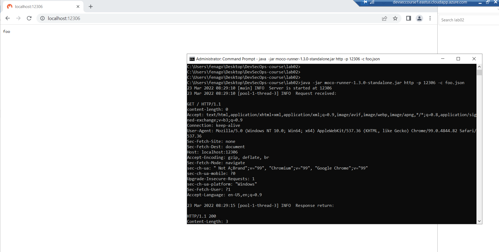

Integrating Security and Automation
===================================

The following topics will briefly be discussed in this lab:

-   Automation frameworks and techniques
-   Automating existing security testing
-   Security testing with an existing automation framework


HTTP mock server
================

In this task, we will setup and run "moco" https://github.com/dreamhead/moco .

`moco-runner-1.3.0-standalone.jar` has been downloaded already in `lab02` folder.

Run following commands in the cmd to start mock server:

```
cd C:\Users\fenago\Desktop\DevSecOps-course\lab02

java -jar moco-runner-1.3.0-standalone.jar http -p 12306 -c foo.json
```

Open http://localhost:12306 in Chrome after starting mock server.



**Exercises**

1) Update `foo.json` to return your name in response as show below:
2) Change port to 12307 and restart the server.


Behavior-driven development testing frameworks
==============================================

`Behave` has been installed already in the lab environment.
https://github.com/behave/behave

Create a directory called "features/". In that directory create a file called "example.feature" containing:

```
# -- FILE: features/example.feature
Feature: Showing off behave

  Scenario: Run a simple test
    Given we have behave installed
     When we implement 5 tests
     Then behave will test them for us!
```

Make a new directory called "features/steps/". In that directory create a file called "example_steps.py" containing:

```
# -- FILE: features/steps/example_steps.py
from behave import given, when, then, step

@given('we have behave installed')
def step_impl(context):
    pass

@when('we implement {number:d} tests')
def step_impl(context, number):  # -- NOTE: number is converted into integer
    assert number > 1 or number == 0
    context.tests_count = number

@then('behave will test them for us!')
def step_impl(context):
    assert context.failed is False
    assert context.tests_count >= 0
```

Run behave by running following command in the terminal: `behave`

**Output:**

```
Feature: Showing off behave # features/example.feature:2

  Scenario: Run a simple test          # features/example.feature:4
    Given we have behave installed     # features/steps/example_steps.py:4
    When we implement 5 tests          # features/steps/example_steps.py:8
    Then behave will test them for us! # features/steps/example_steps.py:13

1 feature passed, 0 failed, 0 skipped
1 scenario passed, 0 failed, 0 skipped
3 steps passed, 0 failed, 0 skipped, 0 undefined
```


In the coming labs, we will demostrate the uses of Robot Framework to achieve the security automation testing.


Testing data generators
=======================

Here are some tools that can generate testing data based on
the user-defined data type or format such as (date, address, ID, numeric
data or strings):

#### Mockaroo
Open https://mockaroo.com/ in browser and click **Preview Data** to get generated data:


**Task:** 

1) Remove `ip_address` field by clicking `X`.
2) Add three new fields by clicking `Add Another Field` button.
3) Click **Type** dropdown and select different Type from menu for all new fields:


#### JSON Schema Faker
Open http://json-schema-faker.js.org/ in browser and click **Options** link to get follow menu:


Click **Enum** from above menu and it will take you following screen. Click Generate to generate test data:


**Task:** 

1) Change minItems to `10` and change items names in enum and click Generate button again.
2) Click Options links and try different options i-e; **boolean** and **integer** etc.

#### JS Faker	

This provides a command-line interface (CLI) to generate the data type based on your options, such as system, name, address, and phone. It can also output based on the specified locale language. It has been installed already: https://github.com/lestoni/faker-cli

Open terminal and try following examples:

```
faker-cli --helpers userCard

faker-cli --random uuid

faker-cli --locale de --helpers userCard
```