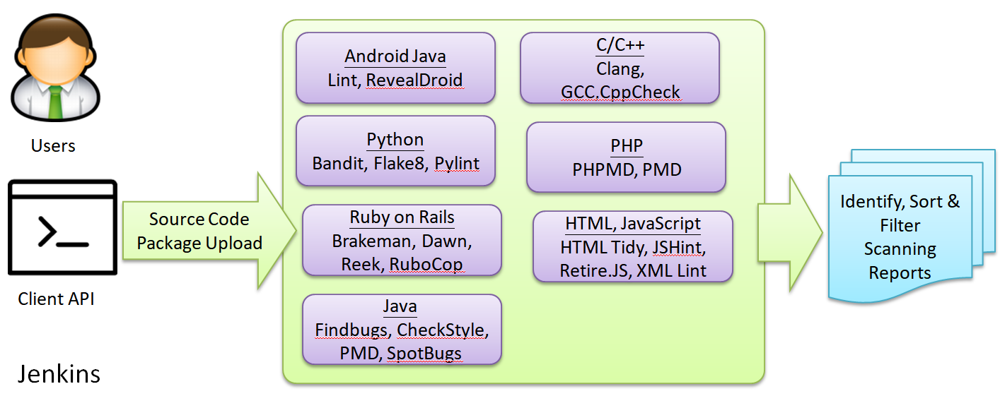
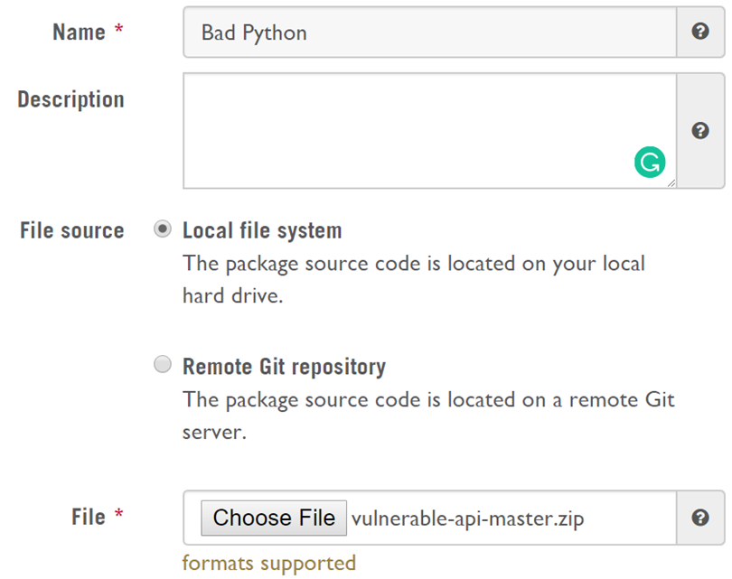
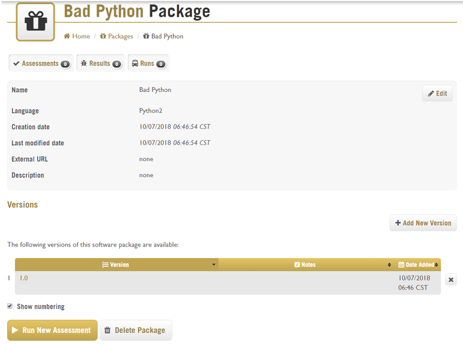
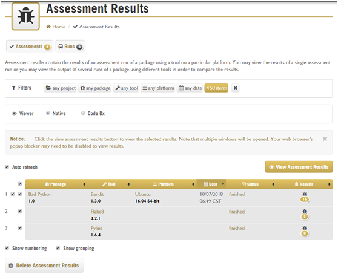
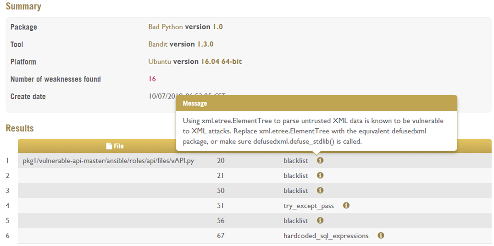
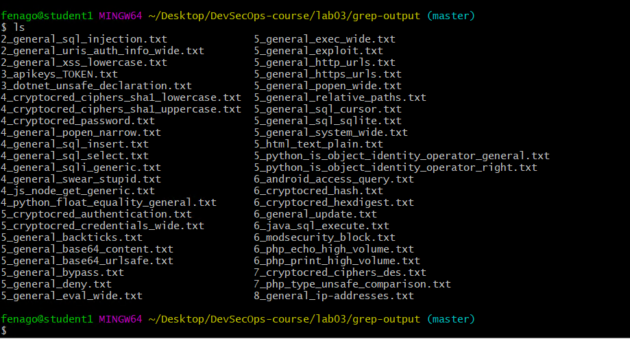
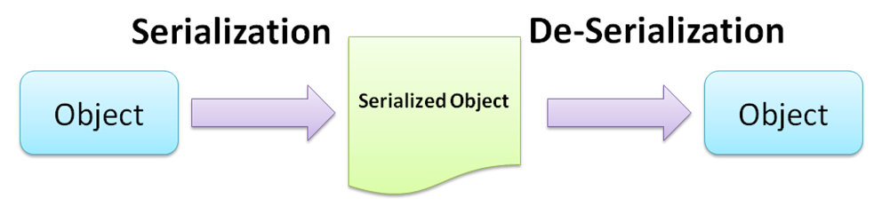
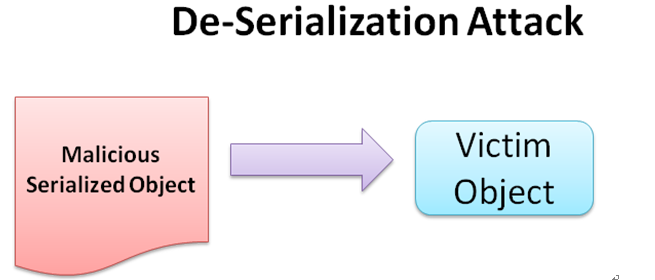

Secure Code Inspection
======================

In this lab, we will discuss white-box testing techniques for secure
code review. For an in-house software development team, it\'s a
challenge to review all the source code for every software release. This
is not only because of the pressure of release cycles, but because of
the impracticality of requiring every developer to be familiar with all
the secure coding best practices for all different programming
languages, such as Java, C/C++, and Python. Therefore, we will
demonstrate how to build your own automated secure coding platform with
open source solutions for every release.

This lab will cover the following topics:

-   Case study---automating a secure code review
-   Secure coding best practices and methodology
-   Vulnerable code patterns for every programming language
-   Automating secure code scanning tools with Jenkins (using C/C++,
    Java, Python, JavaScript, and PHP)

Case study -- automating a secure code review
=============================================

Software Company-X releases cloud services. The Android development team
in company-X is using IDE developer tools to do secure code review for
released Android applications. However, the uses of the IDE developer
tools may have less visibility of the whole project security status. The
development manager is also looking for a secure coding inspection
service that can establish consistent secure coding quality across
projects. Therefore, a secure coding scanning service will be in a need.


Secure coding scanning service -- SWAMP
=======================================

The following diagram shows an ideal secure coding inspection service.
It provides users or developers with interfaces to submit the source
code or package. The interface for the operations could be a GUI, a
RESTful API, **command-line interface** (**CLI**), or a Jenkins plugin.
The programming language that is supported varies from project to
project, but common programming languages include Java, Android app,
C/C++, and also web script languages such as PHP, Python, JavaScript,
and Ruby. Once the coding scanning is done, the service is expected to
deliver a comprehensive inspection report that identifies the
vulnerability and offers remedial suggestions:





Secure code inspection framework


The **Software Assurance Marketplace** (**SWAMP**) provides a standalone
software application called **SWAMP in a Box** (**SiB**), which allows
you to build your in-house secure code inspection services with the
support of various scanning tools. SiB can be downloaded from here:
<https://github.com/mirswamp/deployment>.[](https://github.com/mirswamp/deployment)

To demonstrate how the SWAMP works, we may clone or download the
vulnerable Python API project as a ZIP package here:
<https://github.com/rahulunair/vulnerable-api>. The SWAMP also provides
the cloud service for the scanning service; just sign into the SWAMP
portal by using your GitHub or Google accounts:
<https://www.mir-swamp.org/>.[](https://www.mir-swamp.org/)


Step 1 -- adding a new package
==============================

Once you have logged in to the SWAMP portal, create a new package by
clicking [Packages] and then [Add New
Packages]. Fill in the information as in the following
screenshot. The package must be compressed into a ZIP archive to be
uploaded to the SWAMP. In our example, we give [Bad Python] in the
[Name] field, and select the previously downloaded ZAP,
[vulnerable-api-mater.zip]:





Project import in SWAMP


If it\'s uploaded correctly, the next step will require certain project
information, such as source code and build information. We may keep the
Python version as [Python2] and click [Next] for
the next page to [Save New Package] at the end of the
step.


Step 2 -- running the assessment
================================

Once the package is created, click the [Run New
Assessment] button, then click [Save and
Run] on the next page:





Assessments in SWAMP


Step 3 -- viewing the results
=============================

When the assessment is done, you will be able to see the assessment
results here: <https://www.mir-swamp.org/#results>. Or, you can navigate
to [Home] then [Results]:




Assessments results in SWAMP


Take the vulnerable Python as an example: the SWAMP applies three
scanning tools, Bandit, Flake8, and Pylint, for the scanning. We may
review one of the scanning results by selecting the checkbox in front of
the package name and clicking [View Assessment Results]
button. This brings us to the options of [Native] or
[Code Dx] view. The [Native] view provides
a summary table of the identified security code issues, and the [Code
Dx] view is an interactive interface with the original
source code.

The following diagram shows a sample of the [Native]
view:




Message of results in SWAMP


Secure coding patterns for inspection
=====================================

To perform a secure code scan, we must define the scanning rules based
on common security issues and the programming language in question.
It\'s fundamental to use keyword-driven expressions, regular
expressions, or string operations for the scanning rules. The following
table shows common risky APIs which may introduce security
vulnerabilities and secure coding patterns which are indicators for
potential security issues for various programming languages.

The **false positive** column indicates whether the search result
requires further manual verification. For example, [Low] means
that once the keyword is matched in the source code, the security issue
can be confirmed without the need for further verification. [Med]
means the identified patterns still require further verification:

**Programming language**


**Risky API or insecure code patterns**

**False positive**

General

Weak encryption

[Blowfish \| DES \| 3DES \| RC4 \| MD5 \| SHA1 \| XOR \| ARC4 \| IDEA \|
ECB \| CBC \| TLS 1.0 \| SSL 2.0 \| Base64 \| RIPEMD \| base64]

[Low]

Insecure protocol

[SSL \| HTTP \| FTP \| Telnet]

[Low]

Hardcoded information

[Password \| IP address \| Email \| Special Hotkey \| URL \| Mobile
Number \| Name]

[High]

C/C++

Command injection

[execl\|execlp\|execle\|system\|popen\|WinExec\|ShellExecute \|
execv\|execvp\|]

[Med]

Buffer overflow

[fscanf\|sscanf\|vsscanf\|vfscanf\|scanf\|vscanf\|wscanf\|]

[sprintf\|vsprintf\|swprintf\|vswprintf\|snprintf\|vsnprintf]

[getchar\|read\|\_gettc\|fgetc\|getc\|]

[memcpy\|CopyMemory\|bcopy\|memmove]

[lstrcpy\|wcscpy\|lstrcpyn\|wcsncpy\|\_tcscpy\|\_mbscpy
\|strncat\|strncpy ]

[Med]

Java

Injection

[Runtime \| ProcessBuilder \| CommandLine \| zookeeper.Shell \|
System.out.printf \| createStatement]

[Low]

Path traversal

[getAbsolutePath]

[Low]

Deserialization

[XMLDecoder \| xstream \| readObject \| readResolve \| InvocationHandle
\| ObjectInputStream]

[Med]

Weak random

[Java.util.Random]

[Low]

URL injection

[url= \| href=]

[Low]

XML external entity (XXE)

[DocumentBuilder \| XMLInputFactory \| SAXReader \| SAXParser \|
SAXBuilder \| XMLReader \| DocumentHelper \| XMLInputFactory \|
XMLStreamReader]

[Med]

URL authorization bypass

[.getRequestURL( \| .getRequestURI]

[Med]

File-handling validation

[ZipiInputStream \| .endsWith(]

[Med]

ZIP of Death

[ZipFile \| ZipInputStream]

[Med]

Information leakage

[FileNotFoundException \| JARException \| MissingResourceException \|
acl.NotOwnerException \| ConcurrentException \| ModificaitonException \|
InsufficientResourceException \| BindException \| OutOfMemoryError \|
StackOverflowException \| SQLException]

[Med]

Python

Injection

[execfile \| input \| commands \| subprocess]

[Med]

Risky API

[pickle.load \| eval]

[Med]

PHP

Injection

[shell\_exec \| system \| exec \| popen \| passthru \| proc\_open \|
pcntl\_exec \| eval \| assert \| preg\_replace \| create\_function \|
preg\_match \| str\_replace ]

[Low]

JavaScript

Risky API

[eval \| execScript \| sessionStorage \| localStorage]

[Low]

\
This table uses the keywords and regular expression patterns approach to
identifying security vulnerabilities in the source code. However, this
kind of approach may have certain limitations. Some of the security
issues may require further source code correlations to be identified.
For advanced searches that go beyond the use of a regular expressions
search in the source code, the open source ReBulk Python library can be
considered. The ReBulk library allows developers to build more complex
match rules to search for specific coding issues.


Quick and simple secure code scanning tools
===========================================

We may identify secure code vulnerabilities by using the keywords,
secure code patterns and risky APIs listed in the table in the previous
section. This can be a simple and quick solution to apply to any partial
source code. However, the biggest problem of this approach is the
false-positive rate, which needs to be optimized by defining proper
secure code regular expression match patterns. We will introduce two
tools that can do a quick scan of the source code, based on key secure
code patterns.


Automatic secure code inspection script in Linux
================================================

For this approach, we recommend an all-in-one shell script, the **Code
Review Audit Script Scanner** (**CRASS**). This one script includes
everything needed for secure code scanning, and it defines the secure
code scanning patterns for Java, JSP, Flex Flash, .NET, PHP, HTML,
Android, iOS, Python, Ruby, and C. It can easily be extended by editing
the [grep-it.sh] file. We may use the same vulnerable Python
project from before as our example for the following steps.


Step 1 -- downloading the CRASS
===============================

Download the [grep-it.sh] script from here:
[**https://github.com/floyd-fuh/crass/blob/master/grep-it.sh**](https://github.com/floyd-fuh/crass/blob/master/grep-it.sh)
, under the target project folder. For example, we may download it under
the [/vulpython] folder.

Alternatively, if you are using Git, execute the following command to
download the script:


```
git   clone     https://github.com/floyd-fuh/crass/blob/master/grep-it.sh
```


Step 2 -- executing the code review audit scan
==============================================

Execute the command with a parameter to specify the target project
folder. The following command will scan the vulnerable source code under
the [/vulpython] folder:


```
$ bash  grep-it.sh  ./vulpython
```


Step 3 -- reviewing the results
===============================

Once the scanning is done, the scanning results will be output under the
[\\grep-output] folder of the target scanning project.

The scanning results will be generated into files separated by security
topic, as shown in the following diagram:





Code scan results


Automatic secure code inspection tools for Windows
==================================================

This approach is very easy to deploy without the need to install other
dependencies, and it doesn\'t require a whole buildable source code
package to do the code scanning. For some cases, to identify security
code issues, it requires not only to identify the risky API but also to
review the context of the usage, which will be explained more in the
next section.

For Windows users, the secure code scanning tool **Visual Code Grepper**
(**VCG**) is recommended. It provides not only GUI but also CLI mode. It
supports multiple programming languages, including C/C++, Java, PHP, VB,
and C\#. The default installation comes with details on the predefined
banned and risky functions of each programming language in the
configuration files ([\*.conf]), and the rules can also be easily
customized by editing the configuration files. Here are the steps to
scan the project.


Step -- downloading VCG (Visual Code Grepper)
=============================================

Download the setup package and run the setup to install VCG on Windows.
The installer is available here:
<https://github.com/nccgroup/VCG/tree/master/VCG-Setup/Release>.[](https://github.com/nccgroup/VCG/tree/master/VCG-Setup/Release)


Step 2: Executing VCG
=====================

Executing [VisualCodeGrepper.exe] will directly launch VCG in GUI
mode.

If you would like to execute in console mode, use the following command:


```
$ VisualCodeGrepper    -c  -v  -t   <DirectoryName>
```


For other options, please refer to the [Readme.txt] file in the
URL below.

<https://github.com/nccgroup/VCG/blob/master/VCG-Setup/Release/README.txt>


Step 3: Reviewing the VCG scanning results
==========================================

By default, the scanning results will be generated as [test1.csv]
under the installed path. Alternatively, you may also use the [VCG
GUI] \| [File] \| [Import Results from CSV
File] \| [test1.csv] to review the results with
highlighted colors.


Case study -- XXE security
==========================

The XXE security issue is one of the OWASP Top 10 security issues. The
solution to the XXE issue is to disable XXE and **DTD** (**Document Type
Definition**) processing. Therefore, when we are doing source code
review, we are looking for whether the configuration of DTD is missing
in the source code, as shown in the following example:


```
Factory.setFeature(“http://apache.org/xml/features/disallow-doctype-decl”, true);
```


White-box review is still the most efficient approach to identifying XXE
issues. The easiest thing to do is to discover whether one of the
following XML libraries is being used to parse XML. We may use one of
the tools such as CRASS or VCG mentioned in previous section to do such
a search with the keywords listed here:

  -------------------------- ------------------------------------------------------------------------------------------------------------------------------------------------------------------------------------------------------------------------------------------------------------------------------
  **Programming language**   **Source code patterns for potential XXE issues**
  Java                       [SAXParser \| SAXParserFactory \| DocumentBuilderFactory \| TransformerFactory \| XMLReader \| DOMParser \| SAXBuilder \| SAXReader \| XMLInputFactory \| SchemaFactory \| DocumentBuilderFactoryImpl \| DocumentBuilderImpl \| SAXParserFactoryImpl \| SAXParserImpl]
  C/C++                      [xmlCtxtRead \| xmlCtxtUseOptions \| xmlParseInNodeContext \| xmlReadDoc \| xmlReadFd \| xmlReadFile \| xmlReadIO \| xmlReadMemory]
  -------------------------- ------------------------------------------------------------------------------------------------------------------------------------------------------------------------------------------------------------------------------------------------------------------------------

\
Once these XML parser APIs are found in the source code, we will do a
further manual review to check if the DTD resolution is explicitly
disabled in the source code. Just be aware that to disable the DTD, it
needs to be defined explicitly in the source. Take SAXreader as an
example, to prevent XXE effectively, the following three lines are
necessary.


```
saxReader.setFeature("http://apache.org/xml/features/disallow-doctype-decl", true);
saxReader.setFeature("http://xml.org/sax/features/external-general-entities", false);
saxReader.setFeature("http://xml.org/sax/features/external-parameter-entities", false);
```


Although source code scanning can\'t do a perfect job in identifying the
XXE issue, we still can use the techniques to narrow the scope in
identifying the XXE issue.

Please also refer to OWASP XML Prevent CheatSheet for details.
<https://www.owasp.org/index.php/XML_External_Entity_(XXE)_Prevention_Cheat_Sheet>


Case study -- deserialization security issue
============================================

The deserialization security issue is commonly seen in Java, and is a
**Remote Code Execution** (**RCE**) attack. Serialization is the process
in Java of converting the state of an object into a byte stream
(serialized object), which can be stored in files, memory, or a
database. Deserialization is the reverse process, creating an object
based on the byte stream.

For the deserialization attack, the serialized object becomes one of
untrusted data input for the receiver to do the deserialization. The
attack may tamper with or replace the serialized object with malicious
code. This can be referred to in *CWE-502: Deserialization of untrusted
data* <http://cwe.mitre.org/data/definitions/502.html>





Process of deserialization


\



Deserialization attack\


The serialized object can be stored or transmitted by memory, files, and
networks. The hacker may tamper with the serialized object or inject
malicious code so that the reader/receiver of the serialized object will
be vulnerable to injection attacks:

To discern whether our Java project is vulnerable to the deserialization
security issue, we can look for specific deserialization behaviors with
API keywords. Although we can\'t completely automate code scanning here,
we can at least narrow the scope of the review area:

  -------------------------- ----------------------------------------------------------------------------------------------------------------------------------------------------------------------------------------------------------
  **Programming language**   **Source code patterns for potential deserialization security issues**
  Java                       [XMLDecoder \| XStream \| readResolve \| readExternal \| ObjectInputSteam \| readObject \| readObjectNoData \| java.lang.reflect.InvocationHandler \| MethodHandler.invoke \| Object.finalize \| ]
  -------------------------- ----------------------------------------------------------------------------------------------------------------------------------------------------------------------------------------------------------

If none of the APIs listed here have been used, we don\'t need to worry
much about the deserialization security issue. However, if one of APIs
has been used in the source code, then it warrants further
investigation; one of the following mitigations can be implemented:

-   Whitelisting or blacklisting the deserialized class
-   Adoption of any look-ahead Java deserialization library, such as
    [SerialKiller]


To identify the security risks for injection attacks, it is suggested to
clearly define what kinds of injection we are focused on. For example,
the injection attacks may be categoritzed as SQL injection, Command
injection, XSS, XXE, and so on. For a large scale project, try to focus
on one type of injection at a time. This approach not only narrows the
scope of the scan but also help to reduce false positives.


Summary
=======

In this lab, we introduced how to build your own secure code
inspection system with the SWAMP. The SWAMP allows developers to submit
their source code or package for automatic secure code review, helping
them to identify critical security issues at the source-code level. The
SWAMP provides cloud and on-premises versions. We demonstrated the steps
for submitting a vulnerable Python project for a security review on
SWAMP.

As we continue to look at secure code review, there are key security
issues that we will focus on, such as weak encryption algorithms,
insecure protocol, hardcoded sensitive information, and risky APIs that
may result in command injection or buffer overflow. The list of risky
APIs can be a reference to use when implementing a secure code review
tool. In a case study of this lab, we demonstrated the use of CRASS
to scan vulnerable Python APIs. Furthermore, we also introduced another
generic general secure coding inspection tool, VCG.

We discussed two security cases, the XXE and deserialization security
issues. Once we are familiar with the security code patterns for
identifying such security issues, we may use code inspection tools, such
as CRASS and VCG, to identify the vulnerability in the source code.

In the coming lab, we will apply similar code inspection techniques
to look for sensitive information leakage and privacy security issues.


Questions
=========

1.  *MD5 \| SHA1 \| XOR \| ARC4*---these are the insecure code
    indicators for which one of the following?
    1.  Weak Encryption
    2.  Insecure protocol
    3.  Hardcoded information
    4.  Command injection
2.  What kind of source code security issue can be identified with low
    false positive?
    1.  Weak encryption
    2.  Insecure protocol
    3.  Weak random
    4.  All of the above
3.  What APIs are risky to command injection?
    1.  [system]
    2.  [execl]
    3.  [ShellExecute]
    4.  All of the above


4.  What can lead to XXE injection?
    1.  Failing to disable the external DTD configuration
    2.  No prepared statement
    3.  The use of eval
    4.  No output encoding


5.  What APIs are related to XXE handling?
    1.  [SAXParser]
    2.  [SchemaFactory]
    3.  [DocumentBuilderFactoryImpl]
    4.  All of the above
6.  Which of these is a correct statement about the deserialization
    security issue?
    1.  Serialization is the process in Java of converting the state of
        an object into a byte stream (serialized object), which can be
        stored in files, memory, or a database. Deserialization is the
        reverse process, involving the creation of an object based on
        the byte stream.
    2.  [readObject] is the API that may be vulnerable to a
        deserialization security issue.
    3.  The deserialization security issue may result in an RCE attack.
    4.  All of the above.
