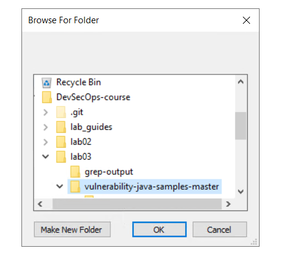

Secure Code Inspection
======================


This lab will cover the following topics:

-   Secure coding best practices
-   Vulnerable code patterns for every programming language
-   Automating secure code scanning tools


Automatic secure code inspection script in Linux
================================================

For this approach, we recommend an all-in-one shell script, the **Code
Review Audit Script Scanner** (**CRASS**). This one script includes
everything needed for secure code scanning, and it defines the secure
code scanning patterns for Java, JSP, Flex Flash, .NET, PHP, HTML,
Android, iOS, Python, Ruby, and C. It can easily be extended by editing
the [grep-it.sh] file. We may use the same vulnerable Python
project from before as our example for the following steps.


Step 1 -- downloading the CRASS
===============================

`grep-it.sh` script has been downloaded already from here:
[**https://github.com/floyd-fuh/crass/blob/master/grep-it.sh**](https://github.com/floyd-fuh/crass/blob/master/grep-it.sh) in `lab03` folder.


Step 2 -- executing the code review audit scan
==============================================

Following repository contains an example Python API that is vulnerable to several different web API attacks. It has been cloned already in `lab03` folder.
https://github.com/mattvaldes/vulnerable-api

Execute the command with a parameter to specify the target project
folder. The following command will scan the vulnerable source code under
the [/vulnerable-api] folder:

**Important:** Make sure to run this exercise from git bash:


```
bash  grep-it.sh  ./vulnerable-api
```

Wait for scan to complete for few minutes.


Step 3 -- reviewing the results
===============================

Once the scanning is done, the scanning results will be output under the
[\\grep-output] folder of the target scanning project.

The scanning results will be generated into files separated by security
topic, as shown in the following diagram:


**Task:** Analyze all these files one by one:


Automatic secure code inspection tools for Windows
==================================================


Step: Executing VCG
====================

Search `VisualCodeGrepper` to directly launch VCG in GUI mode:


Click **Settings** and select `Java`:


Click **File** and select `New Target Directory`:





Click **Scan** and select `Full Scan`:


Step 3: Reviewing the VCG scanning results
==========================================

**Output:**


Click **File** and select `Export Results to CSV file`

You may use the [VCG GUI] \| [File] \| [Import Results from CSV File] \| [test1.csv] to review the results with highlighted colors.


Summary
=======

In a case study of this lab, we demonstrated the use of CRASS
to scan vulnerable Python APIs. Furthermore, we also introduced another
generic general secure coding inspection tool, VCG.

In the coming lab, we will apply similar code inspection techniques
to look for sensitive information leakage and privacy security issues.
