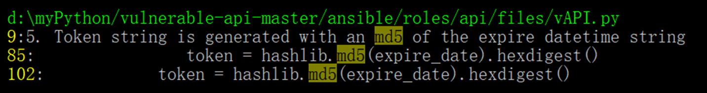
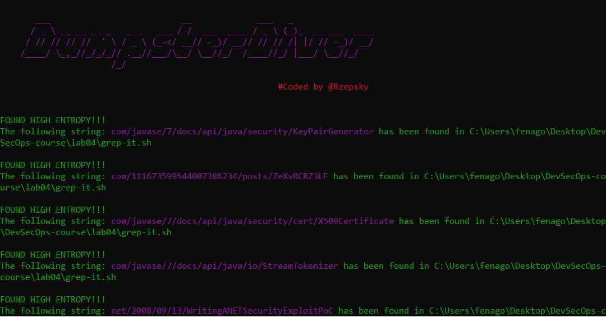
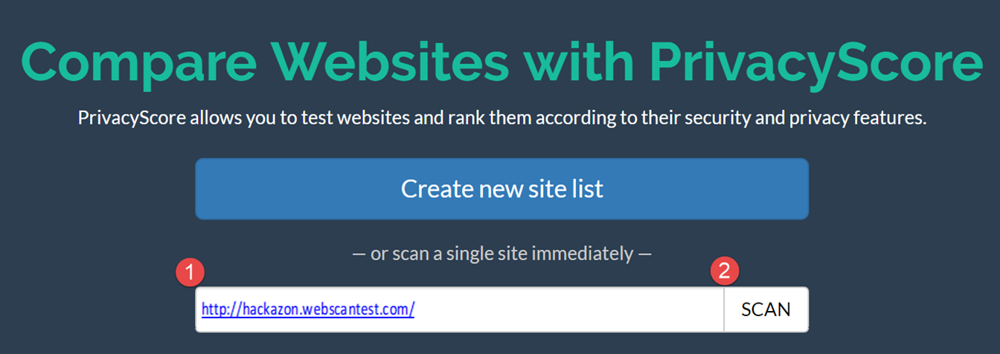
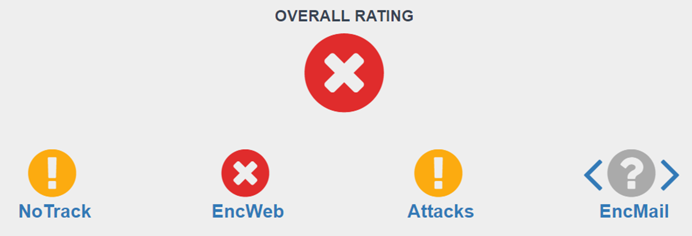

Sensitive Information and Privacy Testing
=========================================

The following is what we will be covering in this lab:

-   Automated sensitive information scanning in the source code
-   Automated sensitive information scanning for the application and
    database


Case study -- weak encryption search
====================================

Let\'s still use the same project, the Python Vulnerable API, to search
for weak encryption used in the source code. In this case, we will be
looking for the uses of the vulnerable MD5 algorithm in the source code.
The tool we introduce here is The Silver Searcher, which can do a fast
recursive search based on a given keyword for all file contents, and
indicate the results.

Step 1 -- installing The Silver Searcher
========================================

The Silver Searcher providers installation details for different
platforms:
<https://github.com/ggreer/the_silver_searcher>.[](https://github.com/ggreer/the_silver_searcher)

For Windows releases, the tool can be downloaded here:
<https://github.com/k-takata/the_silver_searcher-win32/releases>.[](https://github.com/k-takata/the_silver_searcher-win32/releases)


Step 2 -- executing the tool (using Windows as an example)
==========================================================

Use [ag -h] to display all the options and usage in the console.
In this case, we will use [-w] to match the keyword, [md5].
The AG tool can be executed as follows:


```
ag –w md5 ./vulnerable-api
```

Step 3 -- reviewing the results (using Windows as an example)
=============================================================

The following screenshot shows the output of the tool. It shows that the
[vAPI.py] file contains the [md5] keyword in three lines.

There are also other options to support various kinds of search. Just
type [ag] to see the output in the console:





Case study -- searching for a private key
=========================================

Let\'s take another case to look at searching for the compromise of API
key information. An API key being hardcoded in the source code or a
password being weakly encrypted in the source code are both common
security vulnerabilities. To search for a private encryption key or
hardcoded password requires the calculation of entropy which is a number
to represent the level of randomness. A string with a high entropy value
is normally an indicator of a potential API key, hash value, or
encrypted message. In the following demonstration, we will also use the
vulnerable Python API project to search for vulnerable API keys in the
source code. The tools we will be using are [entropy.py] and
[DumpsterDiver]. To download the script, execute the following
command:


```
git clone https://github.com/securing/DumpsterDiver
```

Step 1 -- calculating the entropy
=================================

This step of entropy calculation is optional. However, an entropy value
will help to improve the accuracy of the search result. For example, say
we know of one other API key in the source code. Knowing the entropy
value of that known API key will help to identify another unknown key
with higher accuracy. In this case, we\'re assuming the known API key is
[ZeXvRCRZ3LF]:

`python  entropy.py   ZeXvRCRZ3LF`


The output of the entropy calculation will be done by DumpsterDiver. The
entropy value of the known API key string is [3.095795255] bits.
Once we have the exact entropy value of the known API key, we can search
for the same entropy value of other API Keys.


Step 2 -- Searching for high-entropy strings
============================================

Based on the entropy value, we can search all the projects for similar
entropy values of [3.095]. Again, this is optional; it just helps
us to locate what we are looking for more accurately. If the entropy
value is not specified, DumpsterDiver will just list all the
high-entropy value strings:


```
python  DumpsterDiver.py   --entropy  3.095  -p  ./vulnerable-api
```


Step 3 -- Reviewing the results
===============================

DumpsterDiver will list all the identified entropy strings. Then, it may
need to check whether any of them indicate private API key leakage. For
example, the following screenshot shows three strings with the same
entropy value having been identified. We can further review whether
these are exposed API keys:





Case study -- website privacy inspection
========================================

Here we will look at how to identify vulnerabilities in private
information when a web service goes live.


For a quick demo of how to use PrivacyScore, you can use the online
version to scan a vulnerable website. If the web service you are
developing can\'t be reached over the internet, PrivacyScore also
provides a standalone version that you can set up in house.


Step 1 -- visiting PrivacyScore or setting it up locally
========================================================

For the online version of PrivacyScore, please visit
<https://privacyscore.org/>.[](https://privacyscore.org/)

To set up PrivacyScore locally, refer to
<https://github.com/PrivacyScore/PrivacyScore/>.[](https://github.com/PrivacyScore/PrivacyScore/)

Input the target vulnerable website,
[http://hackazon.webscantest.com/], and click
[SCAN], as shown in the following screenshot. The
scanning will be triggered and will run on the cloud:





Step 2 -- reviewing the results
===============================

After the scanning is done, you will see the scanning results as
follows. In our example, the website shows potential risks for the
NoTrack and Attacks categories. It suggests that the web administrator
take further actions to review the third-party embeds, the uses of HTTPS
everywhere, and also the secure configuration of HTTP security headers:





Summary
=======

In this lab, we looked at three case studies. The first case study was about
searching for weak encryption using The Silver Searcher. The second case
was about identifying potential API key leakage in the source code by
using DumpsterDiver. The final case was about examining website privacy,
looking specifically at the use of PrivacyScore to scan the target
website.

We have practiced various kinds of white-box source code review
techniques for sensitive information.