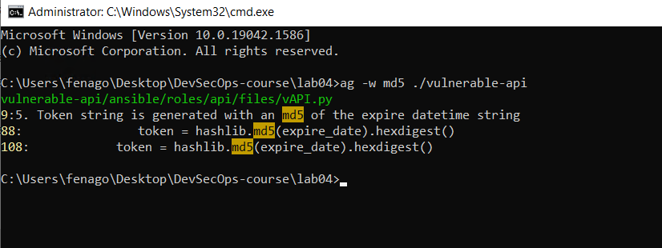

Sensitive Information and Privacy Testing
=========================================

After discussing how to review the security of your code, we will now
discuss how to use automated scanning to prevent the disclosure of
sensitive information for every software release. There are three
typical scenarios related to data privacy handling. The first is where
sensitive information is included in the source code, such as an API
key, a hardcoded password, a hidden hotkey, an email address, or an IP
or URL. Secondly, sensitive information can also be stored in cookies,
since cookies can collect the browsing behaviors of users. Finally,
large projects handling massive amounts of data require effective ways
of identifying and protecting any **Personal Identifiable Information**
(**PII**) stored in the database.

The following is what we will be covering in this lab:

-   The objective of sensitive information testing
-   Automated sensitive information scanning in the source code
-   Automated sensitive information scanning for the application and
    database

The objective of sensitive information testing
==============================================

In addition to secure code patterns, we also need to pay attention to
the potential disclosure of sensitive information in our software
releases. The identification of any PII helps us to investigate how the
system is handling this sensitive data and see whether there is any
violation of legislation, such as the **General Data Protection
Regulation** (**GDPR**). Furthermore, the purpose of scanning for
system-related sensitive information leakage is to review any system
vulnerability exposure, such as that of a password or API key.

The following table shows details about scanning for sensitive
information, PII, and the source code:

+-----------------------+-----------------------+-----------------------+
| **Area of white-box   | **Objective**         | **The primary scope   |
| scanning**            |                       | of the scan**         |
+-----------------------+-----------------------+-----------------------+
| Sensitive information | To ensure no leaking  | Settings              |
| scanning for system   | of sensitive          |                       |
| information           | information, such as  | Installed components  |
|                       | an API key, a         |                       |
|                       | password, or          | Scripts               |
|                       | hardcoded             |                       |
|                       | administrator account |                       |
|                       | credentials           |                       |
+-----------------------+-----------------------+-----------------------+
| Privacy scanning for  | To review how PII is  | Database              |
| handling PII          | stored, handled,      |                       |
|                       | presented, and        | Storage               |
|                       | removed               |                       |
|                       |                       | Configuration         |
+-----------------------+-----------------------+-----------------------+
| Secure code scanning  | To ensure the source  | Source code           |
|                       | code complies with    |                       |
|                       | secure coding rules,  |                       |
|                       | and to mitigate OWASP |                       |
|                       | Top 10 security       |                       |
|                       | issues                |                       |
+-----------------------+-----------------------+-----------------------+


PII discovery
=============

Understanding where and how PII is stored is the first step for the
proper protection of private data. To proceed with PII data discovery,
we will discuss some simple methods of searching for any PII that may be
stored on the system. Generally, PII can be stored anywhere in an
application or system. PII may even be found in the recycle bin.
Discovering and protecting PII requires constant effort and due
diligence. The purpose of PII data discovery is to find answers to the
following questions:

-   What types of PII are present (such as names, emails, or other
    personal information)?
-   Where is the PII stored (could be a database, files, or
    configuration)?
-   How is the PII classified?
-   What access permissions are there to the PII?

One common and simple approach to PII discovery is using regular
expressions. The following table lists examples of regular expression
patterns we may use to search the source code, configuration, and log
files:

  ----------------------------------- ----------------------------------------------------------------
  **PII-related information**         **Examples of regular expression patterns**

  Credit card number                  [\\d{4}\[ -\]?\\d{4}\[ -\]?\\d{4}\[ -\]?\\d{4}\|\\d{4}\[
                                      -\]?\\d{6}\[ -\]?\\d{4}\\d?]

  Email address                       [/(\[a-z0-9\_\\-.+\]+)@\\w+(\\.\\w+)\*]

  IP address                          [\\b(?:\\d{1,3}\\.){3}\\d{1,3}\\b]

  Credentials                         [1234 \| admin \| password \| pass \| creds \| login]

  Phone number                        [(\\(?\\+?\[0-9\]{1,2}\\)?\[-. \]?)?(\\(?\[0-9\]{3}\\)?\|\
                                      \[0-9\]{3})\[-. \]?(\[0-9\]{3}\[-.
                                      \]?\[0-9\]{4}\|\\b\[A-Z0-9\]{7}\\b)]

  Address                             [(street\|st\|road\|rd\|avenue\|ave\|drive\|dr\|loop\|court\|\
                                      ct\|circle\|cir\|lane\|ln\|boulevard\|blvd\|way)\\.?\\b]

  Social security number              [\\b\\d{3}\[ -.\]?\\d{2}\[ -.\]?\\d{4}\\b]

  ZIP code                            [\\b\\d{5}\\b(-\\d{4})?\\b]

  URL                                 [(\[\^\\s:/?\#\]+):\\/\\/(\[\^/?\#\\s\]\*)(\[\^?\#\\s\]\*)\
                                      (\\?(\[\^\#\\s\]\*))?(\#(\[\^\\s\]\*))?]

  Dates (MM/DD/YYYY )                 [\^(\[1\]\[12\]\|\[0\]?\[1-9\])\[\\/-\](\[3\]\[01\]\|\
                                      \[12\]\\d\|\[0\]?\[1-9\])\[\\/-\](\\d{4}\|\\d{2})\$]
  ----------------------------------- ----------------------------------------------------------------


Sensitive information discovery
===============================

In addition to PII, there is also other sensitive information related to
the system and applications that needs to be discovered and secured. The
purpose of identifying these is to avoid such information, which may be
hardcoded in the source code or within the configuration files, being
exposed to debug logs:

+-----------------------------------+-----------------------------------+
| **System-related**                | **Examples of regular expression  |
| s**ensitive/vulnerable**          | patterns**                        |
| i**nformation**                   |                                   |
+-----------------------------------+-----------------------------------+
| Password                          | [Passw(d\|ord)?\|secret \|        |
|                                   | username \| key]            |
+-----------------------------------+-----------------------------------+
| Private key                       | [(private\|ap                     |
|                                   | i\|secret\|aws)\[\_-\]?key] |
+-----------------------------------+-----------------------------------+
| Hardcoded URL                     | [(http \| https \| ftp \|         |
|                                   | ftps)]                      |
+-----------------------------------+-----------------------------------+
| MD5 hash                          | [\^\[a-f0-9\]{32}\$]        |
+-----------------------------------+-----------------------------------+
| SHA1 hash                         | [\\b(\[a-f0-9\]{40})\\b]    |
+-----------------------------------+-----------------------------------+
| Base64 encoding                   | [\^(?:\[A-Za-z0-9+/\]{4})\*\      |
|                                   | (?:\[A-Za-z0-9+/\]{2}==\|]\ |
|                                   | [\[A-Za-z0-9+/\]{3}=\|\           |
|                                   | \[A-Za-z0-9+/\]{4})\$]      |
+-----------------------------------+-----------------------------------+
| SQL statements                    | [(SELECT\\s\[\\w\\\*\\)\\\        |
|                                   | (\\,\\                            |
|                                   | s\]+\\sFROM\\s\[\\w\]+)\|]\ |
|                                   | [(UPDATE\\s\[\\w\]+\\sSE          |
|                                   | T\\s\[\\w\\,\\\'\\=\]+)\|]\ |
|                                   | [(INSERT\\sIN                     |
|                                   | TO\\s\[\\d\\w\]+\[\\s\\w\\d\\)\\\ |
|                                   | (\\,\]\*\\sVALUES\\               |
|                                   | s\\(\[\\d\\w\\\'\\,\\)\]+)] |
+-----------------------------------+-----------------------------------+
| Private IP                        | [(\^127\\.)\|(\                   |
|                                   | ^10\\.)\|(\^172\\.1\[6-9\]\\.)\|\ |
|                                   | (\^172\\.2\[0-9\]\\.)\|]\   |
|                                   | [(\^172\\.3\[0                    |
|                                   | -1\]\\.)\|(\^192\\.168\\.)] |
+-----------------------------------+-----------------------------------+

Here are just some more details about what we\'ll be searching for and
why:

-   A hardcoded URL in the source code or a private IP defined in the
    source code can potentially become a backdoor.
-   MD5, SHA1, and Base64 are weak encryption/encoding algorithms. Any
    passwords encoded by Base64 or hashed by MD5 and SHA1, will be at
    high risk.
-   For SQL statements, we will be looking for whether there are any
    missing prepare statements and any sensitive information queries.


Privacy search tools
====================

Using regular expression patterns is the first step in building your own
secure code scanning service. It\'s easy to use GREP to quickly search
for specified patterns. In the next sections, we will introduce three
tools that can make these search jobs easier:

  --------------------- ------------------------------------------------------------------------------------------------------------------------------------------------------------------------------------------------------------------------------------------------------------------------------
  **Tool name**         **Key characteristics**
  The Silver Searcher   This works similarly to Linux GREP for full-text searches in files, but it\'s much faster. It can support multiple platforms and is easy to use: <https://github.com/ggreer/the_silver_searcher>.[](https://github.com/ggreer/the_silver_searcher)
  ReDataSense           This is useful for searching for PII in a MySQL database or in files. It can also define flexible search patterns/rules. It\'s a Java program but can also support multiple platforms: <https://github.com/redglue/redsense>.[](https://github.com/redglue/redsense)
  DumpsterDiver         This is used to search for secrets, API keys, and encrypted passwords by using entropy. It can search logs, files, and compressed archives, and can also customize scanning rules: <https://github.com/securing/DumpsterDiver>.[](https://github.com/securing/DumpsterDiver)
  --------------------- ------------------------------------------------------------------------------------------------------------------------------------------------------------------------------------------------------------------------------------------------------------------------------


Case study -- weak encryption search
====================================

Let\'s still use the same project, the Python Vulnerable API, to search
for weak encryption used in the source code. In this case, we will be
looking for the uses of the vulnerable MD5 algorithm in the source code.
The tool we introduce here is The Silver Searcher, which can do a fast
recursive search based on a given keyword for all file contents, and
indicate the results.


Step 1 -- installing The Silver Searcher
========================================

The Silver Searcher providers installation details for different
platforms:
<https://github.com/ggreer/the_silver_searcher>.[](https://github.com/ggreer/the_silver_searcher)

For Windows releases, the tool can be downloaded here:
<https://github.com/k-takata/the_silver_searcher-win32/releases>.[](https://github.com/k-takata/the_silver_searcher-win32/releases)


Step 2 -- executing the tool (using Windows as an example)
==========================================================

Use [ag -h] to display all the options and usage in the console.
In this case, we will use [-w] to match the keyword, [md5].
The AG tool can be executed as follows:


```
$ ag –w md5 d:\<targetPath>
```


Step 3 -- reviewing the results (using Windows as an example)
=============================================================

The following screenshot shows the output of the tool. It shows that the
[vAPI.py] file contains the [md5] keyword in three lines.

There are also other options to support various kinds of search. Just
type [ag] to see the output in the console:





Case study -- searching for a private key
=========================================

Let\'s take another case to look at searching for the compromise of API
key information. An API key being hardcoded in the source code or a
password being weakly encrypted in the source code are both common
security vulnerabilities. To search for a private encryption key or
hardcoded password requires the calculation of entropy which is a number
to represent the level of randomness. A string with a high entropy value
is normally an indicator of a potential API key, hash value, or
encrypted message. In the following demonstration, we will also use the
vulnerable Python API project to search for vulnerable API keys in the
source code. The tools we will be using are [entropy.py] and
[DumpsterDiver]. To download the script, execute the following
command:


```
$ git clone https://github.com/securing/DumpsterDiver
```


Step 1 -- calculating the entropy
=================================

This step of entropy calculation is optional. However, an entropy value
will help to improve the accuracy of the search result. For example, say
we know of one other API key in the source code. Knowing the entropy
value of that known API key will help to identify another unknown key
with higher accuracy. In this case, we\'re assuming the known API key is
[ZeXvRCRZ3LF]:


```
$  python  entropy.py   ZeXvRCRZ3LF
```


The output of the entropy calculation will be done by DumpsterDiver. The
entropy value of the known API key string is [3.095795255] bits.
Once we have the exact entropy value of the known API key, we can search
for the same entropy value of other API Keys.


Step 2 -- Searching for high-entropy strings
============================================

Based on the entropy value, we can search all the projects for similar
entropy values of [3.095]. Again, this is optional; it just helps
us to locate what we are looking for more accurately. If the entropy
value is not specified, DumpsterDiver will just list all the
high-entropy value strings:


```
$  python  DumpsterDiver.py   --entropy  3.095  -p   <TargetProjectPath>
```


Step 3 -- Reviewing the results
===============================

DumpsterDiver will list all the identified entropy strings. Then, it may
need to check whether any of them indicate private API key leakage. For
example, the following screenshot shows three strings with the same
entropy value having been identified. We can further review whether
these are exposed API keys:


Case study -- website privacy inspection
========================================

Here we will look at how to identify vulnerabilities in private
information when a web service goes live.

The insecure design of a website may result in the leaking or
interception of private information. One of the most common ways in
which information leakage can occur is by the use of insecure
communication protocols, such as HTTP, Telnet, or FTP. These protocols
are communicating messages without any encryption. The web administrator
will need an automatic privacy scanning tool to do see whether this is
an issue affecting them.

Here we introduce the use of PrivacyScore. It provides the following
privacy inspections:

+-----------------------------------+-----------------------------------+
| **Privacy scan scenarios**        | **Examples**                      |
+-----------------------------------+-----------------------------------+
| No Track:                         | -   Checks whether third-party    |
|                                   |     embeds are being used         |
| No Browsing histories tracked by  | -   Checks whether Google         |
| websites and third parties        |     Analytics is being used       |
|                                   | -   Checks whether the web server |
|                                   |     geo-location is based on DNS  |
|                                   |     IP lookup                     |
+-----------------------------------+-----------------------------------+
| EncWeb:                           | -   Checks whether the server is  |
|                                   |     running with HTTPS            |
| Encryption of web traffic         | -   Checks for automatic          |
|                                   |     redirection to HTTPS          |
+-----------------------------------+-----------------------------------+
| Attacks:                          | -   Checks for HTTP security      |
|                                   |     headers, such as              |
| Protection against various        |     X-Frame-Options, **Content    |
| attacks                           |     Security Policy** (**CSP**),  |
|                                   |     **Cross-site scripting**      |
|                                   |     (**XSS**) protection,         |
|                                   |     X-Content-Type-Options, and   |
|                                   |     referrer-policy               |
+-----------------------------------+-----------------------------------+
| EncMail:                          | -   Checks for the DNS if the     |
|                                   |     domain also includes an email |
| Encryption of mail traffic        |     server                        |
+-----------------------------------+-----------------------------------+


For a quick demo of how to use PrivacyScore, you can use the online
version to scan a vulnerable website. If the web service you are
developing can\'t be reached over the internet, PrivacyScore also
provides a standalone version that you can set up in house.


Step 1 -- visiting PrivacyScore or setting it up locally
========================================================

For the online version of PrivacyScore, please visit
<https://privacyscore.org/>.[](https://privacyscore.org/)

To set up PrivacyScore locally, refer to
<https://github.com/PrivacyScore/PrivacyScore/>.[](https://github.com/PrivacyScore/PrivacyScore/)

Input the target vulnerable website,
[http://hackazon.webscantest.com/], and click
[SCAN], as shown in the following screenshot. The
scanning will be triggered and will run on the cloud:


Step 2 -- reviewing the results
===============================

After the scanning is done, you will see the scanning results as
follows. In our example, the website shows potential risks for the
NoTrack and Attacks categories. It suggests that the web administrator
take further actions to review the third-party embeds, the uses of HTTPS
everywhere, and also the secure configuration of HTTP security headers:


Summary
=======

We discussed the objective of testing for sensitive information in this
lab. In terms of privacy testing, the GDPR is the primary baseline
we will comply with. Privacy testing is focused on how PII is handled,
and it\'s important to identify any risks of system-related sensitive
information, such as passwords, API keys, or private IPs, being leaked.
We looked at some patterns that help in searching for PII as well as
sensitive system-related information.

We then looked at three case studies. The first case study was about
searching for weak encryption using The Silver Searcher. The second case
was about identifying potential API key leakage in the source code by
using DumpsterDiver. The final case was about examining website privacy,
looking specifically at the use of PrivacyScore to scan the target
website.

We have practiced various kinds of white-box source code review
techniques for sensitive information.


Questions
=========

1.  Which one of the following does not apply to white-box scanning?
    -   **Web UI** testing
    -   Privacy scanning PII
    -   Secure code scanning
2.  What is the objective of PII discovery?
    -   To discern the types of PII
    -   To see how the PII is classified
    -   **All of above**
3.  What is the regular expression for IP address?
    -   [/(\[a-z0-9\_\\-.+\]+)@\\w+(\\.\\w+)\*]
    -   [\\d{4}\[ -\]?\\d{4}\[ -\]?\\d{4}\[ -\]?\\d{4}\|\\d{4}\[
        -\]?\\d{6}\[ -\]?\\d{4}\\d?]
    -   [**\\b(?:\\d{1,3}\\.){3}\\d{1,3}\\b**]
4.  Why are we looking for Base64 encoding?
    -   **Any password encoded with Base64 is very** **vulnerable and
        can be easily reversed**
    -   To ensure there is no possibility of injection attack
    -   To avoid backdoor connection behavior


Further reading
===============

-   The Silver Searcher: <https://github.com/ggreer/the_silver_searcher>
-   A web privacy measurement framework:
    <https://github.com/citp/OpenWPM>
-   PrivacyScore project: <https://github.com/PrivacyScore/PrivacyScore>
-   Common Regex: <https://github.com/madisonmay/CommonRegex>
-   De-identification: <https://github.com/vmenger/deduce>
-   PII search:
    <https://technet.microsoft.com/en-us/library/2008.04.securitywatch.aspx>
-   Python Vulnerable API:
    <https://github.com/rahulunair/vulnerable-api/>
-   StaCoAn cross-platform static code analysis:
    <https://github.com/vincentcox/StaCoAn>
