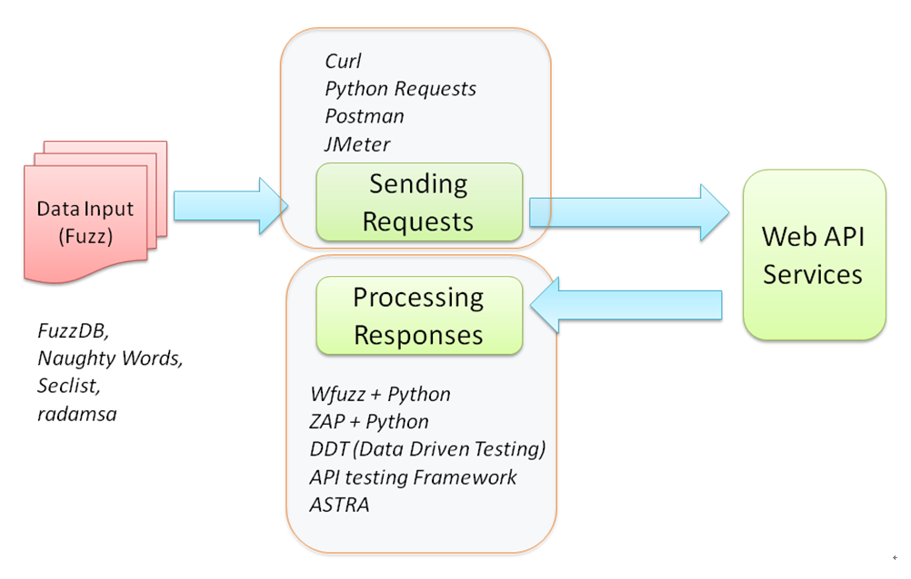

Security API and Fuzz Testing
=============================

n After the privacy and sensitive information security inspection, we
will now explore API and fuzz testing. As the cloud software release can
be on an API-level basis, there can be hundreds of APIs released at a
time. The software development team will definitely need an effective
way to automate the security testing for every API release. In this
lab, we will elaborate further with the help of an example by using
an online pet store for how to build your automated API security testing
framework with various tools. The API security testing focuses mainly on
the data injection and abnormal payload. Therefore, the Fuzz testing
will also be introduced as random data input and security injection for
the automated API security testing.

The following topics will be discussed in this lab:

-   Automated security testing for every API release
-   How to build your security API and fuzz testing framework with ZAP,
    JMeter, and FuzzDB


Automated security testing for every API release
================================================

Some of the web services are released with standard REST or SOAP APIs.
The key difference between web and API security testing is the browser
UI dependency. In API testing, we will only focus on the request and
response instead of the UI layout or presentation.

It is always recommended to use the API testing approach because web UI
testing can provide unreliable testing results. General API security
testing may cover authentication, authorization, input validation, error
handling, data protection, secure transmission, and HTTP header
security.

The case we will discuss here concerns a development manager who would
like to build an API security testing framework for every release.
However, he may encounter the following challenges when he is trying to
build the API security testing framework, especially for a development
team without experienced security expertise. In the following sections,
we will demonstrate some open source tools and approaches to solving
these issues.

-   **Data input**: API security testing requires purpose-built random
    security testing data (payload)
-   **Process request**: This requires a proper framework to process the
    data input, to send the requests to web server, and process the
    responses
-   **Process response**: To identify if any security vulnerabilities
    exist based on the responses. For the web API, the typical standard
    responses are JSON or XML instead of HTML, JavaScript, or CSS

For Fuzz data input as security payloads, refer to the following
resources:

-   **FuzzDB**: <https://github.com/fuzzdb-project/fuzzdb>
-   **SecLists**: <https://github.com/danielmiessler/SecLists>
-   **Radamsa**: <https://github.com/vah13/radamsa/releases>

Radamsa is a fuzz data payloads generator based on a specified format or
data sample. It can help if you expect to generate a lot of random and
unexpected data payloads:





Fuzz Testing Tools


To process the HTTP requests and responses, we will use JMeter and ZAP
in our demonstration cases.


Building your security API testing framework
============================================

There are several approaches and open source tools that can help to
build your API security testing framework. The key challenge for
security testing is the [processing responses] part. For example,
to be able to identify the SQL injection vulnerability, the security
testing requires not only proper designed injection payloads, but also
the ability to identify the responses for SQL injection patterns.
Therefore, when we build the security testing for restful or SOAP APIs,
it\'s recommended that you apply the web security testing framework to
help with the response detection.

To build the security API testing framework, we will introduce three
levels of approaches as summarized in the following table:

  -------------- -------------------------- ----------------------------------------------------------------------------------------------------------------------------------------------------------------------------------------------------------------------------------------------------------------------------------------------------------------------------------------------------------------------------------------------------------------------------------------------------------------------------------------------------------
  **Level**      **Recommended toolkits**   **Pros and cons**
  Basic          ZAP                        ZAP can provide a general web security baseline scan. However, ZAP can\'t do specific REST or SOAP API security testing without proper guidance. For example, the HTTP POST request testing can\'t be done here, and that\'s why we introduce JMeter for the next level.
  Intermediate   ZAP + JMeter               The rationale we introduce JMeter is to send specific REST or SOAP APIs and message body through ZAP. In this approach, ZAP will be running in proxy mode to monitor and detect the request/response for security issues.
  Advanced       ZAP + JMeter + fuzz data   We will use JMeter with parameterized testing (data-driven testing). The fuzz data is a dictionary list of specific security issues, such as XSS, SQL injection, or common vulnerable passwords. Although ZAP itself also includes the fuzz testing that can replace the specified parameters with fuzz data, ZAP fuzz testing can only be done by GUI mode at this moment. By using ZAP and JMeter, we can execute the automation in command console mode for the integration with other CI frameworks.
  Advanced       ZAP + OpenAPI              In this case, ZAP will import the API definition files, and do the initial security assessment based on the API lists.
  -------------- -------------------------- ----------------------------------------------------------------------------------------------------------------------------------------------------------------------------------------------------------------------------------------------------------------------------------------------------------------------------------------------------------------------------------------------------------------------------------------------------------------------------------------------------------


Case study 1 -- basic -- web service testing with ZAP CLI
=========================================================

In this case, we will demonstrate how to execute ZAP using the **command
line interface** (**CLI**), which provides a simple way to trigger the
security testing and can be easily integrated with other frameworks. The
key steps of the web security scanning include spider scan, active scan,
and review the scan results.


Step 1 -- OWASP ZAP download and launch with port 8090
======================================================

The OWASP ZAP installer can be downloaded at
<https://github.com/zaproxy/zaproxy/wiki/Downloads> depending on the
platform. Once the installation is done, launch ZAP in GUI mode.
Although ZAP can also be executed in daemon mode, the GUI mode will help
us to review the security assessment results. By default, the ZAP CLI is
using the default port [8090] with ZAP. The proxy settings for ZAP
can be configured using the menu under the [Tools] \|
[Options] \| [Local Proxies] \|
[Port] \| [8090], as shown in the following
screenshot:


OWASP ZAP proxy configuration


Step 2 -- install the ZAP-CLI
=============================

ZAP provides several non-GUI interfaces for integration, such as Java
API, REST API, and CLI. You may choose one of them for the integration.
We will use ZAP-CLI here because it\'s easy to set up, and is also
suitable for engineers who have a little programming background. Please
ensure Python and PIP are installed on the system. The ZAP-CLI can be
installed by one command line, as follows:


```
$ pip install --upgrade zapcli
```


To access ZAP using ZAP-CLI or ZAP, restful API will require an API Key.
The API key of ZAP can be found or disabled under [Tools]
\| [Options] \| [API]. To simplify the
ZAP-CLI operations, we will disable the API key.


Step 3 -- execute the testing under ZAP-CLI
===========================================

Once ZAP and the ZAP-CLI setup are done, we may trigger a few security
assessments. Please be reminded that a spider scan is a must before
running an active scan. Here are the differences between spider, quick,
and active scans:

-   **Spider Scan**: It will explore and search all possible resources
    and URLs of the website. No security attacks will be performed.
-   **Active Scan**: It will do security checks based on URLs or web
    resources available in the ZAP site tree. Therefore, a spider scan
    to explore web resources is a must before an active scan.
-   **Quick Scan**: It\'s an all-in-one command that can do a spider
    scan, active scan and generate a testing report.

To trigger the security scanning with the ZAP-CLI, execute the commands
in the following order:


```
$ zap-cli  spider       http://demo.testfire.net
$ zap-cli  quick-scan   http://demo.testfire.net
$ zap-cli  active-scan  http://demo.testfire.net
```


If it works well, you should be able to see the list of scanned URLs and
alters in the ZAP GUI.

For other command options, the [\--help] can be used, as follows:


```
$ zap-cli --help
```


For example, the following command will help you to know how to use of
[active-scan]:


```
$ zap-cli   active-scan  --help
```


Refer to the following link for the detailed usage of the ZAP-CLI:

<https://github.com/Grunny/zap-cli>


Step 4 -- review the results
============================

You can the security assessment results in the ZAP GUI console or
generate a report. Alternatively, you can also output the security
findings by using the ZAP-CLI. The following command will output the
alerts at the medium level:


```
$ zap-cli alerts -l Medium
```


For the usage of [alerts] options, try the following command:


```
$ zap-cli   alerts  --help
```


Case study 2 -- intermediate -- API testing with ZAP and JMeter
===============================================================

In this case, we will do the login testing scenario to demonstrate the
uses of JMeter with ZAP. If the team has done the automation testing by
JMeter, the ZAP can work well with JMeter. In this scenario, JMeter will
be used to send HTTP POST with username and password parameters to the
target vulnerable website, and ZAP will be monitoring security issue
through the HTTP requests and responses in proxy mode. Based on the
previously installed ZAP environment, we will set up JMeter for the
testing.

The following diagram shows the frameworks relationship between JMeter
and ZAP:\


JMeter and ZAP security testing


To proceed with the testing, follow these steps.


Step 1 -- download JMeter
=========================

JMeter can be downloaded from
[Https://jmeter.apache.org/download\_jmeter.cgi](https://jmeter.apache.org/download_jmeter.cgi).
Java 8 runtime is required to execute JMeter. It\'s a compressed
package. Once it\'s downloaded, unzip the package. To launch JMeter, run
the [jmeter.bat] (Windows) or [jmeter.sh] (Linux), which can
be found under [\\bin] folder.


Step 2 -- define HTTP request for the login
===========================================

In this step, we will define the HTTP POST request for login to the
vulnerable website. Here is key information of the HTTP [POST]
request for the login. It\'s assumed that the username is [user1]
and the password is [pass1] in this example. The information can
be acquired by using browser network inspector (*F12*), as follows:


```
Request URL:  http://demo.testfire.net/bank/login.aspx
Request Method: POST
Request Data: uid=user1&passw=pass1&btnSubmit=Login
```


To configure JMeter to send the HTTP [POST] login request, we need
to create a [Threat Group] and the [HTTP Request] for the
test plan. Under the HTTP request, define the values as shown in the
following screenshot:


HTTP request configuration in JMeter


In addition, we would like to send the HTTP request through the ZAP
proxy. Define the JMeter proxy in the [Advanced] tab. In
our environment, we are running ZAP listening port [8090]:


HTTP request proxy configuration in JMeter


Step 4 -- execute the JMeter script
===================================

There are two ways to run the JMeter script. One involves using the
menu, and the other involves using the command console. Once the
information is properly defined, send the request by
[Run] \| [Start] or *Ctrl* + *R*. The HTTP
[POST] request will be sent through the ZAP proxy and ZAP will
intercept the request and response for security assessments. Once we
have done the automation scripts with JMeter, it\'s suggested to execute
the JMeter in non-GUI mode for further automation integration. In our
case, the following command will apply to our JMeter script. Use [JMeter
--help] to see further information of each command options:


```
Jmeter  -n  -t  MyRequest.jmx  -l  testResult.jtl  -H 127.0.0.1  -P 8090
```


Step 3 -- review the results in ZAP
===================================

We can review the initial security assessments done by the OWASP ZAP
under [Alerts] tab. Alternatively, execute one of the
following command in the console. It will list the security assessments
results in JSON or HTML format, as follows:


```
$ CURL   "http://localhost:8090/JSON/core/view/alerts"
```


The following command will generate the ZAP alerts report in HTML
format:


```
$ CURL   "http://localhost:8090/HTML/core/view/alerts"
```


Case study 3 -- advanced -- parameterized security payload with fuzz
====================================================================

In this testing scenario, we are going to replace the username and
password with security payloads, such as XXE, XSS, or SQL injection
attacks. To test if the login is vulnerable to SQL injection, JMeter
will be reading the external fuzz SQL injection data to replace the
username and password parameters to send the login request.

To generate a list of security payloads, here are some of the
recommended resources:

+-----------------------------------+-----------------------------------+
| **Fuzz database**                 | **Description**                   |
+-----------------------------------+-----------------------------------+
| FuzzDB                            | FuzzDB compressive application    |
|                                   | security testing dictionary for   |
|                                   | attack patterns (injection, XSS,  |
|                                   | directory traversals), discovery  |
|                                   | (admin directories or sensitive   |
|                                   | files), response analysis         |
|                                   | (regular expression patterns),    |
|                                   | web backdoor samples, and         |
|                                   | user/pwd list.                    |
|                                   |                                   |
|                                   | <https://                         |
|                                   | github.com/fuzzdb-project/fuzzdb> |
+-----------------------------------+-----------------------------------+
| Naughty Strings                   | The Naughty Strings provides a    |
|                                   | very long list of strings. There  |
|                                   | are two formats provided,         |
|                                   | [blns.txt] and              |
|                                   | [blns.json].                |
|                                   |                                   |
|                                   | <https://github.com/minim         |
|                                   | axir/big-list-of-naughty-strings> |
+-----------------------------------+-----------------------------------+
| SecList                           | This is similar to FuzzDB, which  |
|                                   | provides various kinds of fuzz    |
|                                   | data such as command injections,  |
|                                   | JSON, LDAP, user agents, XSS,     |
|                                   | char, numeric, Unicode data, and  |
|                                   | so on                             |
|                                   |                                   |
|                                   | <https://gi                       |
|                                   | thub.com/danielmiessler/SecLists> |
+-----------------------------------+-----------------------------------+
| Radamsa                           | Unlike previous FuzzDB that       |
|                                   | provides a list of word           |
|                                   | dictionary, it\'s a tool that can |
|                                   | dynamically generate              |
|                                   | format-specific based on a given  |
|                                   | sample                            |
|                                   |                                   |
|                                   | <                                 |
|                                   | https://github.com/vah13/radamsa> |
+-----------------------------------+-----------------------------------+

\
Follow the following instructions to apply the SQL injection data with
JMeter.


Step 1 -- download the SQL injection data
=========================================

To replace the parameter password with the SQL injection payloads, we
can use the FuzzDB or SecList resources in the previous list. For
example, SecLists provides a list of SQL injection payloads we can use.
The following table lists common SQL injection security payloads that
can be obtained from the following URL:

<https://github.com/danielmiessler/SecLists/blob/master/Fuzzing/Generic-SQLi.txt>.

In this case, we will create the [sqli.csv] with the SQL injection
security payloads, as follows:

+-----------------------------------------------------------------------+
| **SQL injection payloads samples**                                    |
+-----------------------------------------------------------------------+
| 
| ```                                                |
| UNION ALL SELECT                                                      |
|  ) or sleep(__TIME__)='                                               |
| )) or benchmark(10000000,MD5(1))#                                     |
| hi' or 'a'='a                                                         |
| 0                                                                     |
| 21 %                                                                  |
| limit                                                                 |
| or 1=1                                                                |
| or 2 > 1Copy                                                          |
| ```                                                                   |
| 
+-----------------------------------------------------------------------+


Step 2 -- define the CSV dataset in JMeter
==========================================

To add a CSV dataset, right-click the [Test Plan] \|
[Add] \| [Config Element] \| [CSV Data Set
Config]. In the [CSV Data Set Config], we
can define the data input source from the [sqli.csv] files and
variable names.

The following screenshot shows the [CSV Data Set Config]
in JMeter that is used to read the values from the [sqli.csv]:


CSV Data Set Config in JMeter


Step 3 -- apply the variable name
=================================

In our original JMeter script, we will replace the value of password to
the defined variable name [\${password}] as mentioned in the
previous step:


Defined variables in HTTP request in JMeter


Step 4 -- specify the loop
==========================

Finally, we define the number of loops we would like to send to the HTTP
requests with the parameterized data. In our example, we define loop
count as [10]:


Thread group in JMeter


Step 5 -- execute JMeter and review the security assessment results
===================================================================

Follow the following command to execute the JMeter script with ZAP proxy
[1270.0.1:8090]:


```
$ Jmeter  -n  -t  MyRequest.jmx  -l  testResult.jtl  -H 127.0.0.1  -P 8090
```


Under the OWAZP GUI console, the security assessment will be listed in
the [Alerts] tab. In this case, the SQL injection
vulnerability was identified. If we review the [Alerts]
in the ZAP, we can see the [Application Error
Disclosure], which is also an indicator of error-based
SQL injection vulnerability. To view the alerts, we can also use the
following commands to output to the console or specified files:


```
CURL "http://localhost:8090/JSON/core/view/alerts" > LoginTesting.JSON

CURL "http://localhost:8090/HTML/core/view/alerts" > LoginTesting.HTML
```


The following diagram shows the [Alerts] after sending
the SQL injection payloads to the login API, especially the [Application
Error Disclosure] parts:


Error disclosure in ZAP


In this case, we target the login API for the testing of SQL injection
vulnerability. We apply JMeter to read external FuzzDB resources for the
SQL injection data input and define the CSV data in JMeter for the
parameterized testing of the password variable. Once the various SQL
injection data payloads were sent by JMeter through the ZAP proxy, we
review the security assessments in ZAP. Other security payloads, such as
XSS, XXE, or command injection, can also apply to the same login API for
further testing. On the other hand, we can use similar approaches to
test other APIs.


Case study 4 -- security testing with ZAP Open/SOAP API
=======================================================

Some web services may provide a list of REST or SOAP API interfaces.
These API interfaces are built for other application to do further
integration or customization. The standard response of the REST or SOAP
APIs can be JSON or XML. ZAP can be installed with the OpenAPI and SOAP
API add-ons for the web API security testing. Take the PetStore API as
an example: <https://petstore.swagger.io/>. In this case, ZAP can import
the API definition files and assess security issue for every API. This
is the most effective way to ensure that all the APIs are included in
the ZAP scanning. Simply doing the spider scanning in ZAP won\'t enable
you to list all the API interfaces.


Step 1 -- install the OpenAPI and SOAP API add-ons
==================================================

To enable the API definition import features, ZAP will need to
additionally install two add-ons. Execute the following command in the
console:


```
Zap  -addoninstall  soap  -addoninstall  openapi
```


If the installation is successful, the following command will be able to
output the HTML message in the console:


```
CURL  "http://localhost:8090/UI/openapi/"
```


Step 2 -- import the API definition
===================================

ZAP can import the API definition by a local file or URL Taking the
PetStore API as an example, we provide the URL for [swagger.json]
in the [CURL importUrl] command options. Please be aware that the
following command should be in one line without any line break, although
it may look like two lines due to the layout formatting:


```
CURL "http://localhost:8090/JSON/openapi/action/importUrl/?zapapiformat=JSON&formMethod=GET&url=https://petstore.swagger.io/v2/swagger.json&hostOverride="
```


It may take a while to import the APIs. Once it\'s done, you will see
the API list in the ZAP console as shown in the following diagram:


API security in ZAP


Alternatively, you can also import the API by browser using the
following URL:

[http://localhost:8090/UI/openapi/action/importUrl/ ]


Step 3 -- execute the active security scanning
==============================================

We can use [ascan] to do the active scanning for the PetStore
website. Refer to the following command:


```
CURL  “http://localhost:8090/JSON/ascan/action/scan/?zapapiformat=JSON&formMethod=GET&url=https://petstore.swagger.io/&recurse=&inScopeOnly=&scanPolicyName=&method=&postData=&contextId=”
```


Step 4 -- present the security assessments
==========================================

Once the active scanning is done, view the [alerts] for the
assessments results. It can be in either JSON or HTML formats, as
follows:


```
$  CURL "http://localhost:8090/JSON/core/view/alerts"
$  CURL   "http://localhost:8090/HTML/core/view/alerts"
```


For the advanced user who would like to filter the output with specific
URL, refer to the following command:


```
$ CURL "http://localhost:8090/JSON/core/view/alerts/?zapapiformat=JSON&formMethod=GET&baseurl=https://petstore.swagger.io&start=&count=&riskId="
```


The following command will generate HTML format results:


```
$ CURL "http://localhost:8090/HTML/core/view/alerts/?zapapiformat=HTML&formMethod=GET&baseurl=https://petstore.swagger.io&start=&count=&riskId="
```


Summary
=======

In this lab, we discussed the security testing for API release. The
API security testing involved the data input, the requests, and the
analysis of the responses. For the data input parts, we suggested using
FuzzDB and SecList. To send the API requests, we applied the OWASP ZAP
and JMeter in our case studies. For the security analysis of API
responses, we used OWASP ZAP.

Four hands-on case studies were demonstrated. They applied different
techniques for the API security testing scenarios. In addition, we also
demonstrated how the testing tool JMeter can be integrated with the
security scanning tool ZAP to achieve the API security testing:

-   Basic---web service testing with ZAP CLI
-   Intermediate---API testing with ZAP and JMeter
-   Advanced---parameterized security payload with fuzz
-   Security testing with ZAP OpenAPI/SOAP API

After having discussed API-level security testing, we will move on to
the integrated security testing of web applications in the next lab.


Questions
=========

1.  Which one of the followings is not used for security data payloads
    source?
    1.  FuzzDB
    2.  SecLists
    3.  CURL
    4.  Naughty Strings
2.  Which one can be used to send HTTP requests?
    1.  JMeter
    2.  Python Requests
    3.  CURL
    4.  All of above
3.  Which one of the ZAP-CLI commands can be used to trigger the
    security assessments?
    1.  ZAP-CLI spider
    2.  ZAP-CLI quick-scan
    3.  ZAP-CLI active-scan
    4.  All of above
4.  In JMeter, what element is used to read the CSV values?
    1.  CSV Data Set Config
    2.  HTTP Request
    3.  View Results Tree
    4.  Thread Group
5.  What will the ZAP API do?
    1.  View the testing results?
    2.  Trigger a testing
    3.  Spider a website


Further reading
===============

-   **ASTRA API Security Testing**:
    [https://www.astra-security.info](https://www.astra-security.info/)
-   **API Security Checklist**:
    <https://github.com/shieldfy/API-Security-Checklist>
-   **Python API Security testing by OpenStack Security**:
    <https://github.com/openstack/syntribos>
-   **Testing your API for Security in Python**:
    <https://github.com/BBVA/apitest>
-   **Online Vulnerable Web**:
    [http://zero.webappsecurity.com](http://zero.webappsecurity.com/)
-   **FuzzDB**: <https://github.com/fuzzdb-project/fuzzdb>
-   **SecList**: <https://github.com/danielmiessler/SecLists>
-   **Web Security Fuzz Testing 0d1n**:
    <https://github.com/CoolerVoid/0d1n>
