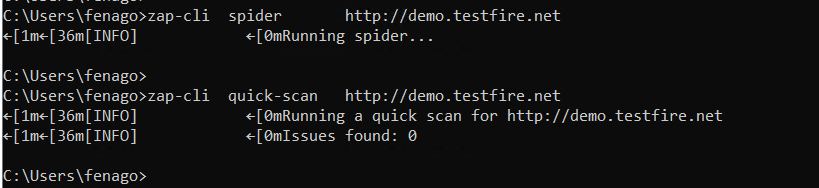

Security API and Fuzz Testing
=============================

The following topics will be discussed in this lab:

-   Automated security testing for every API release
-   How to build your security API and fuzz testing framework with ZAP,
    JMeter, and FuzzDB


Case study 1 -- basic -- web service testing with ZAP CLI
=========================================================

In this case, we will demonstrate how to execute ZAP using the **command
line interface** (**CLI**), which provides a simple way to trigger the
security testing and can be easily integrated with other frameworks. The
key steps of the web security scanning include spider scan, active scan,
and review the scan results.


Step 1 -- OWASP ZAP launch with port 8090
=========================================

The OWASP ZAP installer has been installed in the lab environment
<https://github.com/zaproxy/zaproxy/wiki/Downloads> . Click the following icon on Desktop, 
launch ZAP in GUI mode.
Although ZAP can also be executed in daemon mode, the GUI mode will help
us to review the security assessment results. 


By default, the ZAP CLI is using the default port [8090] with ZAP. The proxy settings for ZAP
can be confirmed using the menu under the [Tools] \|
[Options] \| [Local Proxies] \|
[Port] \| [8090], as shown in the following
screenshot:


Step 2 -- Using ZAP-CLI
=============================

ZAP provides several non-GUI interfaces for integration, such as Java
API, REST API, and CLI. You may choose one of them for the integration.
We will use ZAP-CLI here. Confirm that zapcli is intalled by running following command:


```
zap-cli --help
```


To access ZAP using ZAP-CLI or ZAP, restful API will require an API Key.
The API key of ZAP can be found or disabled under [Tools]
\| [Options] \| [API]. To simplify the
ZAP-CLI operations, we have disable the API key.


Step 3 -- execute the testing under ZAP-CLI
===========================================

To trigger the security scanning with the ZAP-CLI, execute the commands
in the following order:


```
zap-cli  spider       http://demo.testfire.net

zap-cli  quick-scan   http://demo.testfire.net

zap-cli  active-scan  http://demo.testfire.net
```



If it works well, you should be able to see the list of scanned URLs and
alters in the ZAP GUI.


For other command options, the [\--help] can be used, as follows:


```
zap-cli --help
```


For example, the following command will help you to know how to use of
[active-scan]:


```
zap-cli   active-scan  --help
```


Step 4 -- review the results
============================

You can the security assessment results in the ZAP GUI console or
generate a report. Alternatively, you can also output the security
findings by using the ZAP-CLI. The following command will output the
alerts at the medium level:


```
zap-cli alerts -l Medium
```


Case study 2 -- intermediate -- API testing with ZAP and JMeter
===============================================================

In this case, we will do the login testing scenario to demonstrate the
uses of JMeter with ZAP. If the team has done the automation testing by
JMeter, the ZAP can work well with JMeter. In this scenario, JMeter will
be used to send HTTP POST with username and password parameters to the
target vulnerable website, and ZAP will be monitoring security issue
through the HTTP requests and responses in proxy mode. Based on the
previously installed ZAP environment, we will set up JMeter for the
testing.

The following diagram shows the frameworks relationship between JMeter
and ZAP:


To proceed with the testing, follow these steps.


Step 1 -- Launch JMeter
=======================

To launch JMeter, run the [jmeter.bat] (Windows) (Linux), which can be found under [\\bin] folder:

```
cd C:\Users\fenago\Downloads\apache-jmeter-5.4.3\bin

jmeter.bat
```


Step 2 -- define HTTP request for the login
===========================================

**Solution:** JMX file has been saved in `C:\Users\fenago\Desktop\DevSecOps-course\lab05\MyPostRequest.jmx`

In this step, we will define the HTTP POST request for login to the
vulnerable website. Here is key information of the HTTP [POST]
request for the login. It\'s assumed that the username is [user1]
and the password is [pass1] in this example. The information can
be acquired by using browser network inspector (*F12*), as follows:


```
Request URL:  http://demo.testfire.net/bank/login.aspx
Request Method: POST
Request Data: uid=user1&passw=pass1&btnSubmit=Login
```


To configure JMeter to send the HTTP [POST] login request, we need
to create a [Threat Group] and the [HTTP Request] for the
test plan. Under the HTTP request, define the values as shown in the
following screenshot:


In addition, we would like to send the HTTP request through the ZAP
proxy. Define the JMeter proxy in the [Advanced] tab. In
our environment, we are running ZAP listening port [8090]:


Step 4 -- execute the JMeter script
===================================

There are two ways to run the JMeter script. One involves using the
menu, and the other involves using the command console. Once the
information is properly defined, send the request by
[Run] \| [Start] or *Ctrl* + *R*. The HTTP
[POST] request will be sent through the ZAP proxy and ZAP will
intercept the request and response for security assessments. Once we
have done the automation scripts with JMeter, it\'s suggested to execute
the JMeter in non-GUI mode for further automation integration. In our
case, the following command will apply to our JMeter script. Use [JMeter
--help] to see further information of each command options:


```
cd C:\Users\fenago\Desktop\DevSecOps-course\lab05

Jmeter  -n  -t  MyPostRequest.jmx  -l  testPostResult.jtl  -H 127.0.0.1  -P 8090
```


Step 3 -- review the results in ZAP
===================================

We can review the initial security assessments done by the OWASP ZAP
under [Alerts] tab. Alternatively, execute one of the
following command in the console. It will list the security assessments
results in JSON or HTML format, as follows:


```
CURL   "http://localhost:8090/JSON/core/view/alerts"
```


The following command will generate the ZAP alerts report in HTML
format:


```
CURL   "http://localhost:8090/HTML/core/view/alerts"
```

**Note:** You can also open above URL in browser


Case study 3 -- advanced -- parameterized security payload with fuzz
====================================================================

In this testing scenario, we are going to replace the username and
password with security payloads, such as XXE, XSS, or SQL injection
attacks. To test if the login is vulnerable to SQL injection, JMeter
will be reading the external fuzz SQL injection data to replace the
username and password parameters to send the login request.

Follow the following instructions to apply the SQL injection data with JMeter.


Step 1 -- download the SQL injection data
=========================================

To replace the parameter password with the SQL injection payloads, we
can use the FuzzDB or SecList resources in the previous list. For
example, SecLists provides a list of SQL injection payloads we can use.
The following table lists common SQL injection security payloads that
can be obtained from the following URL:

<https://github.com/danielmiessler/SecLists/blob/master/Fuzzing/Generic-SQLi.txt>.

In this case, we will create the [sqli.csv] with the SQL injection
security payloads, as follows:

```
UNION ALL SELECT
 ) or sleep(__TIME__)='
)) or benchmark(10000000,MD5(1))#
hi' or 'a'='a
0
21 %
limit
or 1=1
or 2 > 1
```


Step 2 -- define the CSV dataset in JMeter
==========================================


**Solution:** JMX file has been saved in `C:\Users\fenago\Desktop\DevSecOps-course\lab05\MyRequest.jmx`


To add a CSV dataset, right-click the [Test Plan] \|
[Add] \| [Config Element] \| [CSV Data Set
Config]. In the [CSV Data Set Config], we
can define the data input source from the [sqli.csv] files and
variable names.

The following screenshot shows the [CSV Data Set Config]
in JMeter that is used to read the values from the [sqli.csv]:


Step 3 -- apply the variable name
=================================

In our original JMeter script, we will replace the value of password to
the defined variable name [\${password}] as mentioned in the
previous step:


Defined variables in HTTP request in JMeter


Step 4 -- specify the loop
==========================

Finally, we define the number of loops we would like to send to the HTTP
requests with the parameterized data. In our example, we define loop
count as [10]:


Step 5 -- execute JMeter and review the security assessment results
===================================================================

Follow the following command to execute the JMeter script with ZAP proxy
[1270.0.1:8090]:


```
Jmeter  -n  -t  MyRequest.jmx  -l  testResult.jtl  -H 127.0.0.1  -P 8090
```


Under the OWAZP GUI console, the security assessment will be listed in
the [Alerts] tab. In this case, the SQL injection
vulnerability was identified. If we review the [Alerts]
in the ZAP, we can see the [Application Error
Disclosure], which is also an indicator of error-based
SQL injection vulnerability. To view the alerts, we can also use the
following commands to output to the console or specified files:


```
CURL "http://localhost:8090/JSON/core/view/alerts" > LoginTesting.JSON

CURL "http://localhost:8090/HTML/core/view/alerts" > LoginTesting.HTML
```


Case study 4 -- security testing with ZAP Open/SOAP API
=======================================================

Some web services may provide a list of REST or SOAP API interfaces.
These API interfaces are built for other application to do further
integration or customization. The standard response of the REST or SOAP
APIs can be JSON or XML. ZAP can be installed with the OpenAPI and SOAP
API add-ons for the web API security testing. Take the PetStore API as
an example: <https://petstore.swagger.io/>. In this case, ZAP can import
the API definition files and assess security issue for every API. This
is the most effective way to ensure that all the APIs are included in
the ZAP scanning. Simply doing the spider scanning in ZAP won\'t enable
you to list all the API interfaces.


Step 1 -- install the OpenAPI and SOAP API add-ons
==================================================

To enable the API definition import features, ZAP will need to
additionally install two add-ons. Execute the following command in the
console:


```
Zap  -addoninstall  soap  -addoninstall  openapi
```


Open http://localhost:8090/UI/openapi/ in Chrome to verify:


Step 2 -- import the API definition
===================================

ZAP can import the API definition by a local file or URL Taking the
PetStore API as an example, we provide the URL for [swagger.json]
in the [CURL importUrl] command options. Please be aware that the
following command should be in one line without any line break, although
it may look like two lines due to the layout formatting:


```
CURL "http://localhost:8090/JSON/openapi/action/importUrl/?zapapiformat=JSON&formMethod=GET&url=https://petstore.swagger.io/v2/swagger.json&hostOverride="
```


It may take a while to import the APIs. Once it\'s done, you will see
the API list in the ZAP console as shown in the following diagram:


Alternatively, you can also import the API by browser using the
following URL:

http://localhost:8090/UI/openapi/action/importUrl/


Step 3 -- execute the active security scanning
==============================================

We can use [ascan] to do the active scanning for the PetStore
website. Refer to the following command:


```
CURL  "http://localhost:8090/JSON/ascan/action/scan/?zapapiformat=JSON&formMethod=GET&url=https://petstore.swagger.io/&recurse=&inScopeOnly=&scanPolicyName=&method=&postData=&contextId="
```


Step 4 -- present the security assessments
==========================================

Once the active scanning is done, view the [alerts] for the
assessments results. It can be in either JSON or HTML formats, as
follows:


```
CURL "http://localhost:8090/JSON/core/view/alerts"

CURL  "http://localhost:8090/HTML/core/view/alerts"
```


For the advanced user who would like to filter the output with specific
URL, refer to the following command:


```
CURL "http://localhost:8090/JSON/core/view/alerts/?zapapiformat=JSON&formMethod=GET&baseurl=https://petstore.swagger.io&start=&count=&riskId="
```


Open following URL to get HTML format results:

http://localhost:8090/HTML/core/view/alerts/?zapapiformat=HTML&formMethod=GET&baseurl=https://petstore.swagger.io&start=&count=&riskId=


Summary
=======

In this lab, we discussed the security testing for API release. The
API security testing involved the data input, the requests, and the
analysis of the responses. For the data input parts, we suggested using
FuzzDB and SecList. To send the API requests, we applied the OWASP ZAP
and JMeter in our case studies. For the security analysis of API
responses, we used OWASP ZAP.

Four hands-on case studies were demonstrated. They applied different
techniques for the API security testing scenarios. In addition, we also
demonstrated how the testing tool JMeter can be integrated with the
security scanning tool ZAP to achieve the API security testing:

-   Basic --- web service testing with ZAP CLI
-   Intermediate --- API testing with ZAP and JMeter
-   Advanced --- parameterized security payload with fuzz
-   Security testing with ZAP OpenAPI/SOAP API

After having discussed API-level security testing, we will move on to
the integrated security testing of web applications in the next lab.

