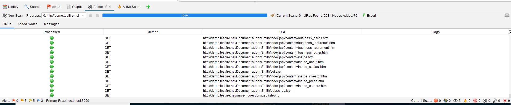
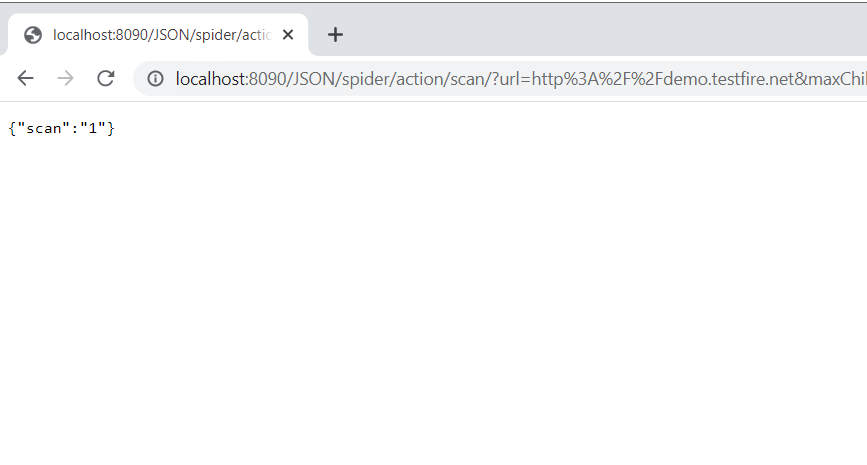
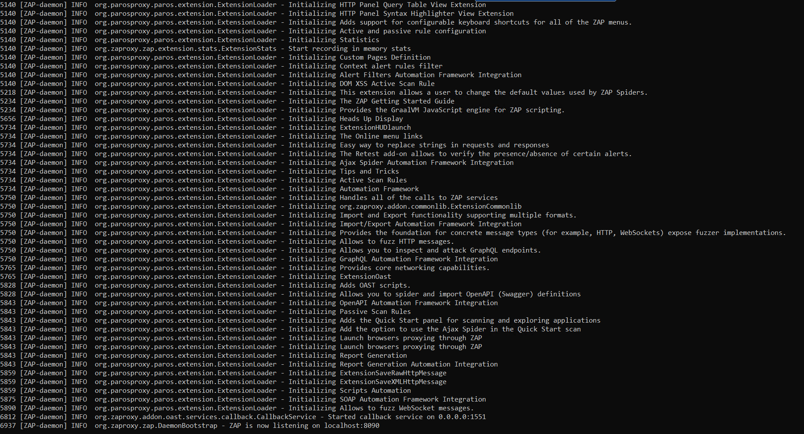
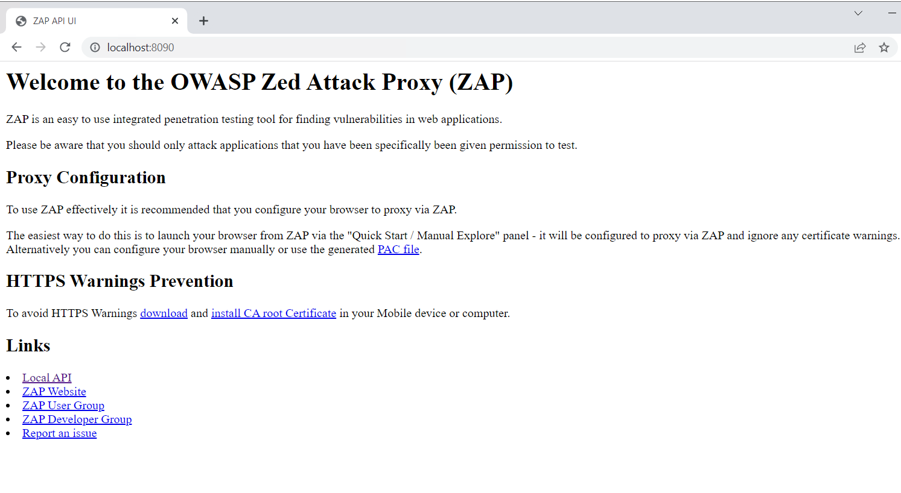

Web Application Security Testing
================================

In this lab, we will cover the following topics:

-   Case 1 --- web security testing using the ZAP REST API
-   Case 2 --- full automation with CURL and the ZAP daemon

Case 1 -- web security testing using the ZAP REST API
=====================================================

In this case, ZAP will be running in proxy mode with port [8090].
Once ZAP is running, the ZAP web console can be reached at
[http://localhost:8090/UI]. The demo website is the target website
to be inspected by ZAP. We will use CURL to trigger the ZAP RESTful API
to operate ZAP to do spider scans, active scans, review alerts, and shut
down ZAP:


Step 1 -- spider scanning the website
=====================================

The purpose of the spider scan is to discover all resources and URLs for
the target website. The spider visits these URLs and will try to
identify all the hyperlinks in the responses. The scanning process
continues recursively whenever new URLs are identified. All identified
URLs can be used for further security inspection and active scans in the
next step.

Sending the REST API request to ZAP will require the API key. To
simplify the implementation, we will disable the API key in our
demonstration. The API key can be disabled under the ZAP console menu,
via [Tools] \| [Options] \|
[API] \| [Disable the API Key] checkbox.

Here is the command to execute the spider scan by [CURL]:


```
curl   "http://localhost:8090/JSON/spider/action/scan/?zapapiformat=JSON&formMethod=GET&url=http://demo.testfire.net&maxChildren=&recurse=&contextName=&subtreeOnly="
```



To get further information for the HTTP [GET] request for the
spider scan, we can use the browser to visit the ZAP URL:
[http://localhost:8090/UI/]. This provides an explanatory API
document and operations. For example, we can trigger the spider scan by
clicking on [spider] and [scan] ([url
maxChildren recurse contextName subtreeOnly]). This will navigate
us to [http://localhost:8090/UI/spider/view/scans/] (as shown in
the following diagram), where we can define some parameters and trigger
the scan. After the spider scan is triggered, the URL we get is the
final URL (the HTTP [GET] request) we need for the CURL
automation.

The following diagram shows the spider scan UI operations in ZAP:


Click **Scan** to run new scan. You will get scan number on success (you might get different scan number):




The spider scan may take a long time since it will extensively and
recursively search for any potential web URLs and resources. Besides,
the time it takes also depends on the number of web pages, parameters,
and the number of threads.


Step 2 -- active scanning the website
=====================================

Once we have done the spider scan, the active scan will find the
security vulnerabilities by sending malicious requests, such as XSS or
SQL injection, based on the scanning policies.

Here is the command to trigger the active scan with [CURL]:


```
curl     "http://localhost:8090/JSON/ascan/action/scan/?zapapiformat=JSON&formMethod=GET&url=http://demo.testfire.net&recurse=&inScopeOnly=&scanPolicyName=&method=&postData=&contextId="
```


The URL of the active scan is
[http://localhost:8090/UI/ascan/action/scan/].[](http://localhost:8090/UI/ascan/action/scan/)


Step 3 -- reviewing the status of the active scan
=================================================

To review the status of the active scan, try one of the following
commands. It will output the percentage of completeness as a status
value. Depending on the output format you need, you may change JSON to
HTML:


```
curl  "http://localhost:8090/JSON/ascan/view/status/"
```


The following command will generate the active scan status in JSON
format:


```
curl  "http://localhost:8090/JSON/ascan/view/status/?zapapiformat=JSON&formMethod=GET&scanId="
```


Step 4 -- reviewing the security assessments
============================================

To review the security assessments made by OWASP ZAP, we may use one of
the REST APIs, as follows:


```
CURL  http://localhost:8090/HTML/core/view/alerts/ 
```


Alternatively, the HTML report can be generated by exporting to
[ZAP\_Report.HTML] via the REST API, as follows:


```
curl    "http://127.0.0.1:8090/OTHER/core/other/htmlreport/?formMethod=GET" > ZAP_Report.HTML
```


Case 2 -- full automation with CURL and the ZAP daemon
======================================================

In this case study, we will further extend the case to execute ZAP in
daemon (headless) mode. We will automate the web security tests with
OWASP ZAP in the following order for a complete testing cycle:

1.  Launch ZAP in daemon mode
2.  Spider scan the whole website
3.  Active scan all the scanned URLs
4.  Check status and wait for the active scan to finish
5.  Shut down the ZAP daemon


Step 1 -- executing ZAP in daemon (headless) mode
=================================================

To launch ZAP in daemon mode, close `ZAP GUI` and then execute the following commands in the terminal:

```
cd C:\Program Files\OWASP\Zed Attack Proxy

ZAP.bat -daemon
```



Step 2 -- checking the status of the ZAP daemon
===============================================

In our testing environment, our ZAP proxy is configured using port
[8090]. The proxy port can be configured from the ZAP GUI menu
under [Tools] \| [Options] \| [Local
Proxies.] Open following URL in browser to check if it\'s running normally:





Step 3 -- fully automating the ZAP API
======================================

The whole scanning process can be fully automated in one script file.
Here, we use the Windows BAT script as an example. The fully automated
ZAP security testing script for the website is named
[AutoZAP.BAT]:


```
echo start the ZAP in daemon mode

cd C:\Program Files\OWASP\Zed Attack Proxy

ZAP.exe -daemon


echo the status of ZAP

CURL http://localhost:8090


echo spider scan for the web site

CURL "http://localhost:8090/JSON/spider/action/scan/?zapapiformat=JSON&formMethod=GET&url=http://demo.testfire.net"


echo Active Scan for the website

CURL "http://localhost:8090/JSON/ascan/action/scan/?zapapiformat=JSON&formMethod=GET&url=http://demo.testfire.net&recurse=&inScopeOnly=&scanPolicyName=&method=&postData=&contextId="


echo Wait for 20 sec to complete the ActiveScan before generating the testing report

echo The timeout is for Windows command. For running in Linux, please change it to sleep.

timeout 20


echo List the security assessments results (alerts), and output the report to ZAP_Report.HTML

CURL "http://localhost:8090/JSON/ascan/view/status/"

CURL "http://localhost:8090/HTML/core/view/alerts/"

CURL "http://127.0.0.1:8090/OTHER/core/other/htmlreport/?formMethod=GET" > ZAP_Report.HTML


echo shutdown the ZAP

CURL "http://localhost:8090/JSON/core/action/shutdown/?zapapiformat=JSON&formMethod=GET"
```


Summary
=======

In this lab, we performed web security testing using ZAP. ZAP was used for web security scanning, which was automated by a REST API or CLI.

The purpose of case 1 was to demonstrate how to automate the ZAP spider
scan by using a REST API and CURL.

The objective of case 2 was to run ZAP in daemon mode and to execute a
full security scan cycle in one script. The automation steps of ZAP
scanning include the following:

1.  Launch ZAP in daemon mode
2.  Spider scan the whole website
3.  Active scan all the scanned URLs
4.  Check status and wait for the active scan to finish
5.  Shut down the ZAP daemon


These cases demonstrated different automation approaches to web
security scanning. In the next lab, we will discuss different
automation approaches to Android security testing.
