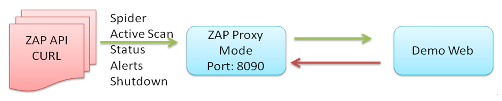
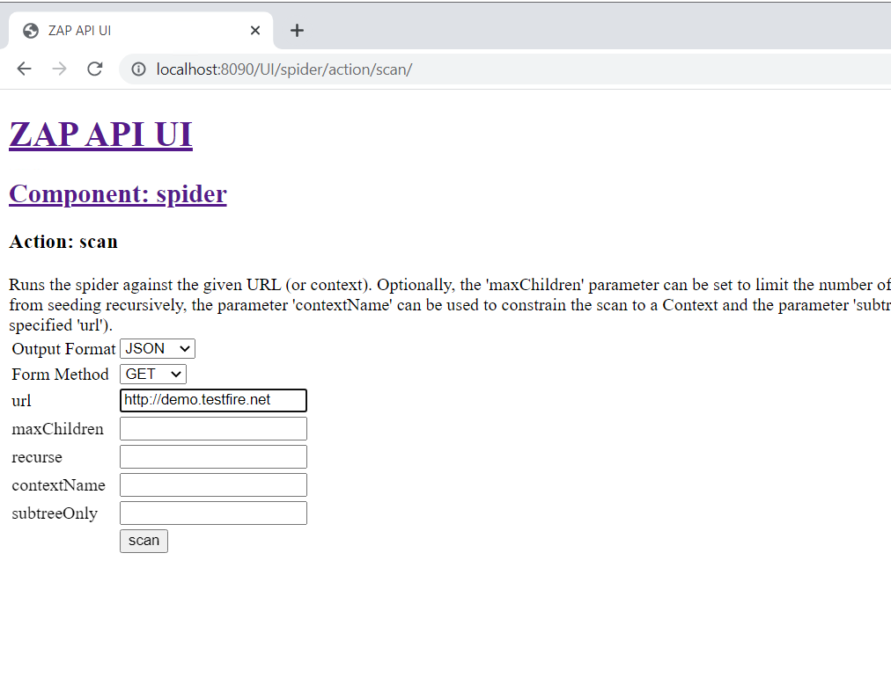
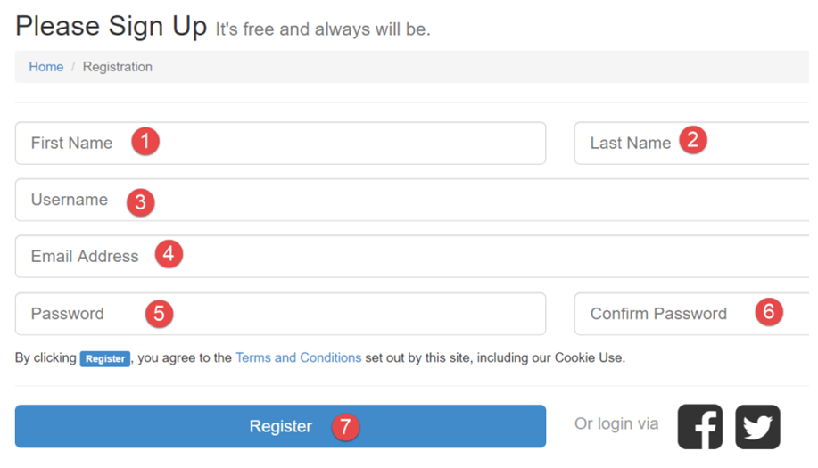
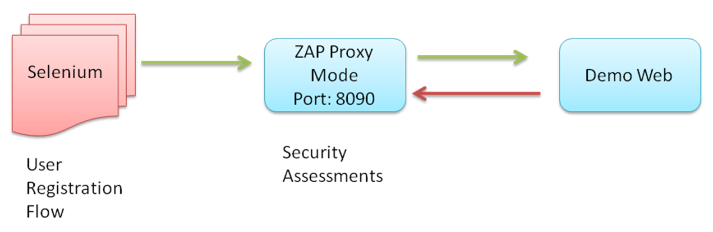

Web Application Security Testing
================================

In this lab, we will use an online shopping site, Hackazon, to
demonstrate how to achieve automated web security testing. The key
challenge in automating web application testing is walking through the
UI business flow while doing a security inspection; for example, using
automated testing to look at user sign-in/sign-out, or to add items to
shopping carts while scanning for potential **cross-site scripting**
(**XSS**) injection vulnerabilities for every data input. Tackling this
challenge requires not only security scanning but also web UI
automation. We will be using security tools, such as ZAP, and also web
UI automation frameworks, such as Selenium and Robot Framework. Using
both of these tools can effectively improve your security testing
coverage. We will share some tips and tools to make web automation
easier.

In this lab, we will cover the following topics:

-   Online shopping site for automated security inspection
-   Case 1---web security testing using the ZAP REST API
-   Case 2---full automation with CURL and the ZAP daemon
-   Case 3---automated security testing for the user registration flow
    using Selenium


Case study -- online shopping site for automated security inspection
====================================================================

We will be using the vulnerable website Hackazon to demonstrate
automation security testing techniques:
<http://hackazon.webscantest.com/>. We will be using three cases to
explore the testing scenario and automation techniques, which are listed
in the following table:

+-----------------------+-----------------------+-----------------------+
| **Case scenario**     | **Security testing    | **Security automation |
|                       | objective**           | techniques**          |
+-----------------------+-----------------------+-----------------------+
| *Case 1---web         | General web security  | -   ZAP active        |
| security testing      | assessments           |     scanning mode     |
| using the ZAP REST    |                       | -   Use of the ZAP    |
| API*                  |                       |     REST API          |
+-----------------------+-----------------------+-----------------------+
| *Case 2---full        | -   Running ZAP in    | ---                   |
| automation with CURL  |     daemon mode       |                       |
| and the ZAP daemon*   | -   Automating the    |                       |
|                       |     ZAP REST API and  |                       |
|                       |     CURL              |                       |
+-----------------------+-----------------------+-----------------------+
| *Case 3---automated   | Security assessments  | -   ZAP security      |
| security testing for  | for the user          |     assessments with  |
| the user registration | registration flow     |     proxy mode        |
| flow*                 |                       | -   Selenium web UI   |
|                       |                       |     automation        |
|                       |                       | -   ZAP with CURL     |
|                       |                       |     REST API          |
|                       |                       |     operations        |
+-----------------------+-----------------------+-----------------------+


Case 1 -- web security testing using the ZAP REST API
=====================================================

In this case, ZAP will be running in proxy mode with port [8090].
Once ZAP is running, the ZAP web console can be reached at
[http://localhost:8090/UI]. The demo website is the target website
to be inspected by ZAP. We will use CURL to trigger the ZAP RESTful API
to operate ZAP to do spider scans, active scans, review alerts, and shut
down ZAP:





ZAP API testing in proxy mode


Step 1 -- spider scanning the website
=====================================

The purpose of the spider scan is to discover all resources and URLs for
the target website. The spider visits these URLs and will try to
identify all the hyperlinks in the responses. The scanning process
continues recursively whenever new URLs are identified. All identified
URLs can be used for further security inspection and active scans in the
next step.

Sending the REST API request to ZAP will require the API key. To
simplify the implementation, we will disable the API key in our
demonstration. The API key can be disabled under the ZAP console menu,
via [Tools] \| [Options] \|
[API] \| [Disable the API Key] checkbox.

Here is the command to execute the spider scan by [CURL]:


```
$ curl   "http://localhost:8090/JSON/spider/action/scan/?zapapiformat=JSON&formMethod=GET&url=http://hackazon.webscantest.com&maxChildren=&recurse=&contextName=&subtreeOnly="
```


To get further information for the HTTP [GET] request for the
spider scan, we can use the browser to visit the ZAP URL:
[http://localhost:8090/UI/]. This provides an explanatory API
document and operations. For example, we can trigger the spider scan by
clicking on [spider] and [scan] ([url
maxChildren recurse contextName subtreeOnly]). This will navigate
us to [http://localhost:8090/UI/spider/view/scans/] (as shown in
the following diagram), where we can define some parameters and trigger
the scan. After the spider scan is triggered, the URL we get is the
final URL (the HTTP [GET] request) we need for the CURL
automation.

The following diagram shows the spider scan UI operations in ZAP:





ZAP spider API


For Windows users, CURL can be downloaded here:
<https://curl.haxx.se/windows/>.[](https://curl.haxx.se/windows/)


The spider scan may take a long time since it will extensively and
recursively search for any potential web URLs and resources. Besides,
the time it takes also depends on the number of web pages, parameters,
and the number of threads. When it takes too long to complete, you may
also configure the spider scan options under [Tools] \|
[Options] \| [Spider], where you may
configure [Maximum depth to crawl] or [Number of threads
used].


Step 2 -- active scanning the website
=====================================

Once we have done the spider scan, the active scan will find the
security vulnerabilities by sending malicious requests, such as XSS or
SQL injection, based on the scanning policies.

Here is the command to trigger the active scan with [CURL]:


```
$ curl     "http://localhost:8090/JSON/ascan/action/scan/?zapapiformat=JSON&formMethod=GET&url=http://hackazon.webscantest.com&recurse=&inScopeOnly=&scanPolicyName=&method=&postData=&contextId="
```


The URL of the active scan is
[http://localhost:8090/UI/ascan/action/scan/].[](http://localhost:8090/UI/ascan/action/scan/)

The key difference between the spider scan and the active scan is that
the spider scan involves passive scanning, which entails monitoring
security issues such as missing security headers, **cross-site request
forgery** (**CSRF**) tokens and so on. On the other hand, the active
scan will send malicious requests such as XSS or SQL injection to attack
the target website. The spider scan will extensively search for web
resources, and the active scan can do specific security testing based on
the scan policy. During execution, using the spider scan to extensively
explore the URLs and resources is the first step before triggering the
active scan, since it will help the active scan with known URLs to do
the security scanning:

  ---------------------------------------- ------------------------------------------------------------------------------------------------------------------- -----------------------------------------------------------------------------------------------
                                           **Spider scan**                                                                                                     **Active scan**
  **Handling of requests and responses**   It\'s a passive scan, which means it monitors requests and responses for the security issues.                       As it\'s an active scan, it will send malicious requests, such as XSS or SQL injection.
  **Purpose**                              Explores the whole site and monitors security issues. It\'s a preliminary step for any further security scanning.   Sends malicious requests and evaluates specific security issues based on the identified URLs.
  ---------------------------------------- ------------------------------------------------------------------------------------------------------------------- -----------------------------------------------------------------------------------------------


Step 3 -- reviewing the status of the active scan
=================================================

To review the status of the active scan, try one of the following
commands. It will output the percentage of completeness as a status
value. Depending on the output format you need, you may change JSON to
HTML:


```
$ curl  "http://localhost:8090/JSON/ascan/view/status/"
```


The following command will generate the active scan status in JSON
format:


```
$ curl  "http://localhost:8090/JSON/ascan/view/status/?zapapiformat=JSON&formMethod=GET&scanId="
```


Step 4 -- reviewing the security assessments
============================================

To review the security assessments made by OWASP ZAP, we may use one of
the REST APIs, as follows:


```
$ CURL  http://localhost:8090/HTML/core/view/alerts/ 
```


Alternatively, the HTML report can be generated by exporting to
[ZAP\_Report.HTML] via the REST API, as follows:


```
$ curl    "http://127.0.0.1:8090/OTHER/core/other/htmlreport/?formMethod=GET" > ZAP_Report.HTML
```


Case 2 -- full automation with CURL and the ZAP daemon
======================================================

In this case study, we will further extend the case to execute ZAP in
daemon (headless) mode. We will automate the web security tests with
OWASP ZAP in the following order for a complete testing cycle:

1.  Launch ZAP in daemon mode
2.  Spider scan the whole website
3.  Active scan all the scanned URLs
4.  Check status and wait for the active scan to finish
5.  Shut down the ZAP daemon


Step 1 -- executing ZAP in daemon (headless) mode
=================================================

To launch ZAP in daemon mode, execute the following commands in the
console.

For Windows, execute the following:


```
$ ZAP.bat -daemon
```


For Linux, execute the following:


```
$ ZAP.sh  -daemon
```


For ZAP command-line options and usage, refer to
<https://github.com/zaproxy/zap-core-help/wiki/HelpCmdline>.[](https://github.com/zaproxy/zap-core-help/wiki/HelpCmdline)


Step 2 -- checking the status of the ZAP daemon
===============================================

In our testing environment, our ZAP proxy is configured using port
[8090]. The proxy port can be configured from the ZAP GUI menu
under [Tools] \| [Options] \| [Local
Proxies.] Use the following commands to check if it\'s
running normally:


```
$ Curl   http://localhost:8090/
```


Step 3 -- fully automating the ZAP API
======================================

The whole scanning process can be fully automated in one script file.
Here, we use the Windows BAT script as an example. The fully automated
ZAP security testing script for the Hackazon website is named
[AutoZAP.BAT]:


```
echo start the ZAP in daemon mode

ZAP.exe -daemon


echo the status of ZAP

CURL http://localhsot:8090


echo spider scan for the web site

CURL "http://localhost:8090/JSON/spider/action/scan/?zapapiformat=JSON&formMethod=GET&url=http://hackazon.webscantest.com"


echo Active Scan for the website

CURL "http://localhost:8090/JSON/ascan/action/scan/?zapapiformat=JSON&formMethod=GET&url=http://hackazon.webscantest.com&recurse=&inScopeOnly=&scanPolicyName=&method=&postData=&contextId="


echo Wait for 20 sec to complete the ActiveScan before generating the testing report

echo The timeout is for Windows command. For running in Linux, please change it to sleep.

timeout 20


echo List the security assessments results (alerts), and output the report to ZAP_Report.HTML

CURL "http://localhost:8090/JSON/ascan/view/status/"

CURL "http://localhost:8090/HTML/core/view/alerts/"

CURL "http://127.0.0.1:8090/OTHER/core/other/htmlreport/?formMethod=GET" > ZAP_Report.HTML


echo shutdown the ZAP

CURL “http://localhost:8090/JSON/core/action/shutdown/?zapapiformat=JSON&formMethod=GET”


```


Case 3 -- automated security testing for the user registration flow with Selenium
=================================================================================

In the previous demo, we used ZAP to do a spider scan and an active
scan. The purpose of the spider scan is to explore all potential URLs
and web resources. However, there are some web resources that will
require manual guidance, such as authenticated resources, user
registration, or the shopping business flows.

Therefore, we will need a web UI automation framework, such as Selenium,
to guide ZAP through some of the web pages. A testing team who may
previously finish the functional automation testing, it\'s suggested to
apply the web security scanner, OWASP ZAP, in proxy mode to reuse the
existing automation testing.

In this case study, we use the user registration flow as an example to
demonstrate how to apply a Selenium automation framework and ZAP for web
security automation testing.

We inspect security issues for the new user registration flow for the
vulnerable shopping site at <http://hackazon.webscantest.com/>. The
sign-up flow, [Sign Up] \| [New User], is
as follows. The Selenium automation framework will do the following
steps:

1.  Visit the home page
2.  Click [Sign Up] \| [New User]
3.  Input the [First Name], [Last Name],
    [Username], [Email Address],
    [Password], and [Confirm Password]
    values, and then click [Register]

During the automated user registration execution by Selenium, we will
launch ZAP as a proxy to monitor the security issues:





Sign Up in NodeGoat


To complete the automated security testing scenario, we will use
SeleniumBase to launch the browser and simulate user behavior to guide
ZAP through the registration flow, as shown in the following diagram:





Selenium and ZAP security testing


Step 1 -- installation of SeleniumBase
======================================

Prepare the environment, to have the Python and pip setup tools ready.
Refer to [Http://seleniumbase.com](http://seleniumbase.com/) for the
installation of SeleniumBase, which is a wrapper of Selenium to make the
implementation much easier:


```
$ git clone https://github.com/seleniumbase/SeleniumBase.git
$ pip install -U -r requirements.txt
$ python setup.py install
```


In addition, Selenium will require the related browser driver to be
installed, as follows:


```
$ seleniumbase install chromedriver
```


Step 2 -- launching ZAP with proxy 8090
=======================================

Execute the following command to launch the ZAP on port [8090]:


```
$ ZAP   -port  8090
```


Step 3 -- executing the user registration flow automation
=========================================================

The following command will help us to execute the SeleniumBase script
and launch the Chrome browser with the local proxy to the running ZAP:


```
$ pytest  userregistration_SB.py   --browser=chrome   --proxy=127.0.0.1:8090
```


Here is the script for [userregistration\_SB.py]. Please be
reminded that the script can only be executed by SeleniumBase, instead
of Selenium.

For readers who may not be familiar with Selenium scripts, it\'s
suggested to use the Katalon/Selenium IDE, which is a tool that allows
you to record website operations and generate the script automatically.
It can be installed as a Chrome or Firefox extension. In our case, we
use the Katalon/Selenium IDE for the user registration flow and export
in the Python 2 (WebDriver + unittest) format. Then, we use the
[seleniumbase covert UserRegistration.py] command to get the
following script:


```
# -*- coding: utf-8 -*-

from seleniumbase import BaseCase
class UserRegistration(BaseCase):

    def test_user_registration(self):
        self.open('http://hackazon.webscantest.com/')
        self.click("link=Sign In / Sign Up")
        self.click('#username')
        self.click("link=New user?")
        self.click('#first_name')
        self.update_text('#first_name', 'FirstName')
        self.update_text('#last_name', 'LastName')
        self.update_text('#username', 'UserName1')
        self.update_text('#email', 'abc@a.com')
        self.update_text('#password', 'pass1234')
        self.update_text('#password_confirmation', 'pass1234')
        self.click("//input[@value='Register']")
```


Step 4 -- active scanning the identified URLs
=============================================

After the user registration UI flow walkthrough, ZAP will be able to
identify more URLs.

The active scan will be able to explore more security based on the newly
identified URLs, as follows:


```
$ CURL "http://localhost:8090/JSON/ascan/action/scan/?zapapiformat=JSON&formMethod=GET&url=http://hackazon.webscantest.com&recurse=&inScopeOnly=&scanPolicyName=&method=&postData=&contextId="
```


Step 5 -- reviewing the security assessments
============================================

Once the automation execution is done, we may execute the following
command to review the security assessments made by ZAP. The following
RESTful API will generate the report in JSON format:


```
$ CURL "http://localhost:8090/JSON/core/view/alerts"
```


The following RESTful API will generate the report in HTML format:


```
$ CURL "http://localhost:8090/HTML/core/view/alerts"
```


If all these steps work, we may integrate all the commands into one
script for further automation execution. Here is the summary of all the
automation commands in one BAT script file,
\"Auto\_ZAP\_UserRegistration.BAT\". Be reminded that we add a Windows
timeout command to wait for the finish of the UI automation;
[UserRegisterResult.html] will be the final security testing
results.

Execute the BAT script, \"Auto\_ZAP\_UserRegistration.BAT\" on Windows:


```
$ ZAP -port 8090

$ pytest UserRegistration.py --browser=chrome --proxy=127.0.0.1:8090

$ timeout /T 30

$ CURL "http://localhost:8090/JSON/ascan/action/scan/?zapapiformat=JSON&formMethod=GET&url=http://hackazon.webscantest.com&recurse=&inScopeOnly=&scanPolicyName=&method=&postData=&contextId="

$ timeout /T 30

$ Curl “http://localhost:8090/HTML/core/view/alerts” > UserRegisterResult.html
```


Summary
=======

In this lab, we used an online shopping platform to perform web
security testing using ZAP. Two main approaches were introduced. The
first was using ZAP for web security scanning, which was automated by a
REST API or CLI. The other approach was the integration of ZAP and
Selenium to review security issues during the user registration flow.
Let\'s review the key learning objectives of each case.

The purpose of case 1 was to demonstrate how to automate the ZAP spider
scan by using a REST API and CURL.

The objective of case 2 was to run ZAP in daemon mode and to execute a
full security scan cycle in one script. The automation steps of ZAP
scanning include the following:

1.  Launch ZAP in daemon mode
2.  Spider scan the whole website
3.  Active scan all the scanned URLs
4.  Check status and wait for the active scan to finish
5.  Shut down the ZAP daemon

Case 3 looked at automated security testing for the user registration
flow, showing how ZAP and Selenium can be integrated. We used Selenium
to guide ZAP for the registration UI flow.

These three cases demonstrated different automation approaches to web
security scanning. In the next lab, we will discuss different
automation approaches to Android security testing.


Questions
=========

1.  What\'s the typical order of a ZAP scan?
    1.  Spider scan → Active scan → Alerts → Shutdown
    2.  Active Scan → Spider Scan → Alerts → Shutdown
    3.  Active scan → Alerts → Shutdown
2.  In ZAP, what\'s the key difference between a spider scan and an
    active scan?
    1.  A spider scan involves monitoring security issues in passive
        mode
    2.  An active scan will send malicious requests
    3.  An active scan does specific security testing based on the scan
        policy
    4.  All of the above


3.  Which automation framework cannot be used to automate the user
    registration flow?
    1.  Selenium
    2.  SeleniumBase
    3.  All of the above
4.  What can be required to execute the user registration flow
    automation?
    1.  Selenium
    2.  Selenium ChromeDriver
    3.  All of the above


Further reading
===============

-   **ZAPping the Top 10**:
    <https://www.owasp.org/index.php/ZAPpingTheTop10>
-   **SeleniumBase**: <https://github.com/seleniumbase/SeleniumBase>
-   **Katalon Automation Recorder**:
    <https://www.katalon.com/resources-center/blog/katalon-automation-recorder/>
-   **ZAP Blog**: <http://zaproxy.blogspot.com/>
-   **ZAP Proxy**: <https://github.com/zaproxy>
