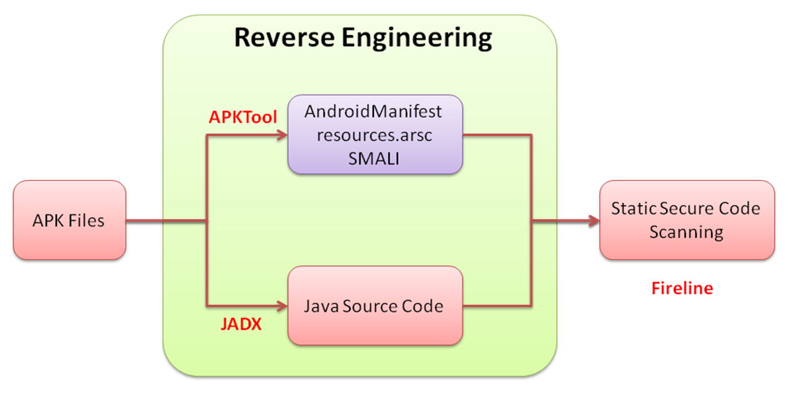
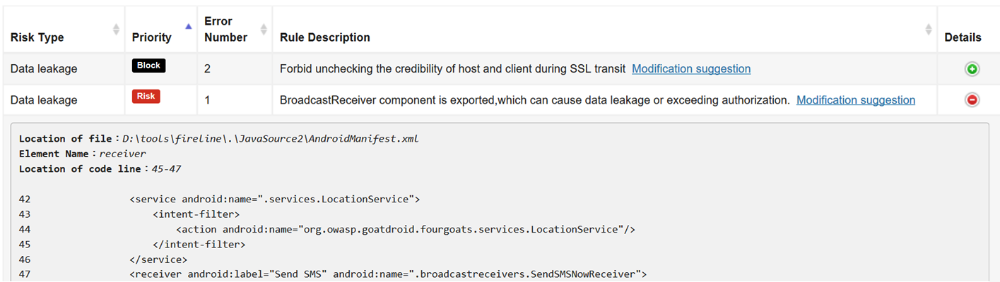
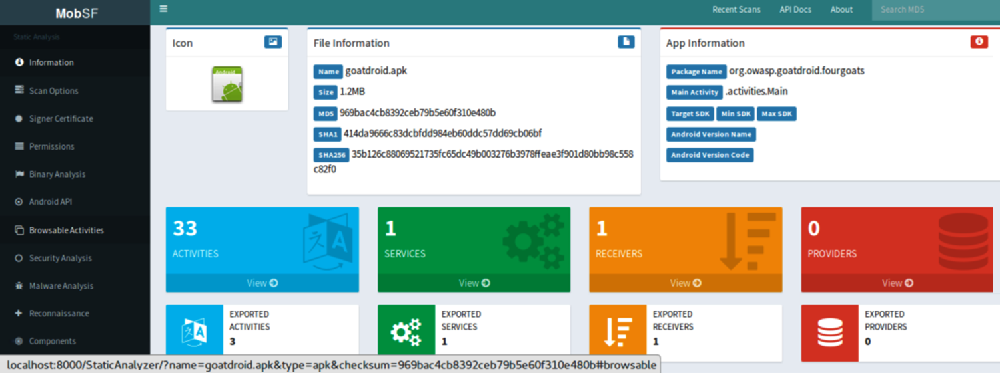

Android Security Testing
========================

It\'s common practice to perform security checks before every Android
application release. However, it can be a challenge for frequent and an
increasing number of releases. The automated security testing process
for an Android mobile application requires the submission of APK
(Android Application Package) binaries, reversing the APK for secure
source code inspection, manifesting a configuration check, and
generating a testing result. We will also introduce mobile
security-related practices, such as OWASP (Open Web Application Security
Project) mobile security testing, and Android secure coding practices.

The following topics will be covered in this lab:

-   Android security review best practices
-   Secure source code review patterns for Android
-   Privacy and sensitive information review
-   General process of APK security analysis
-   Static secure code scanning with QARK
-   Automated security scanning with MobSF


Android security review best practices
======================================

Android application development is primarily based on Java. The MITRE
Java secure coding rules still apply to the Android security review. In
addition, the Android application includes some unique building
components that may introduce new security issues, such as Android
manifest configurations, intents, activity, broadcast, content provider,
and services:

-   Android application secure design / secure coding guidebook by JSSEC
-   Android developers documentation---app security best practices
-   OWASP mobile security testing guide

For common security issues of APK, the *App Security Improvement*
program of the Google Android developers provides the most recent
security issues and the remediation advice, such as path traversal,
insecure hostname verification, and fragment injection. It\'s also a
good reference when the APK is submitted to Google Play.

In the coming sections, we will mainly demonstrate four kinds of
security and privacy scanning of a mobile application, which are listed
in the following table:

+-----------------------+-----------------------+-----------------------+
| **Scanning approach** | **Automated tools**   | **Description**       |
+-----------------------+-----------------------+-----------------------+
| Secure code scanning  | Fireline              | Static Java source    |
|                       |                       | code scanning. It\'s  |
|                       |                       | a light-weight secure |
|                       |                       | code scanning tools,  |
|                       |                       | but it may require    |
|                       |                       | the Java source and   |
|                       |                       | the reverse of APK.   |
+-----------------------+-----------------------+-----------------------+
| Privacy and sensitive | Androwarn             | It\'s focused on      |
| information scan      |                       | privacy and sensitive |
|                       |                       | information scanning  |
|                       |                       | of any given APK.     |
|                       |                       | Static analysis of    |
|                       |                       | the application\'s    |
|                       |                       | Dalvik bytecode,      |
|                       |                       | represented as Smali  |
|                       |                       | for PII and sensitive |
|                       |                       | information leakage   |
|                       |                       | or exfiltration such  |
|                       |                       | as telephony          |
|                       |                       | identifiers,          |
|                       |                       | geolocation           |
|                       |                       | information leakage,  |
|                       |                       | audio/video flow      |
|                       |                       | interception, and so  |
|                       |                       | on.                   |
+-----------------------+-----------------------+-----------------------+
| Light-weight all in   | **QARK**              | It\'s a Python        |
| one APK security      |                       | program that can do   |
| scanning              | (**Quick android      | automatic security    |
|                       | review kit**)         | scanning of any given |
|                       |                       | APK.                  |
+-----------------------+-----------------------+-----------------------+
| All in one security   | **Mobile Security     | The MobSF is similar  |
| scanning              | Framework**           | to QARK (Quick        |
|                       | (**MobSF**)           | Android Review Kit).  |
|                       |                       | In addition, MobSF    |
|                       |                       | supports Android,     |
|                       |                       | Windows, and iOS      |
|                       |                       | applications. It not  |
|                       |                       | only does the static  |
|                       |                       | security analysis,    |
|                       |                       | but also the dynamic  |
|                       |                       | runtime behavior      |
|                       |                       | analysis.             |
+-----------------------+-----------------------+-----------------------+


Secure source code review patterns for Android
==============================================

The Java secure code review techniques and tools in the previous
labs still apply to the Android application. The secure Java coding
is fundamental to the Android security review. On top of that, there are
specific secure code review techniques for the Android application.

The following table summarizes the keywords and patterns for potential
security issues we need to focus on:

+-----------------------------------+-----------------------------------+
| **Security inspection focuses**   | **Related high-risk APIs and      |
|                                   | keywords**                        |
+-----------------------------------+-----------------------------------+
| SQL injection                     | [rawQuery] \|               |
|                                   | [execSQL] \|                |
|                                   | [database] \|               |
|                                   | [.][sqlite] \|        |
|                                   | [SQLiteDatabase]            |
+-----------------------------------+-----------------------------------+
| Insecure SSL handling             | [                                 |
|                                   | ALLOW\_ALL\_HOST\_VERIFIER] |
|                                   | \| [NullHostnameVerifier]   |
|                                   |                                   |
|                                   | [S                                |
|                                   | SLCertificateSocketFactory] |
|                                   | \| [SSLSocketFactory]       |
|                                   |                                   |
|                                   | [                                 |
|                                   | setDefaultHostnameVerifier] |
|                                   |                                   |
|                                   | [WebVie                           |
|                                   | wClient.onReceivedSsLError] |
+-----------------------------------+-----------------------------------+
| Command injection                 | [getRuntime] \|             |
|                                   | [ClassLoader]               |
+-----------------------------------+-----------------------------------+
| WebView for XSS                   | [Android.webkit] \|         |
|                                   | [setJavaScriptEnabled] \|   |
|                                   | [addJavascriptInterface] \| |
|                                   |                                   |
|                                   | [setWebCont                       |
|                                   | entsDebuggingEnabled(true)] |
|                                   |                                   |
|                                   | [loadData] \|               |
|                                   | [postURL]                   |
+-----------------------------------+-----------------------------------+
| Insecure files I/O access         | [MODE\_WORLD\_READABLE] \|  |
|                                   | [MODE\_WORLD\_WRITTABLE]    |
|                                   |                                   |
|                                   | [OpenFileOutput] \|         |
|                                   | [openORCreateDatabase]      |
|                                   |                                   |
|                                   | [file://] \|                |
|                                   | [getSharedPreferences] \|   |
|                                   | [getExternal]               |
+-----------------------------------+-----------------------------------+
| Insecure communication            | [.netURL] \|                |
|                                   | [openSteam] \|              |
|                                   | [netJarURL] \|              |
|                                   | [HttpURL]                   |
|                                   | \|[HttpRqeuest] \|          |
|                                   | [HttpsURL]                  |
+-----------------------------------+-----------------------------------+


The \'OWASP Mobile App security Testing\' guide provides a good
reference for both static and dynamic security anlaysis techniques and
tools. It includes both Android and iOS security testing guide.


Privacy and sensitive information review
========================================

The mobile app is installed on the personal phone, therefore, it\'s more
sensitive if the application will can personal information on the phone
or abuse the phone services. Whenever the privacy information is
handled, we will have to review the purpose and the needs.

The following table summarizes the techniques of identifying the privacy
information access behaviors:

+-----------------------------------+-----------------------------------+
| **Category of privacy check**     | **Example of Android API calls**  |
+-----------------------------------+-----------------------------------+
| Telephony identifiers             | Uses of APIs under the            |
|                                   | [TelephonyManager] will     |
|                                   | allow the application to read     |
|                                   | telephony services and state      |
|                                   | which may leak sensitive          |
|                                   | information, such as IMEI, SIM    |
|                                   | serial number, and cell ID. The   |
|                                   | examples of APIs (methods) under  |
|                                   | the [TelephonyManager] are  |
|                                   | [getCellLocation()],        |
|                                   | [getDeviceId()],            |
|                                   | [getLine1Number()],         |
|                                   | [getNeworkOperator()],      |
|                                   | [getSimSerialNumber()].     |
+-----------------------------------+-----------------------------------+
| Audio/video interception          | There are two primary APIs used   |
|                                   | to do the audio and video         |
|                                   | recordings, which are all under   |
|                                   | the [MediaRecorder] class.  |
|                                   | The [setAudioSource]        |
|                                   | defines the audio sources for     |
|                                   | recording, and the                |
|                                   | [SetVideoSource] configures |
|                                   | the source for video recording.   |
+-----------------------------------+-----------------------------------+
| Suspicious backdoor connection    | The class                         |
|                                   | [ConnectivityManager] can   |
|                                   | be used to query the state of     |
|                                   | network connectivity. In          |
|                                   | addition, the uses of             |
|                                   | [                                 |
|                                   | WifiConfiguration.toString] |
|                                   | can be an indicator of reading    |
|                                   | WiFi credentials.                 |
|                                   |                                   |
|                                   | The use of [Socket] can be  |
|                                   | a potential backdoor connection   |
|                                   | to a remote IP address and port:  |
|                                   |                                   |
|                                   | -   [ServerSocket]          |
|                                   | -   [Connect]               |
|                                   | -   [DatagramSocket]        |
+-----------------------------------+-----------------------------------+
| Abuses of phone calls and SMS     | The following may be an indicator |
|                                   | of making phone call or SMS:      |
|                                   |                                   |
|                                   | -   [Android.provid               |
|                                   | er.Telephony.SMS\_RECEIVED] |
|                                   |     (defined in                   |
|                                   |     [AndroidManifest.xml])  |
|                                   | -   [                             |
|                                   | SmsManager.sendTextMessage] |
|                                   | -   [                             |
|                                   | android.intent.action.CALL] |
|                                   | -   [                             |
|                                   | android.intent.action.DIAL] |
+-----------------------------------+-----------------------------------+
| Data leakage                      | The privacy data on the phone can |
|                                   | be contacts and SMS. The          |
|                                   | following APIs are indicators of  |
|                                   | reading the data:                 |
|                                   |                                   |
|                                   | -   [Contac                       |
|                                   | tsContract.CommonDataKinds] |
|                                   | -                                 |
|                                   |   [\"content://sms/inbox\"] |
+-----------------------------------+-----------------------------------+
| Root behaviors                    | The application is detecting the  |
|                                   | rooted device or super user       |
|                                   | privilege:                        |
|                                   |                                   |
|                                   | -   [superuser],            |
|                                   |     [supersu],              |
|                                   |     [noshufou]              |
|                                   | -   [isDeviceRooted]        |
|                                   | -   [/system/bin/su],       |
|                                   |     [/system/xbin/su]       |
|                                   | -                                 |
|                                   |   [RootTools.isAccessGiven] |
+-----------------------------------+-----------------------------------+


Privacy scanning with Androwarn
===============================

To automate the privacy scanning with APK, we can use the tool Androwarn
which is a Python script to do the privacy information scanning.


Step 1 -- scanning of an APK
============================

The execution of Androwarn takes some parameters, such as the APK, the
report format, the level of verbosity, and the lookup to Google Play.
The Google Play lookup is recommended to be disabled if the testing
environment can\'t connect to the internet, as follows:


```
$ python androwarn.py -i ./SampleApplication/bin/SampleApplication.apk -r html -v 3 -n
```


For detailed usage of Androwarn, refer to python [androwarn.py -h]


Step 2 -- review the report
===========================

If you have specified the HTML report output in the previous step, then
the report will be generated under the [/androwarn/Report], as
follows:


Information Leakage in Androwarn report


General process of APK security analysis
========================================

The security analysis of an Android application normally requires a
certain reverse engineering process. The APK is a compressed file. The
first step would be to get the APK uncompressed and reverse it into DEX
bytecode or Smali resource files. These can be seen as Android
intermediate resource files. Then, the DEX can further be reversed into
Java class in order to get the Java source code. The following diagram
shows the process and related tools we will demonstrate in the coming
section:





Reverse engineering of an APK


This is a list of the tools for the reverse engineering of APK and
security analysis:

  ----------------------------- --------------------------------------------------------------------------------------------------------------------------
  **Tools**                     **Usage in security testing**
  [apktool\_2.1.0.jar]    The [APKTool] is used to reverse the APK file into Smali, resource files and also extract the [manifest.xml]
  [JADX]                  It\'s used to reverse the APK file into Java source code
  [fireline\_1.5.6.jar]   It\'s used to do static secure code scanning based on resource, and Java source codes
  [goatdroid.apk]         It\'s the vulnerable sample APK
  ----------------------------- --------------------------------------------------------------------------------------------------------------------------

Here is how we place these tools in the folder for the purposes of the
coming demonstration:

+-----------------------------------------------------------------------+
| **Folder structure of the testing environment**                       |
+-----------------------------------------------------------------------+
| [\\jadx]                                                        |
|                                                                       |
| [\\APKscan]                                                     |
|                                                                       |
| [+\-\-\-\-\-- apktool\_2.1.0.jar]                               |
|                                                                       |
| [+\-\-\-\-\-\-- fireline\_1.5.6.jar]                            |
|                                                                       |
| [+\-\-\-\-\-\-- goatdroid.apk]                                  |
|                                                                       |
| [+\-\-\-\-\-\--\\JavaSource1]                                   |
|                                                                       |
| [+\-\-\-\-\-\--\\JavaSource2]                                   |
|                                                                       |
| [+\-\-\-\-\-\--\\Output]                                        |
+-----------------------------------------------------------------------+


Step 1 -- use APKTool to reverse the APK to Manifest.xml, Smali and resources
=============================================================================

The purpose of this step is to generate the Smali, resource files, and
[manifest.xml] for initial security analysis. There are some
security issues that can be identified by these file types, such as
sensitive information exposure and incorrect permission settings, as
follows:


```
$ Java  –jar  apktool_2.1.0.jar   d  goatdroid.apk   -o  JavaSource1  -f 
```


Step 2 -- use JADX to reverse the APK into Java source code
===========================================================

This will reverse the APK into Java source code. Then, we can do static
secure code scanning in the next setup, as follows:


```
$ Jadx  goatdroid.apk  -d   d:\JavaSource2
```


Step 3 -- use Fireline to scan all the Java source files
========================================================

Finally, we use Fireline to scan all the resource files, manifest and
Java source code for security issue, as follows:


```
$ Java   -jar   fireline_1.5.6.jar   -s  d:\JavaSource   –r   d:\Output
```


Step 4 -- review the scanning results
=====================================

The scanning report of the Fireline will be generated under the
[d:\\Output]:





Fireline scanning report


Static secure code scanning with QARK
=====================================

**QARK** (**Quick Android Review Kit**) is a Python security scanner to
identify Android application vulnerabilities. QARK can take APK or Java
as source input, and do the reverse engineering automatically for
further security analysis. It\'s easy to install and use. We will be
using the QARK to analyze the [goatdroid.apk] in the following
steps.


Step 1 -- install QARK
======================

The installation can be easily done by python PIP, as follows:


```
$ pip install qark
```


Step 2 -- APK scanning with QARK
================================

To scan the APK, execute the python script [qarkMain.py] with
parameters, as follows:


```
$ python qarkMain.py -p qark/sampleApp/goatdroid/goatdroid.apk   --source=1
```


For detailed usage of the [qarkMain], refer to the [python
qarkMain.py -h].


Step 3 -- review the results
============================

The report will be generated under the [/qark/report/report.html].
The following screenshot shows the scanning report of the
[goatdroid.apk]:


QARK scanning report


Automated security scanning with MobSF
======================================

The **mobile Security Framework** (**MobSF**) provides security analysis
for the iOS, Windows, and Android applications. It can also do dynamic
analysis based on runtime behaviors of the application. The MobSF
provides an easy to use UI for users to drag and drop the mobile
applications for analysis and also includes rest API interface to do
further CI/CD integration with your automation framework. In our
demonstration, we will show how to use MobSF API to analyze a sample
vulnerable Android application, [goatdroid.apk].


Step 1 -- set up the MobSF
==========================

The easiest way to set up the MobSF is by using docker. The following
setup will enable the MobSF running with [8000] port. Once the
setup is ready, the MobSF management console can be visited by using a
browser with the URL, [http://127.0.0.1:8000/], as follows:


```
$ docker pull opensecurity/mobile-security-framework-mobsfdocker run -it -p 8000:8000 opensecurity/mobile-security-framework-mobsf:latest
```


Step 2 -- upload the APK by REST API
====================================

In this step, we will use the REST [API /api/v1/upload] to upload
the APK to the MobSF. For the value of the API Key, and usage of each
rest API, refer to [http://localhost:8000/api\_docs]. In our
MobSF, the API key is
[563d64fc5054d3b239ac0419f1d6b2378465f5c80e1778c283eb1e3265bdd7ae]:


```
$ curl -F 'file=@goatdroid.apk' http://localhost:8000/api/v1/upload -H "Authorization:563d64fc5054d3b239ac0419f1d6b2378465f5c80e1778c283eb1e3265bdd7ae"
```


To review if the upload is successful, you may use the browser to view
the URL, [http://127.0.0.1:8000/recent\_scans].


Step 3 -- scan the APK
======================

To scan the APK, use the API [/api/v1/scan]. It needs to provide
the following parameters, [file\_name, MD5] hash value of the APK,
and the API key:


```
$ curl -X POST --url http://localhost:8000/api/v1/scan --data "scan_type=apk&file_name= goatdroid.apk&hash= 969bac4cb8392ceb79b5e60f310e480b" -H "Authorization:563d64fc5054d3b239ac0419f1d6b2378465f5c80e1778c283eb1e3265bdd7ae"
```


Step 4 -- download the report
=============================

The API [api/v1/download\_pdf] is used to generate a PDF file of
the scanning results. It requires the MD5 hash value of the APK, and API
key. We also specify the filename as [MobSFTest.pdf] in our
example:


```
$ curl -X POST  --url  http://localhost:8000/api/v1/download_pdf  --data "hash=969bac4cb8392ceb79b5e60f310e480b&scan_type=apk" -H "Authorization:563d64fc5054d3b239ac0419f1d6b2378465f5c80e1778c283eb1e3265bdd7ae"  >  MobSFTest.pdf
```


The following screenshot shows parts of the scanning report in
[MobSFTest.pdf]:





Scanning report of MobSF


Summary
=======

In this lab, we introduced secure Android development practices,
such as secure coding guidebook, security best practices, and the OWASP
mobile security testing guide. Based on these secure implementation and
testing practices, we also illustrated some automated scanning tools.
The Fireline is used to scan the Java source code for security issues.
The Androwarn is specific for privacy and sensitive information scan.
The QARK and MobSF are the integrated Android security scan frameworks
that can do the reverse of APK and secure code scanning.

We also illustrated the secure code review patterns for Android
applications. There are some high-risk APIs that may result in serious
security issues. We categorized the security issues into SQL injection,
insecure SSL handling, command injection, webview XSS, insecure files
I/O, and the insecure communication. In addition, we also listed the API
calls that related to privacy, such as telephony identifiers, audio
interception, potential backdoor connection, abuse of phone call, data
leakage, and root behaviors.

To automate these security and privacy security reviews, we apply
different tools based on the scenario. We use Fireline for the secure
code scanning, but it will require the Java source code. Androwarn is
used to do privacy scanning for any APK files. We used QARK to do the
automated APK static security scanning. Finally, the MobSF is introduced
for Windows, iOS, and Android applications security review. MobSF can
also do the dynamic security scanning. The operations of MobSF can be
automated by restful API was also demonstrated.

In the next lab, we will discuss the infrastructure security for
system hardening, secure communication and configurations.


Questions
=========

1.  Which one of the following is not for Android security?
    1.  Fireline
    2.  Androwarn
    3.  QARK
    4.  NMAP
2.  Which of the following is not for the review of potential SQL
    injection?
    1.  [execSQL]
    2.  [NullHostnameVerifier]
    3.  [sqlite]
    4.  [database]
3.  Which of the following is related for the SSL secure communication
    1.  [setDefaultHostnameVerifier]
    2.  [SSLCertificateSocketFactory]
    3.  [ALLOW\_ALL\_HOST\_VERIFIER]
    4.  All of above
4.  For the review of privacy information access, which Android API is
    not related to telephony identifiers?
    1.  [getDeviceId]
    2.  [getNeworkOperator]
    3.  [setAudioSource]
    4.  [getSimSerialNumber]


5.  Which one of the tools can not do Android reverse engineering?
    1.  APKTool
    2.  JADX
    3.  Fireline
    4.  QARK


Further reading
===============

-   **Fireline Android static analysis**:
    <http://magic.360.cn/en/index.html>
-   **Android privacy scan (Androwarn)**:
    <https://github.com/maaaaz/androwarn/>
-   **Mobile Security Framework (MobSF)**:
    <https://github.com/MobSF/Mobile-Security-Framework-MobSF/wiki/1.-documentation>
-   **Quick Android review kit**: <https://github.com/linkedin/qark/>
-   **AndroBugs framework**:
    <https://github.com/AndroBugs/AndroBugs_Framework>
-   **OWASP mobile testing guide**:
    <https://legacy.gitbook.com/book/sushi2k/the-owasp-mobile-security-testing-guide>
-   **JADX**: <https://github.com/skylot/jadx>
-   **DEX2JAR**: <https://github.com/pxb1988/dex2jar>
-   **Android** **Cuckoo Sandbox**:
    <http://cuckoo-droid.readthedocs.io/en/latest/>
-   **Vulnerable APK---GoatDroid.APK**:
    <https://github.com/linkedin/qark/blob/master/tests/goatdroid.apk>
-   **Vulnerable APK---InSecureBankv2.APK**:
    <https://github.com/dineshshetty/Android-InsecureBankv2>
-   **Android APK Scan**:
    <https://github.com/itsmenaga/apkscan/blob/master/apkscan.py>
-   **Android Static Code Analyzer**:
    <https://github.com/vincentcox/StaCoAn>
-   **Android Security 2017 Year in Review**:
    <https://source.android.com/security/reports/Google_Android_Security_2017_Report_Final.pdf>
-   **Google App security improvement program**:
    <https://developer.android.com/google/play/asi>
-   **Mobile Security Framework API docs**:
    <https://github.com/MobSF/Mobile-Security-Framework-MobSF/wiki/3.-REST-API-Documentation>
