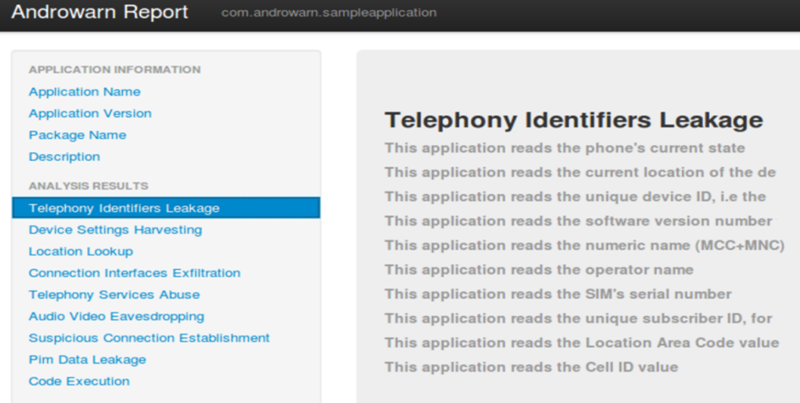
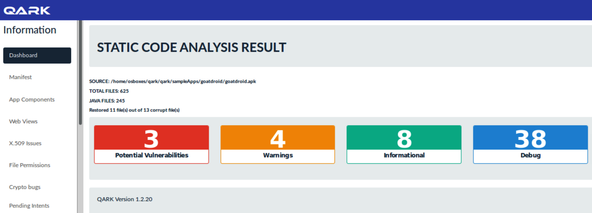

Android Security Testing
========================

The following topics will be covered in this lab:

-   Secure source code review patterns for Android
-   Privacy and sensitive information review
-   General process of APK security analysis
-   Static secure code scanning with QARK


Privacy scanning with Androwarn
===============================

To automate the privacy scanning with APK, we can use the tool Androwarn
which is a Python script to do the privacy information scanning.


Step 1 -- scanning of an APK
============================

The execution of Androwarn takes some parameters, such as the APK, the
report format, the level of verbosity, and the lookup to Google Play.
The Google Play lookup is recommended to be disabled if the testing
environment can\'t connect to the internet, as follows:


```
python androwarn.py -i ./_SampleApplication/bin/SampleApplication.apk -r html -v 3
```


For detailed usage of Androwarn, refer to python [androwarn.py -h]


Step 2 -- review the report
===========================

If you have specified the HTML report output in the previous step, then
the report will be generated under the [/androwarn/Report], as
follows:





General process of APK security analysis
========================================


This is a list of the tools for the reverse engineering of APK and
security analysis:


Step 1 -- use APKTool to reverse the APK to Manifest.xml, Smali and resources
=============================================================================

The purpose of this step is to generate the Smali, resource files, and
[manifest.xml] for initial security analysis. There are some
security issues that can be identified by these file types, such as
sensitive information exposure and incorrect permission settings, as
follows:


```
Java  –jar  apktool_2.1.0.jar   d  goatdroid.apk   -o  JavaSource1  -f 
```


Step 2 -- use JADX to reverse the APK into Java source code
===========================================================

This will reverse the APK into Java source code. Then, we can do static
secure code scanning in the next setup, as follows:

To Do:


Step 3 -- APK scanning with QARK
================================

To scan the APK, execute the python script [qarkMain.py] with parameters, as follows:


```
qark --java ./JavaSource2
```


For detailed usage of the [qarkMain], refer to the [python qarkMain.py -h].


Step 3 -- review the results
============================

The report will be generated under the [/qark/report/report.html].
The following screenshot shows the scanning report of the
[goatdroid.apk]:





Summary
=======

To automate these security and privacy security reviews, we applied
different tools based on the scenario. Androwarn is
used to do privacy scanning for any APK files. We used QARK to do the
automated APK static security scanning.

In the next lab, we will discuss the infrastructure security for
system hardening, secure communication and configurations.


Questions
=========

1.  Which one of the following is not for Android security?
    1.  Fireline
    2.  Androwarn
    3.  QARK
    4.  NMAP
2.  Which of the following is not for the review of potential SQL
    injection?
    1.  [execSQL]
    2.  [NullHostnameVerifier]
    3.  [sqlite]
    4.  [database]
3.  Which of the following is related for the SSL secure communication
    1.  [setDefaultHostnameVerifier]
    2.  [SSLCertificateSocketFactory]
    3.  [ALLOW\_ALL\_HOST\_VERIFIER]
    4.  All of above
4.  For the review of privacy information access, which Android API is
    not related to telephony identifiers?
    1.  [getDeviceId]
    2.  [getNeworkOperator]
    3.  [setAudioSource]
    4.  [getSimSerialNumber]


5.  Which one of the tools can not do Android reverse engineering?
    1.  APKTool
    2.  JADX
    3.  Fireline
    4.  QARK


Further reading
===============

-   **Fireline Android static analysis**:
    <http://magic.360.cn/en/index.html>
-   **Android privacy scan (Androwarn)**:
    <https://github.com/maaaaz/androwarn/>
-   **Mobile Security Framework (MobSF)**:
    <https://github.com/MobSF/Mobile-Security-Framework-MobSF/wiki/1.-documentation>
-   **Quick Android review kit**: <https://github.com/linkedin/qark/>
-   **AndroBugs framework**:
    <https://github.com/AndroBugs/AndroBugs_Framework>
-   **OWASP mobile testing guide**:
    <https://legacy.gitbook.com/book/sushi2k/the-owasp-mobile-security-testing-guide>
-   **JADX**: <https://github.com/skylot/jadx>
-   **DEX2JAR**: <https://github.com/pxb1988/dex2jar>
-   **Android** **Cuckoo Sandbox**:
    <http://cuckoo-droid.readthedocs.io/en/latest/>
-   **Vulnerable APK---GoatDroid.APK**:
    <https://github.com/linkedin/qark/blob/master/tests/goatdroid.apk>
-   **Vulnerable APK---InSecureBankv2.APK**:
    <https://github.com/dineshshetty/Android-InsecureBankv2>
-   **Android APK Scan**:
    <https://github.com/itsmenaga/apkscan/blob/master/apkscan.py>
-   **Android Static Code Analyzer**:
    <https://github.com/vincentcox/StaCoAn>
-   **Android Security 2017 Year in Review**:
    <https://source.android.com/security/reports/Google_Android_Security_2017_Report_Final.pdf>
-   **Google App security improvement program**:
    <https://developer.android.com/google/play/asi>
-   **Mobile Security Framework API docs**:
    <https://github.com/MobSF/Mobile-Security-Framework-MobSF/wiki/3.-REST-API-Documentation>
