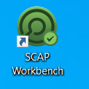

Infrastructure Security
=======================

The topics to be covered in this lab are as follows:

-   The scope of infrastructure security
-   Secure configuration best practices
-   Network security assessments with Nmap
-   CVE vulnerability scanning
-   HTTPS security check with SSLyze

OpenSCAP security guide
=======================

The OpenSCAP is mainly focused on OS secure configuration guides that
can be found at <https://static.open-scap.org/>. In addition, OpenSCAP
also provides several kinds of scanning tools to check the
configurations, such as OpenSCAP Base, SCAP Workbench, and OpenSCAP
Daemon. We will demonstrate the uses of SCAP Workbench in the following
section:


Step 1 -- installation of SCAP workbench
========================================

SCAP Workbench is one of secure configuration scanning tool that
provides the GUI to do remote scanning. The SCAP Workbench tool has been downloaded in the lab environment: <https://github.com/OpenSCAP/scap-workbench/releases>.


Step 2 -- OpenSCAP security guide
=================================

Launch the scap workbench located on Desktop:



It will ask you to load a security profile. We selected RHEL7 in our example.
You may specify the SSH host to do the scanning.

The following screenshot shows how SCAP works:


Network security assessments with Nmap
======================================


The common network security assessment scenario and Nmap commands are
listed in the following table:


Open terminal and run all nmap commands and observe their output:

- Fast scan for listening ports

`nmap -F --open -Pn demo.testfire.net`

- Scan for any missing HTTP security headers such as XSS-Protection

`nmap -p80 --script http-security-headers -Pn demo.testfire.net`

- DOS attack with HTTPS Slowloris

`nmap -p80,443 --script http-slowloris --max-parallelism 500 -Pn demo.testfire.net`

- Scanning for all TCP listening ports

`nmap -p1-65535 --open -Pn demo.testfire.net`

- Scanning for all UDP listening ports

`nmap -p1-65535 -sU --open -Pn demo.testfire.net`

- Scanning for common ports

`Nmap -p21, 23,80, 137,138, 443, 445, 1433, 3306, 1521, 3389 --open pPn demo.testfire.net`

**Note:** Some of above scans will take time to complete.

Known vulnerable components scan by OWASP dependency check
==========================================================

Here we demonstrate the uses of the command line version of OWASP
dependency check for local files scanning.


Step 1 -- installation of OWASP dependency check
================================================

The OWASP dependency check provides JAR, which can be executed under
command line.


Step 2 -- CVE scanning with OWASP dependency check
==================================================

In our demonstration, we specify to scan the [C:\Users\fenago\Downloads\apache-jmeter-5.4.3],
and output the testing report under existing folder which will be
[\\dependency-check\\bin], as follows:


```
cd C:\Users\fenago\Downloads\dependency-check\bin

dependency-check.bat   --project   Testing   --out   .   --scan  C:\Users\fenago\Downloads\apache-jmeter-5.4.3
```

**Note:** It will take few minutes to complete the scan.

The following screenshot shows the execution results of executing the listed command:


Once the scanning is done, you may find the
[dependency-check-report.html] under the [\\dependency-check\\bin].

Here is the sample of dependency check output HTML report:


Click one of the Vulnerability to get details:


In addition to security vulnerabilities issues, the uses of open source
also need to pay attention to the license types and restrictions such as
GPL or LGPL. The suggested open source tools that can do the license
scanning are: Askalono, Licensee, LiD, and ScanCode.


HTTPS security check with SSLyze
================================

The following table lists common HTTPS security testing scenario and the
uses of SSLyze:


To execute the SSLyze under Windows, refer to the following command:

```
sslyze demo.testfire.net
```

**Task:** Try commands shown in the above table.

The [sslyze \--help] will list the detailed usage of each command
option:


In addition to SSyze, the **Mozilla TLS Observatory** also provides a
suite of tools to scan the TLS services. For an online version of TLS
check, refer to
[https://observatory.mozilla.org](https://observatory.mozilla.org/).


Summary
=======

In this lab, we discussed the infrastructure security, which
includes security scanning for known vulnerable components, secure
configuration, and secure communication. For the secure configuration,
the CIS benchmarks, STIGs, and the OpenSCAP security guide are the
guidelines we can follow. For the vulnerable components scanning, we
demonstrated two technical approaches. One is CVE scanning with NMAP
network scanning and the other is file scanning with OWASP dependency
check. For the secure communication, we introduced SSLyze for the HTTPS
commutation settings.

In the next lab, we will introduce more BDD automation frameworks to
apply to security testing.
