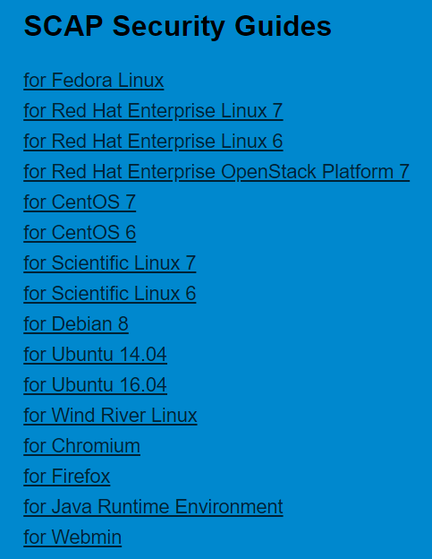
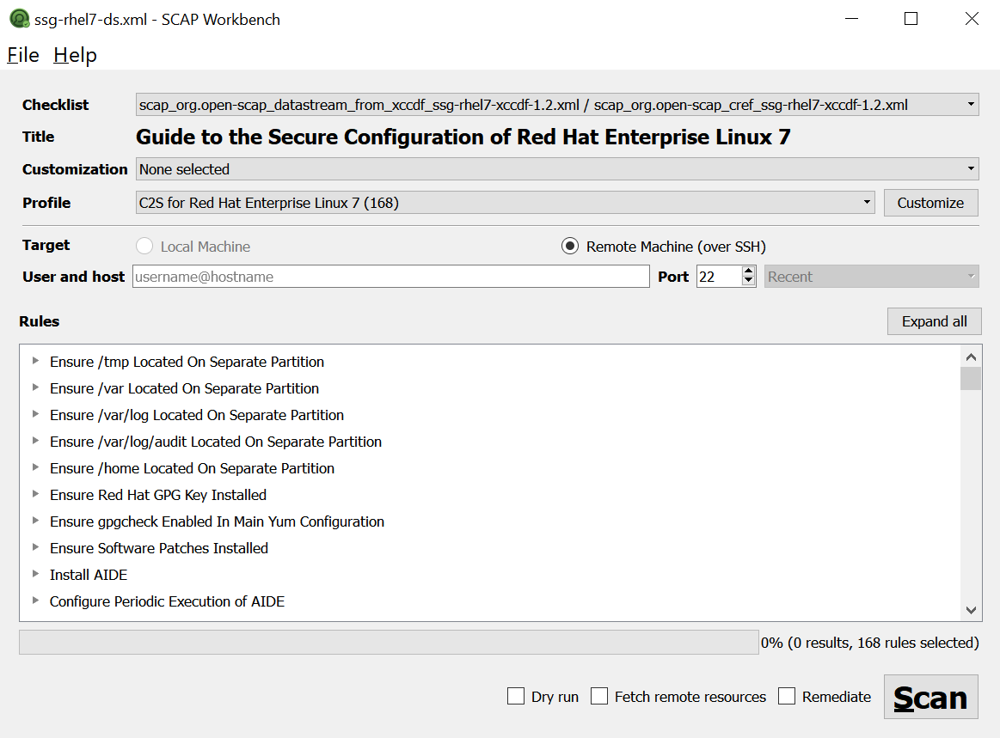
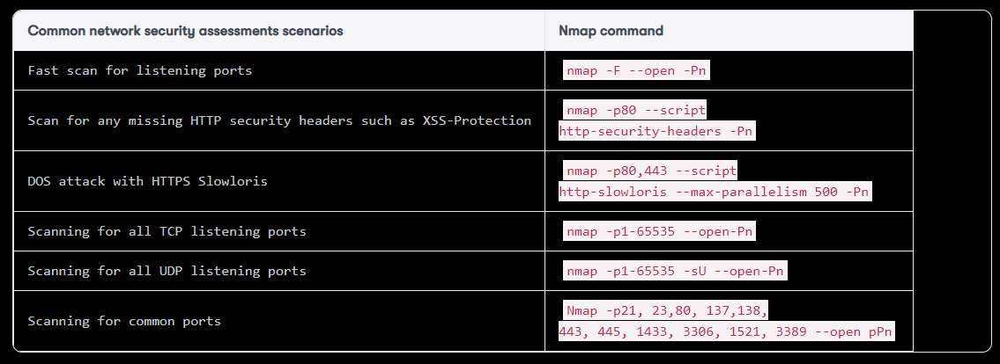
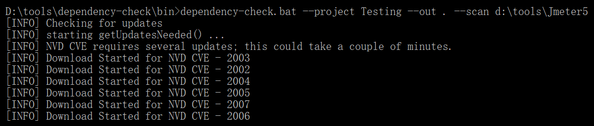
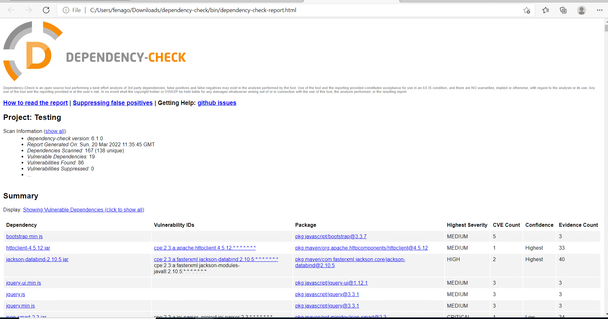
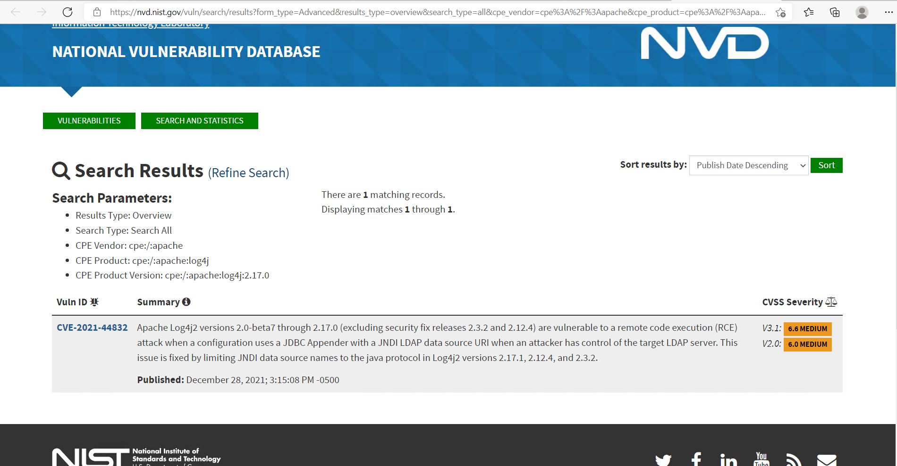
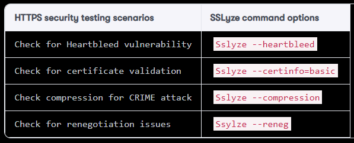
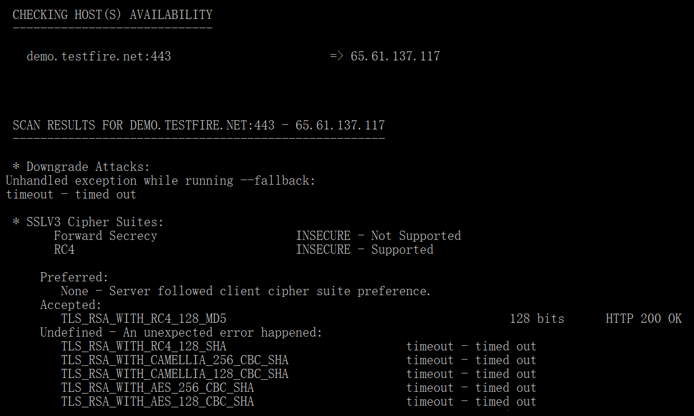

Infrastructure Security
=======================

The topics to be covered in this lab are as follows:

-   The scope of infrastructure security
-   Secure configuration best practices
-   Network security assessments with Nmap
-   CVE vulnerability scanning
-   HTTPS security check with SSLyze
-   Behavior driven security automation---Gauntlt


OpenSCAP security guide
=======================

The OpenSCAP is mainly focused on OS secure configuration guides that
can be found at <https://static.open-scap.org/>. In addition, OpenSCAP
also provides several kinds of scanning tools to check the
configurations, such as OpenSCAP Base, SCAP Workbench, and OpenSCAP
Daemon. We will demonstrate the uses of SCAP Workbench in the following
section:





Step 1 -- installation of SCAP workbench
========================================

SCAP Workbench is one of secure configuration scanning tool that
provides the GUI to do remote scanning. The SCAP Workbench tool has been downloaded in the lab environment: <https://github.com/OpenSCAP/scap-workbench/releases>.


Step 2 -- OpenSCAP security guide
=================================

Once the package MSI installer [scap-workbench-1.1.5-1.msi] is
downloaded and installed, launch the [scap-workbench.exe]. It will
ask you to load a security profile. We selected RHEL7 in our example.
You may specify the SSH host to do the scanning.

The following screenshot shows how SCAP works:





Network security assessments with Nmap
======================================


The common network security assessment scenario and Nmap commands are
listed in the following table:




Known vulnerable components scan by OWASP dependency check
==========================================================

Here we demonstrate the uses of the command line version of OWASP
dependency check for local files scanning.


Step 1 -- installation of OWASP dependency check
================================================

The OWASP dependency check provides JAR, which can be executed under
command line. It also provides Marven, Gradle, and Jenkins plugins. In
our example, to reduce any required dependencies, we will use the
command-line version for the demonstration. Download the ZIP file and
unzip it, as follows:

<https://www.owasp.org/index.php/OWASP_Dependency_Check>.


Step 2 -- CVE scanning with OWASP dependency check
==================================================

In our demonstration, we specify to scan the [d:\\tools\\Jmeter5],
and output the testing report under existing folder which will be
[\\dependency-check\\bin], as follows:


```
dependency-check.bat   --project   Testing   --out   .   --scan   d:\tools\Jmeter5
```


The following screenshot shows the execution results of executing the
listed command:





Once the scanning is done, you may find the
[dependency-check-report.html] under the
[\\dependency-check\\bin].

Here is the sample of dependency check output HTML report:




Click one of the Vulnerability to get details:




In addition to security vulnerabilities issues, the uses of open source
also need to pay attention to the license types and restrictions such as
GPL or LGPL. The suggested open source tools that can do the license
scanning are: Askalono, Licensee, LiD, and ScanCode.


HTTPS security check with SSLyze
================================

The following table lists common HTTPS security testing scenario and the
uses of SSLyze:



To execute the SSLyze under Windows, refer to the following command:

```
sslyze demo.testfire.net
```


The [sslyze \--help] will list the detailed usage of each command
option:





In addition to SSyze, the **Mozilla TLS Observatory** also provides a
suite of tools to scan the TLS services. For an online version of TLS
check, refer to
[https://observatory.mozilla.org](https://observatory.mozilla.org/).


Summary
=======

In this lab, we discussed the infrastructure security, which
includes security scanning for known vulnerable components, secure
configuration, and secure communication. For the secure configuration,
the CIS benchmarks, STIGs, and the OpenSCAP security guide are the
guidelines we can follow. For the vulnerable components scanning, we
demonstrated two technical approaches. One is CVE scanning with NMAP
network scanning and the other is file scanning with OWASP dependency
check. For the secure communication, we introduced SSLyze for the HTTPS
commutation settings.

In the next lab, we will introduce more BDD automation frameworks to
apply to security testing.


Questions
=========

1.  Which of the following is not used for known vulnerable components
    scanning?
    1.  OpenVAS
    2.  NMAP
    3.  RetireJS
    4.  SQLMap
2.  Which of the following is not security guidelines for
    configurations?
    1.  OpenSCAP
    2.  STIG
    3.  CVE
    4.  CIS Benchmarks
3.  If I\'m looking for a specific product secure configuration, which
    of the following references are suggested?
    1.  STIG
    2.  OpenSCAP
    3.  CIS Benchmarks
    4.  NIST
4.  What security assessment does NMAP do?
    1.  Fast Scan for listening ports
    2.  DOS attack with HTTPS Slowloris
    3.  Scanning for all TCP listening ports
    4.  All of above


5.  Which of the following is a vulnerability database?
    1.  CVE
    2.  ExploitDB
    3.  OSVDBE
    4.  All of the above
6.  Which of the following does SSLyze not do?
    1.  Check for Heartbleed vulnerability
    2.  Check for certificate validation
    3.  Check for known CVE
    4.  Check compression for CRIME attack


Further reading
===============

-   **Automate the secure configuration scanning with OpenSCAP**:
    <https://www.open-scap.org/tools/openscap-base/>
-   **System Configuration Audit Tools (system, kernel, permissions,
    services, network, distro, and ****external)**:
    <https://github.com/trimstray/otseca>
-   **RapidScan**: <https://github.com/skavngr/rapidscan/>
-   **Nmap Reference Guide**:
    <https://nmap.org/book/man-briefoptions.html>
-   **Mozilla SSL Configuration Generator**:
    <https://mozilla.github.io/server-side-tls/ssl-config-generator/>
-   **OpenSCAP for security configuration scanning**:
    <https://www.open-scap.org/>
-   **ZMAP network scanner**: <https://zmap.io/>
-   **MASScan for quick port scanning**:
    <https://github.com/robertdavidgraham/masscan>
-   **Advanced vulnerability scanning with Nmap NSE**:
    <https://github.com/scipag/vulscan>
-   **Gauntlt BDD Security Testing Framework**:
    <https://github.com/gauntlt/gauntlt>
-   **OWASP Dependency Track**: <https://dependencytrack.org/>
-   **NMAP NSE (Nmap Scripting Engine)**: <https://nmap.org/nsedoc/>
-   **Askalono License Texts Scan**: <https://github.com/amzn/askalono>
