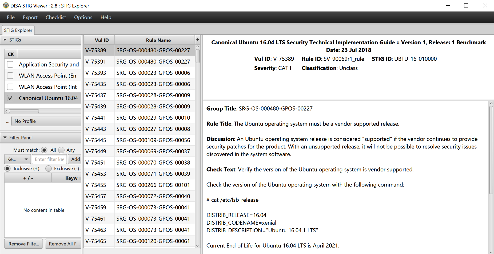
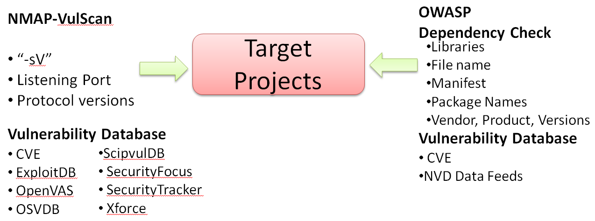
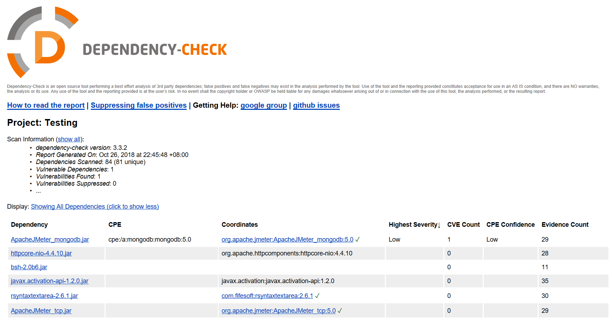
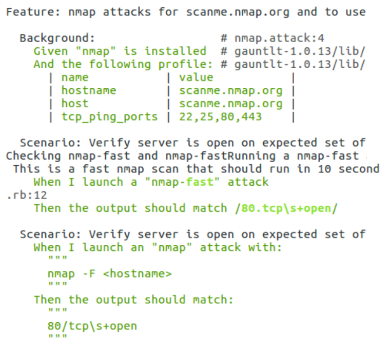
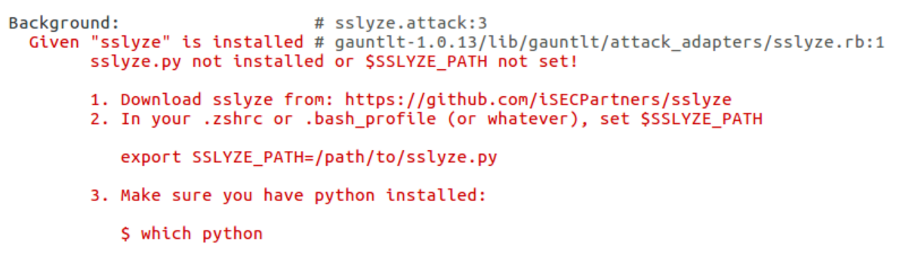

Infrastructure Security
=======================

The Android security was discussed in the previous lab, and this
lab will focus on the infrastructure and platform security. For a
PaaS platform or even SaaS service providers, the fundamental security
requirement is to ensure that the infrastructure is secure. Therefore,
the security operations team will need to do regular scanning on the
infrastructure to ensure security configurations for security
compliance. The infrastructure security includes the secure
configuration with web services, database and OS, the secure
communication protocol such as TLS v1.2, and the uses of secure versions
of third-party components and dependencies. We will illustrate how to
set up your own automated scanning framework to run these regular secure
configuration inspections.

The topics to be covered in this lab are as follows:

-   The scope of infrastructure security
-   Secure configuration best practices
-   Network security assessments with Nmap
-   CVE vulnerability scanning
-   HTTPS security check with SSLyze
-   Behavior driven security automation---Gauntlt


The scope of infrastructure security
====================================

The scope of infrastructure or platform security covers the operating
system, virtualization, docker, web services, database, and secure
communication.

The review of infrastructure security includes identifying the known
vulnerable components, secure configurations, and secure communication
protocols:

+-----------------------+-----------------------+-----------------------+
| **In                  | **Description**       | **Open source tools   |
| frastructure/platform |                       | and resources**       |
| security**            |                       |                       |
+-----------------------+-----------------------+-----------------------+
| Known vulnerable      | The known vulnerable  | -   OpenVAS           |
| components            | CVE component is one  | -   NMAP              |
|                       | of OWASP top 10       | -   OWASP Dependency  |
|                       | threats. If a         |     Check             |
|                       | component is          | -   RetireJS          |
|                       | exploited, the        |                       |
|                       | application can be    |                       |
|                       | vulnerable for remote |                       |
|                       | injection or data     |                       |
|                       | leakage security      |                       |
|                       | risks.                |                       |
+-----------------------+-----------------------+-----------------------+
| Secure configuration  | The secure            | -   OpenSCAP          |
|                       | configuration is to   | -   CIS benchmarks    |
|                       | ensure the OS, Web,   | -   STIG              |
|                       | virtualization, and   |                       |
|                       | databases are         |                       |
|                       | configured securely   |                       |
|                       | such as password      |                       |
|                       | complexity, removal   |                       |
|                       | of default settings,  |                       |
|                       | or disable            |                       |
|                       | unnecessary services. |                       |
+-----------------------+-----------------------+-----------------------+
| Insecure network      | The followings secure | -   NMAP              |
| communication         | communication         | -   SSLyze            |
|                       | protocol versions     |                       |
|                       | should be used:       |                       |
|                       |                       |                       |
|                       | -   SFTP instead of   |                       |
|                       |     FTP               |                       |
|                       | -   TLS 1.2 instead   |                       |
|                       |     of HTTP, SSL, and |                       |
|                       |     TLS 1.1           |                       |
|                       | -   SNMP V3 instead   |                       |
|                       |     of v1/v2          |                       |
|                       | -   SSH v2 instead of |                       |
|                       |     SSH v1 or Telnet  |                       |
+-----------------------+-----------------------+-----------------------+


Secure configuration best practices
===================================

There are some industry security practices we can refer to for the
secure configuration of the infrastructure. Here we will introduce three
practices: the Center for Internet Security benchmarks, **Security
Technical Implementation Guides** (**STIGs**), and the OpenSCAP Security
Guide.


CIS (Center for Internet Security) benchmarks
=============================================

The **Center for Internet Security** (**CIS**) benchmarks provides a
wide range of secure configuration recommendations. It covers the
following areas:

-   Desktops and web browsers
-   Mobile devices
-   Network devices
-   Security metrics
-   Servers---operating systems
-   Servers---other
-   Virtualization platforms and cloud

In addition to providing secure configuration, the CIS also provides
some tools for secure configuration scanning.

For information, refer to <https://learn.cisecurity.org/benchmarks>.


Security technical implementation guides (STIGs)
================================================

The STIGs provide more application-specific secure configuration
suggestions. However, the STIG security guides are in XML format. To
view the STIGs, you needs to download a STIG Viewer, which is a Java
JAR. Follow the following steps to view the Ubuntu STIG:

1.  Download the STIG Viewer from the URL.
    <https://iase.disa.mil/stigs/pages/stig-viewing-guidance.aspx>
2.  Unzip the file and click the [STIGViewer-2.8.jar] to open the
    viewer
3.  Download the Ubuntu STIG from the
    <https://iase.disa.mil/stigs/os/unix-linux/Pages/index.aspx>
4.  Unzip to get the file,
    [U\_Canonical\_Ubuntu\_16-04\_LTS\_STIG\_V1R1\_Manual-xccdf.xml]
5.  Use the STIG Viewer to load the XML by the menu
    [File] \| [Import STIG]

The following screenshot shows the results of importing the Ubuntu
profile in the STIG Viewer:





STIG viewer


OpenSCAP security guide
=======================

The OpenSCAP is mainly focused on OS secure configuration guides that
can be found at <https://static.open-scap.org/>. In addition, OpenSCAP
also provides several kinds of scanning tools to check the
configurations, such as OpenSCAP Base, SCAP Workbench, and OpenSCAP
Daemon. We will demonstrate the uses of SCAP Workbench in the following
section:


SCAP security guides


Step 1 -- installation of SCAP workbench
========================================

SCAP Workbench is one of secure configuration scanning tool that
provides the GUI to do remote scanning. The SCAP Workbench tool can be
downloaded here <https://github.com/OpenSCAP/scap-workbench/releases>.

In our demonstration, we download the Windows version MSI installer for
remote SSH to scan target Linux secure configurations.


Step 2 -- OpenSCAP security guide
=================================

Once the package MSI installer [scap-workbench-1.1.5-1.msi] is
downloaded and installed, launch the [scap-workbench.exe]. It will
ask you to load a security profile. We selected RHEL7 in our example.
You may specify the SSH host to do the scanning.

The following screenshot shows how SCAP works:


SCAP Workbench


Network security assessments with Nmap
======================================

**Network Mapper** (**Nmap**) is an open source network security
scanning tool. It\'s widely used to do host, services, port system
security audits, and also the SSL vulnerability. Identifying all the
hosts, services, protocols, and communication ports on the network is
the first step for network security assessment.

The installation of Nmap will depend on the OS.

The common network security assessment scenario and Nmap commands are
listed in the following table:

+-----------------------------------+-----------------------------------+
| **Common network security         | **Nmap command**                  |
| assessments scenarios**           |                                   |
+-----------------------------------+-----------------------------------+
| Fast scan for listening ports     | [nmap -F \--open -Pn]       |
+-----------------------------------+-----------------------------------+
| Scan for any missing HTTP         | [nmap -p80 \--script\             |
| security headers such as          | http-security-headers -Pn]  |
| XSS-Protection                    |                                   |
+-----------------------------------+-----------------------------------+
| DOS attack with HTTPS Slowloris   | [nmap -p80,443 \--script\         |
|                                   | http-slowloris \--max-parallelism |
|                                   | 500 -Pn]                    |
+-----------------------------------+-----------------------------------+
| Scanning for all TCP listening    | [nmap -p1-65535 \--open-Pn] |
| ports                             |                                   |
+-----------------------------------+-----------------------------------+
| Scanning for all UDP listening    | [nmap -p1-65535 -sU               |
| ports                             | \--open-Pn]                 |
+-----------------------------------+-----------------------------------+
| Scanning for common ports         | [Nmap -p21, 23,80, 137,138,\      |
|                                   | 443, 445, 1433, 3306, 1521, 3389  |
|                                   | \--open pPn]                |
+-----------------------------------+-----------------------------------+


Nmap usage tips
===============

Nmap usage tips. To improve the scanning accuracy, here are some of the
recommendations for the Nmap command execution:

-   When the result is [no-response], it may happen under the
    heavy load or high-delay network environment. If you are sure a
    specific port is listening but the result returns
    [no-response]. It\'s suggested to add the delay time by using
    [-scan\_delay \<time\>].
-   If the scanning result is [open\|filtered], it can be
    concluded that the port is open or closed. It only means there may
    be proxy or firewall in between the target scan port.
-   Nmap can be extended by using **Nmap Scripting Engine** (**NSE**) to
    do other security testing, such as SSL checks, XXS, and even SQL
    injection scans.

Nmap can also be extended to do CVE vulnerability scanning. For example,
we can use the [Vulscan] module that enables Nmap to query offline
vulnerability database after the service identification scanning.

In addition to Nmap, MASScan and ZMAP are alternative tools to consider.
In terms of network port scanning, scanning with MASScan can have a
quick result in a short time.


CVE vulnerability scanning
==========================

The known vulnerability scan is to identify the known CVE of the
modules, libraries, source code, add-ons, services, and applications
used in the infrastructure. To archive these kinds of scanning, we will
introduce two main different approaches. The OWASP dependency check is a
local scan of files to identify the vulnerabilities. This type of scan
approach can be more accurate than a network scan. However, if the local
scan of files is not feasible, we will use the network scan Nmap
instead. Here is the summary of these two scan approaches:

  ------------------------------ ------------------------------------------------- ------------------------------------------------------------
                                 **OWASP dependency check**                        **NMAP-VulScan**
  Approaches                     Package properties, such as libraries, filename   Network communications, such as port and protocol versions
  Vulnerability database query   CVE, NVD Data Feeds                               CVE, OSVDB, ExploitDB, and so on
  Local/remote scan              A local scan of files and packages                Remote scan over the network
  ------------------------------ ------------------------------------------------- ------------------------------------------------------------

The following diagram shows two different scan approaches to identify
known vulnerabilities. The **NMAP-VulScan** is using network scan
approach and the OWASP dependency check is to scan local files
properties:





NMAP-VulScan and OWASP dependency check for vulnerabilities scan


Known vulnerable components scan by VulScan
===========================================

Follow the following steps to install the NMAP VulScan and do the
scanning.


Step 1 -- installation of VulScan
=================================

The installation of VulScan is mainly the NMAP script file
[vulscan.nse] and also other known vulnerable database CSV files.
We may use git clone command to download all we need. Once these files
are downloaded, copy those files to the installed Nmap folders,
[Nmap\\scripts\\vulscan\\\*]:


```
git  clone  https://github.com/scipag/vulscan.git
```


Step 2 -- NMAP scanning with VulScan
====================================

To do the NMAP scanning with the [vulscan.nse] script on the
target [zero.webappsecurity.com](http://zero.webappsecurity.com/), we
may execute the following command line:


```
$ nmap -sV --script==vulscan.nse zero.webappsecurity.com
```


Known vulnerable components scan by OWASP dependency check
==========================================================

Here we demonstrate the uses of the command line version of OWASP
dependency check for local files scanning.


Step 1 -- installation of OWASP dependency check
================================================

The OWASP dependency check provides JAR, which can be executed under
command line. It also provides Marven, Gradle, and Jenkins plugins. In
our example, to reduce any required dependencies, we will use the
command-line version for the demonstration. Download the ZIP file and
unzip it, as follows:

<https://www.owasp.org/index.php/OWASP_Dependency_Check>.


Step 2 -- CVE scanning with OWASP dependency check
==================================================

After unzipping the command line version, the BAT or SH to execute the
dependency check will be under the following folder:

-   [\\dependency-check\\bin\\dependency-check.bat]
-   [\\dependency-check\\bin\\dependency-check.sh]

In our demonstration, we specify to scan the [d:\\tools\\Jmeter5],
and output the testing report under existing folder which will be
[\\dependency-check\\bin], as follows:


```
> dependency-check.bat   --project   Testing   --out   .   --scan   d:\tools\Jmeter5
```


For other uses of the command line, refer to
<https://github.com/jeremylong/DependencyCheck>.

The following screenshot shows the execution results of executing the
listed command:


Dependency check execution


Once the scanning is done, you may find the
[dependency-check-report.html] under the
[\\dependency-check\\bin].

Here is the sample of dependency check output HTML report:





Dependency Check Report


In addition to security vulnerabilities issues, the uses of open source
also need to pay attention to the license types and restrictions such as
GPL or LGPL. The suggested open source tools that can do the license
scanning are: Askalono, Licensee, LiD, and ScanCode.


HTTPS security check with SSLyze
================================

It\'s common to apply HTTPS for web service security. The HTTPS requires
proper security configuration to ensure secure communication. The common
security issues can be weak cipher suites, insecure renegotiation,
Heartbleed attack, invalid certificates, and insecure protocols, such as
SSL v3, TLS 1.1. (TLS v1.3 is the latest secure communication protocol
at the time of the writing.)

The following table lists common HTTPS security testing scenario and the
uses of SSLyze:

  -------------------------------------- ----------------------------------
  **HTTPS security testing scenarios**   **SSLyze command options**
  Check for Heartbleed vulnerability     [Sslyze \--heartbleed]
  Check for certificate validation       [Sslyze \--certinfo=basic]
  Check compression for CRIME attack     [Sslyze \--compression]
  Check for renegotiation issues         [Ssylze \--reneg]
  -------------------------------------- ----------------------------------

The SSLyze can be installed by Python PIP or there is also a Windows
[.exe] version, which can be found at
<https://github.com/nabla-c0d3/sslyze/releases>:


```
$ pip install --upgrade sslyze
```


To execute the SSLyze [.exe] under Windows, refer to the following
command:


```
$ sslyze   --regular   demo.testfire.net
```


The [sslyze \--help] will list the detailed usage of each command
option:


Sslyze scanning report


In addition to SSyze, the **Mozilla TLS Observatory** also provides a
suite of tools to scan the TLS services. For an online version of TLS
check, refer to
[https://observatory.mozilla.org](https://observatory.mozilla.org/).


Behavior-driven security automation -- Gauntlt
==============================================

The Gauntlt is a behavior-driven security testing framework.
Behavior-driven means all the testing scripts are written in the
following format. The purpose of the behavior-driven framework is to
make the testing steps easier to understand. For a non-security team,
the testing scripts and testing reports can be easily communicated for
what and how security is tested:


```
Feature: Description for all scenarios in this file
 Scenario: Description of this scenario
 Given...
 When...
 Then...
 Scenario:...
```


Here is the Gauntlt testing scrip to trigger the NMAP scanning. In this
scenario, we use NMAP to ensure the port [80] is listening:


```
Scenario: NMAP Scanning for website
 When I launch a nmap attack
 Then the output should contain:
  """
       80/tcp
  """
```


Step 1 -- Gauntlt installation
==============================

The Gauntlt provides several ways of installation including Docker and
Vagrant. You may also download the Gauntlt installation shell script to
install the Gauntlt.

Follow the following steps to install the [gauntlt]:


```
$ git clone https://github.com/gauntlt/gauntlt
$ cd gauntlt
$ source ./install_gauntlt_deps.sh
$ bash ./ready_to_rumble.sh
$ gauntlt
```


Be reminded that the Gauntlt installation only includes the security
tools adopters. The security tools such as Arachni, CURL, Nmap, sqlmap,
and SSLyze will require additional installation respectively.


Step 2 -- BDD security testing script
=====================================

We will create a script file named [nmap.attack]. The key purpose
of the script is to use NMAP to validate if the target website, ScanMe,
is listening with the expected ports, such as [22], [25],
[80], and [443]. As you can see, the BDD-style script makes
it easier for readers to understand the testing steps, the testing
scenario, and the expected results:

**Feature**: [nmap] attacks for
[scanme.nmap.org](http://scanme.nmap.org/)\
**Background**: It\'s used to check ScanMe website port listening status
[22], [25], [80], and [443]

**Given** [nmap] is installed\
**And** the following profile:


```
| name           | value           |
| hostname       | scanme.nmap.org |
| host           | scanme.nmap.org |
| tcp_ping_ports | 22,25,80,443    |
```


**Scenario**: Verify server is open on the expected set of ports using
the [nmap-fast] attack step\
**When** I launch a [nmap-fast] attack\
**Then** the output should match [/80.tcp\\s+open/]


Step 3 -- execution and results
===============================

Use the following command to execute the NMAP attack script:


```
$ gauntlt      nmap.attack
```


The following screenshot shows the execution result of the Gauntlt with
NMAP script:





Gauntlt scanning results


In addition, there are also other examples of the execution of security
tools. You may find the scripts under the [/gauntlt/examples/]
folder. Taking SSLyze testing as an example, the script can be found
under [/gauntlt/examples/sslyze/ssylze.attack] or at:
<https://github.com/gauntlt/gauntlt/blob/master/examples/sslyze/sslyze.attack>:


```
$ gauntlt     sslyze.attack
```


If Gauntlt identifies the specified security tool, SSLyze, is not
installed, it will also prompt proper guidance for the installation
steps as the following screenshot shows:





Gauntlt missing tools


Summary
=======

In this lab, we discussed the infrastructure security, which
includes security scanning for known vulnerable components, secure
configuration, and secure communication. For the secure configuration,
the CIS benchmarks, STIGs, and the OpenSCAP security guide are the
guidelines we can follow. For the vulnerable components scanning, we
demonstrated two technical approaches. One is CVE scanning with NMAP
network scanning and the other is file scanning with OWASP dependency
check. For the secure communication, we introduced SSLyze for the HTTPS
commutation settings. Finally, we also demonstrated one BDD automation
framework Gauntlt to do the NMAP scanning.

In the next lab, we will introduce more BDD automation frameworks to
apply to security testing.


Questions
=========

1.  Which of the following is not used for known vulnerable components
    scanning?
    1.  OpenVAS
    2.  NMAP
    3.  RetireJS
    4.  SQLMap
2.  Which of the following is not security guidelines for
    configurations?
    1.  OpenSCAP
    2.  STIG
    3.  CVE
    4.  CIS Benchmarks
3.  If I\'m looking for a specific product secure configuration, which
    of the following references are suggested?
    1.  STIG
    2.  OpenSCAP
    3.  CIS Benchmarks
    4.  NIST
4.  What security assessment does NMAP do?
    1.  Fast Scan for listening ports
    2.  DOS attack with HTTPS Slowloris
    3.  Scanning for all TCP listening ports
    4.  All of above


5.  Which of the following is a vulnerability database?
    1.  CVE
    2.  ExploitDB
    3.  OSVDBE
    4.  All of the above
6.  Which of the following does SSLyze not do?
    1.  Check for Heartbleed vulnerability
    2.  Check for certificate validation
    3.  Check for known CVE
    4.  Check compression for CRIME attack


Further reading
===============

-   **Automate the secure configuration scanning with OpenSCAP**:
    <https://www.open-scap.org/tools/openscap-base/>
-   **System Configuration Audit Tools (system, kernel, permissions,
    services, network, distro, and ****external)**:
    <https://github.com/trimstray/otseca>
-   **RapidScan**: <https://github.com/skavngr/rapidscan/>
-   **Nmap Reference Guide**:
    <https://nmap.org/book/man-briefoptions.html>
-   **Mozilla SSL Configuration Generator**:
    <https://mozilla.github.io/server-side-tls/ssl-config-generator/>
-   **OpenSCAP for security configuration scanning**:
    <https://www.open-scap.org/>
-   **ZMAP network scanner**: <https://zmap.io/>
-   **MASScan for quick port scanning**:
    <https://github.com/robertdavidgraham/masscan>
-   **Advanced vulnerability scanning with Nmap NSE**:
    <https://github.com/scipag/vulscan>
-   **Gauntlt BDD Security Testing Framework**:
    <https://github.com/gauntlt/gauntlt>
-   **OWASP Dependency Track**: <https://dependencytrack.org/>
-   **NMAP NSE (Nmap Scripting Engine)**: <https://nmap.org/nsedoc/>
-   **Askalono License Texts Scan**: <https://github.com/amzn/askalono>
