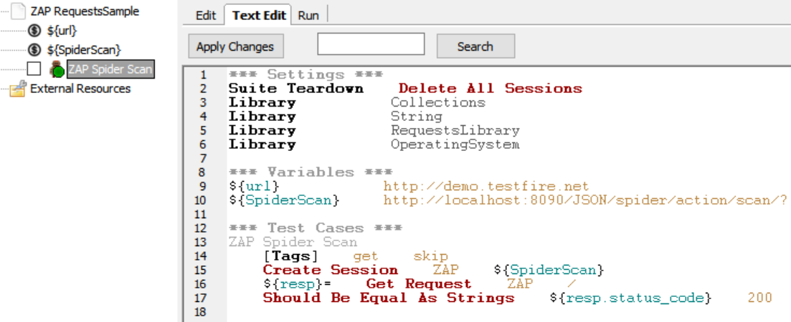
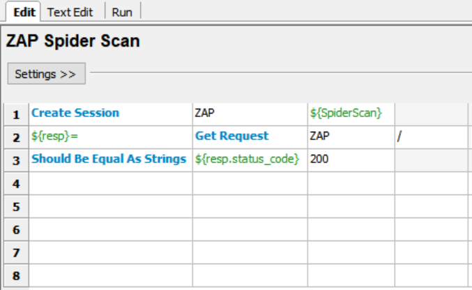
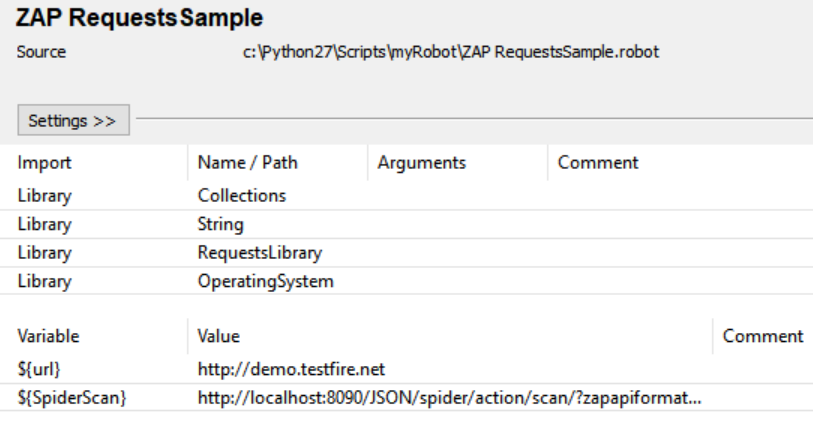

BDD Acceptance Security Testing
===============================

In this lab, we will introduce
**behavior-driven development** (**BDD**) acceptance testing with
automation security testing. BDD security testing is introduced to
improve the communication of the nature of security testing to all
functional teams involved. We will use security testing tools on top of
the BDD security automation testing framework and hook into the testing
process.

The following topics are to be covered in this lab:

-   Security testing communication
-   Overview of BDD security testing
-   BDD testing framework


Adoption of Robot Framework with sqlmap
=======================================

Let\'s take SQL injection testing as a simple example to see the effects
of Robot Framework adoption. As the business objective, we would like to
avoid any SQL injection attacks, which may result in authentication
bypasses, information leakage, authorization bypasses, and command
injection. Before integration with Robot Framework, SQL injection
execution by [sqlmap] will be as follows:

To Do:

```
python sqlmap.py   -u    "http://demo.testfire.net/"    -- batch    --banner
```


The following is an excerpt from the [sqlmap] testing results. If
these results were just delivered to stakeholders with no context, few
stakeholders would be able to understand the report:


```
[xx:xx:39] [INFO] heuristic (basic) test shows that GET parameter 'id' might be 
injectable (possible DBMS: 'MySQL')
[xx:xx:39] [INFO] testing for SQL injection on GET parameter 'id'
[xx:xx:39] [INFO] testing 'MySQL >= 4.1 AND error-based - WHERE or HAVING clause '
[xx:xx:39] [INFO] GET parameter 'id' is 'MySQL >= 4.1 AND error-based - WHERE or
HAVING clause' injectable 
GET parameter 'id' is vulnerable. 
```


The following steps show how this is done.On the other hand, if we apply
Robot Framework to execute [sqlmap], the Robot Framework execution
script would be much more understandable, as certain keywords are used
to define the testing steps.


Step 1 -- Robot Framework setup and preparation
===============================================

Robot Framework is implemented with Python, and supported on both Python
2 and Python 3. The easiest way to install Robot Framework is by the
Python PIP package:


```
python -m pip install robotframework
```


In addition, it\'s suggested to install the Robot Framework IDE, called
RIDE, which will help to edit the testing script easier. RIDE can be
installed by using PIP. Once the installation is done, RIDE can be
started by running [ride.py]:


```
pip install robotframework-ride
```


Once the installation of RIDE is done, execute [ride.py] to launch
it.

Once installation of Robot Framework is done, we may install
[sqlmap] as follows:


```
git clone --depth 1 https://github.com/sqlmapproject/sqlmap.git sqlmap-dev
```


Step 2 -- sqlmap with Robot Framework
=====================================

The Robot Framework script for executing sqlmap is as follows:


```
*** Settings ***
Library SSHLibrary
*** Variables ***
${HOST_URL}                 http://demo.testfire.net
*** Test Cases ***
SQL Injection Testing
[Documentation]   Use SQLmap to do the SQL injection testing on target host
${output}=  Execute Command   python sqlmap.py -u ${HOST_URL} -- batch --banner
Should  Not Contain    ${output}    vulnerable
```


In this case, we use [Execute Command], and [Should Not
Contain] to define the [sqlmap] execution steps and the
expected testing results. Here you can see the difference that the
adoption of Robot Framework makes. Robot Framework is a keyword-driven
acceptance testing framework that is able to describe the testing steps
with well-defined expected results.

Furthermore, Robot Framework is also flexible enough to define other
user-defined keywords and variables, to make its output more
understandable.


Testing framework -- Robot Framework with ZAP
=============================================

Here we will introduce BDD automation
testing framework, Robot Framework. The reason that we also introduce
Robot Framework is that it\'s widely used in automation testing and also
supports various kinds of testing frameworks, such as Selenium for web
UI testing, and Requests for REST API testing. Its flexibility and
simple keyword-driven script make Robot Framework a good fit for
security testing automation. Robot Framework is a generic automation
framework for acceptance testing and ATDD. We will use Robot Framework
to manage the execution steps of ZAP. The typical web security scanning
steps with ZAP are listed here:

1.  Start a headless ZAP
2.  Create a new ZAP session
3.  Perform a spider scan
4.  Perform an active scan
5.  Review the scanning results and ZAP alerts

In the following steps, we will demonstrate one simple ZAP spider scan
to understand how Robot Framework can be used to do security testing
with OWASP ZAP.


Step 1 -- environment setup and preparation
===========================================

In this case, we will launch ZAP as proxy mode with the listening port
[8090]. We will perform ZAP execution by using Robot Framework to
send the REST API to ZAP.

Step 2 -- the Robot Framework script for the ZAP spider scan
============================================================

In this Robot Framework script, we will trigger ZAP to do the spider
scan for the website. The following steps will be performed:

1.  ZAP spider scan for the target website
2.  Get the ZAP scanning response; the response status code should be
    200 success

There are two main approaches to using Robot Framework for ZAP web
scanning. The first one is using the OWASP ZAP CLI, which allows us to
send commands to control ZAP executions. The other way is using the ZAP
REST API. Since we have demonstrated how to execute via the command line
in the previous sqlmap example, we will demonstrate how to use the ZAP
REST API with Robot Framework. To achieve this, Robot Framework will
need to install the Requests library to send the RESTful API requests to
ZAP.

Here is the full Robot Framework testing script in plain text with the
filename [ZAP RequestsSample.robot]:


```
*** Settings ***
Suite Teardown Delete All Sessions
Library Collections
Library String
Library RequestsLibrary
Library OperatingSystem
*** Variables ***
${url}                             http://demo.testfire.net
${SpiderScan}            http://localhost:8090/JSON/spider/action/scan/?zapapiformat=JSON&formMethod=GET&url=${url}&maxChildren=&recurse=&contextName=&subtreeOnly=
*** Test Cases ***
ZAP Spider Scan
[Tags] get skip
Create Session                  ZAP                              ${SpiderScan}
${resp}=                             Get Request               ZAP                               /
Should Be Equal As Strings ${resp.status_code} 200
```


If you are using **RIDE** (**Robot Framework Test Data Editor**), here
is the script in text mode:





Text view of a ZAP spider scan in Robot Framework


Here is the table view of the script in RIDE:





Table view of a ZAP spider scan in Robot Framework


Here are the required settings in RIDE:





ZAP settings in Robot Framework


Once the spider scan is done, the web security scanning results will be
found at the following URL:


```
http://localhost:8090/HTML/core/view/alertsSummary/?zapapiformat=HTML&formMethod=GET
```


Alternatively, use the ZAP CLI to output the report in HTML as follows.
Be reminded that the ZAP CLI will need to be installed with [pip install
zapcli]:


```
zap-cli report -o   ZAP_Report.html  -f html
```


It\'s always recommended to use RIDE to edit the Robot Framework script
although the script can also be edited by using notepad. In RIDE, you
may mouse move over the keyword and press CTRL to present the detailed
usage.


Step 3 -- robot script execution
================================

Execute the following commands under the CLI console:


```
robot    "ZAP RequestsSample.robot"
```


Once the execution is done, the Robot Framework testing report will be
generated under the same folder of the robot script. [output.xml],
[log.html], and [report.html] will be generated.


Summary
=======

Robot Framework uses a keyword-driven approach to define the testing
steps. We
demonstrated the testing of SQL injection by using [sqlmap], and
illustrated how Robot Framework can be used to execute [sqlmap] .
In the Robot Framework script, we use [Execute Command] to execute
[sqlmap], and we define the expected results by using [Should Not
Contain].

We also illustrated how to integrate Robot Framework with ZAP. We mainly
use the Robot Framework Requests library to send restful APIs to OWASP
ZAP. In the Robot Framework script, we defined a custom variable,
SpiderScan, to execute the spider scan restful API in OWASP ZAP.

After learning about Robot Framework integration with [sqlmap] and
ZAP, we will begin a project to practice all previously mentioned
techniques and tools in the coming labs.


